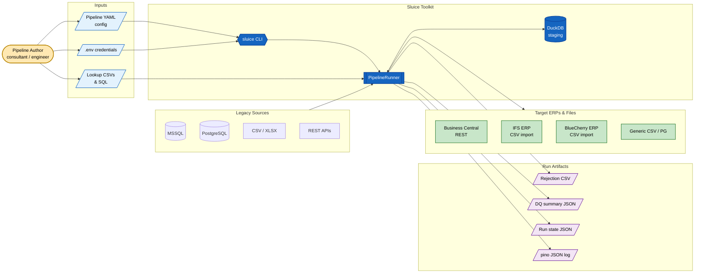
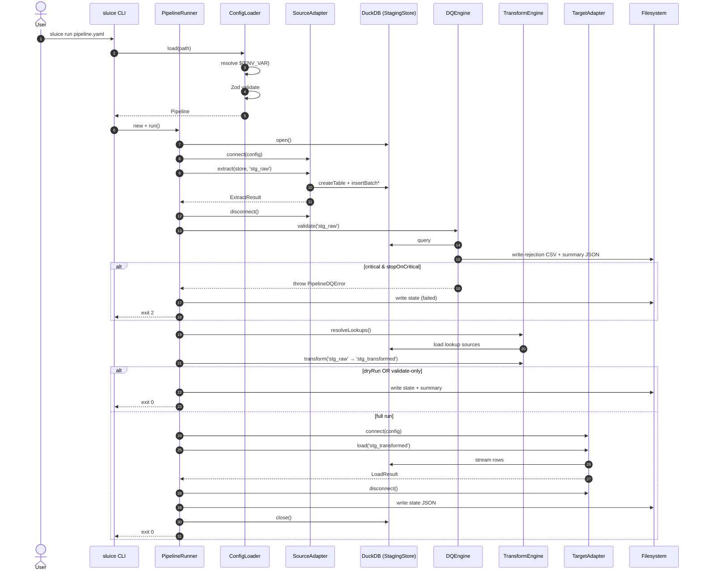
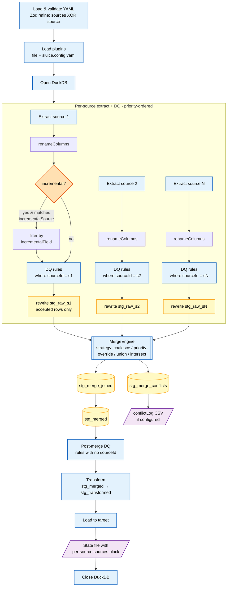
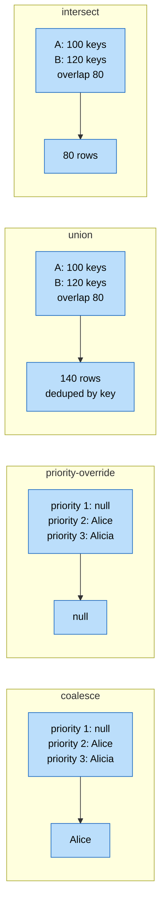

This page is for the technically curious — anyone evaluating Sluice for a real migration who wants to know what's happening under the hood.

The short version: every Sluice pipeline runs through **six phases**, with an embedded DuckDB instance acting as the staging store between them. The phases are sequenced by `PipelineRunner` (or `MultiSourcePipelineRunner` for pipelines with multiple sources). Adapters are pluggable; everything else is engine code with strict module boundaries.

## System context

Where Sluice sits between source systems and the target ERP:



## Single-source runtime

For a pipeline with a single `source:` block, `PipelineRunner` walks six phases in order:



Each phase is its own engine module:

| Phase | Module | Responsibility |
|---|---|---|
| 1. Config load | `src/config/` | YAML → `${ENV_VAR}` resolution → Zod validation → composite-rule expansion |
| 2. Extract | `src/adapters/source/` | Stream source data into DuckDB `stg_raw` |
| 3. DQ | `src/dq/` | Run rules against `stg_raw`; write rejection CSV + summary JSON |
| 4. Transform | `src/transform/` | Apply field mappings, lookups, cleanse ops, expressions → `stg_transformed` |
| 5. Load | `src/adapters/target/` | Stream `stg_transformed` to the target adapter |
| 6. Run state | `src/runner.ts` | Write `{outputDir}/{pipeline.name}-state.json` for incremental mode |

## Multi-source runtime

When a pipeline declares `sources[]` + `merge:`, the CLI auto-routes to `MultiSourcePipelineRunner` (a subclass of `PipelineRunner`). It runs extract + per-source DQ in priority order, then merges, then runs post-merge DQ + transform + load:



The four built-in merge strategies cover the patterns we hit most often:



## Why DuckDB?

DuckDB is the engine's staging layer. It's an embedded, single-file analytical database — no server, no daemon, no rebuild on Node ABI bumps. Sluice uses the official `@duckdb/node-api` package, which is Promise-native, TypeScript-first, and ABI-stable.

What this gives Sluice:

- **Set-based DQ.** Rules like `unique` are evaluated as a SQL `GROUP BY … HAVING COUNT(*) > 1` against the staging table. Nothing else fits in memory at scale.
- **Set-based merge.** Multi-source merges are SQL `JOIN` + `COALESCE` over priority-ordered sources, executed by DuckDB rather than imperatively in JavaScript.
- **Cheap dry-runs.** Pass `stagingDb: ':memory:'` (or `--dry-run`) and the whole pipeline runs without touching disk except to write the rejection CSV.
- **Predictable type behaviour.** Source types map cleanly to DuckDB's columnar types (`VARCHAR`, `BIGINT`, `DOUBLE`, `BOOLEAN`, `TIMESTAMP`).

The default staging file is `{outputDir}/{pipeline.name}.duckdb`. It's safe to delete between runs; Sluice rebuilds it from scratch every time.

## Why YAML + Zod?

Pipelines are described declaratively, not procedurally. The YAML schema is the contract. Zod validates the YAML at load time, and every TypeScript type in Sluice is **inferred** from the Zod schema (`z.infer<typeof PipelineSchema>`). There are no manual `interface` declarations for config types — code and config can't drift apart.

`${ENV_VAR}` tokens are resolved by the loader **before** Zod validation, so secrets never appear in YAML and the schema only ever sees plain strings.

## Module dependency direction

The codebase follows a strict dependency direction:

```
cli.ts → runner.ts / multi-source-runner.ts
            │
            ├─→ adapters/ (source + target)
            ├─→ staging/  (DuckDB wrapper)
            ├─→ dq/       (rule engine)
            ├─→ transform/ (field mapping engine)
            ├─→ merge/    (multi-source merge engine)
            ├─→ plugins/  (Tier 2/3 plugin discovery)
            ├─→ config/   (schema + loader)
            └─→ enrich/   (Phase 4a — types only; impl is private)

utils/ ← (imported by everyone)
```

`plugins/` is imported by `runner`, `dq`, `transform`, and `merge`, but it must **not** import any of them — that's how custom rules and adapters can be registered without creating a cycle. `enrich/` is type-only in the open-source core; the runtime implementation lives in the private `@caracal-lynx/sluice-enrich` package.

## See also

- [Core Concepts](/sluice/getting-started/core-concepts/) — the same picture at a higher level
- [Extension Points](/sluice/architecture/extension-points/) — where to plug into the engine
- [Pipeline YAML Schema](/sluice/reference/pipeline-yaml/) — the declarative contract in full
