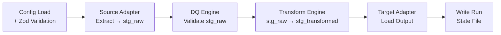

If you're going to spend more than ten minutes with Sluice, it's worth picking up a handful of vocabulary first. Every page in the [Pipeline Reference](/sluice/reference/pipeline-yaml/) assumes you know these terms.

## Pipeline

The unit of work. **One YAML file = one pipeline = one migrated entity** (customers, products, vendors, purchase orders…). A pipeline declares everything Sluice needs to know to run that migration end-to-end.

Pipelines have a lowercase, hyphenated `name:` (used for output filenames and log records) and live alongside each other in a folder — usually one folder per client engagement.

## Source adapter

Where data comes from. Sluice ships with five built-in source adapters: `mssql`, `pg`, `csv`, `xlsx`, and `rest`. Each one knows how to stream raw records from its system into the staging store.

A pipeline has either a single `source:` block or a `sources:` array (multi-source mode). See [Source Adapters](/sluice/reference/source-adapters/).

## Staging

Between every phase, data lives in an embedded **DuckDB** database — a single file (or `:memory:` if you'd rather not touch disk). DuckDB is fast, columnar, and ships with the `@duckdb/node-api` npm package; there's nothing else to install.

Three named tables show up:

| Table | When | Contents |
|---|---|---|
| `stg_raw` | After Extract | Untouched source records (single-source) |
| `stg_raw_{sourceId}` | After Extract | Per-source raw records (multi-source) |
| `stg_merged` | After Merge | Merged records (multi-source only) |
| `stg_transformed` | After Transform | Final shape, ready to load |

The default staging file is `{outputDir}/{pipeline.name}.duckdb`. You can open it in DuckDB CLI or DBeaver and query it directly — handy for debugging.

## Data Quality (DQ)

A configurable set of rules that runs against the staged source data **before** the transform phase. Rules can be `notNull`, `unique`, `pattern`, `email`, `ukPostcode`, `min`/`max`, `maxLength`, `allowedValues`, or any custom rule loaded via the plugin system.

Each check declares a `severity`:

- `critical` — failing rows are removed from the output. With `dq.stopOnCritical: true` (default), the pipeline halts.
- `warning` — failing rows are kept in the output but logged in the rejection CSV.
- `info` — recorded in the DQ summary JSON only.

Rejected rows go to `{outputDir}/{pipeline.name}-rejected.csv`. A summary lands at `{outputDir}/{pipeline.name}-dq-summary.json`. See [Data Quality Rules](/sluice/reference/dq-rules/).

## Transform

Field-level mapping from raw → output schema. Each entry in `transform.fields[]` declares a `type` (`string`, `number`, `decimal`, `boolean`, `date`, `lookup`, `concat`, `constant`, `expression`, `custom`), an optional `cleanse` chain (`trim|titleCase|normaliseUnicode`), and a destination field name.

Lookup tables — small key/value mappings used for currency-code translation, account-manager-id mapping, etc. — are loaded once at the start of the transform phase and cached in memory. They can come from any source adapter (CSV, MSSQL, REST…). See [Transforms](/sluice/reference/transforms/).

## Target adapter

Where data goes. The open-source core ships with two targets: `csv` and `pg`. ERP-specific targets (`bc` for Business Central, `ifs` for IFS, `bluecherry` for BlueCherry) are paid add-ons. See [Target Adapters](/sluice/reference/target-adapters/).

## Run state

After every run, Sluice writes `{outputDir}/{pipeline.name}-state.json`:

```json
{
  "pipeline": "customers-quickstart",
  "lastRunAt": "2026-04-15T09:30:00.000Z",
  "lastMode": "full",
  "rowsExtracted": 1842,
  "rowsLoaded": 1801,
  "criticalViolations": 0,
  "warnings": 41,
  "incrementalSince": ""
}
```

When you run with `mode: incremental`, Sluice reads `lastRunAt` from this file and only extracts records newer than that timestamp. The state file is the only built-in incremental marker — there's no central daemon, no scheduled job, no shared metadata store.

## The six phases

Every single-source run walks through six phases in order. Each phase has its own engine module so the boundaries stay clean.



Multi-source pipelines insert a **Merge** phase between Extract and DQ — see [How It Works](/sluice/architecture/how-it-works/) for the full picture.

## Plugins

Sluice has a three-tier extension model:

- **Tier 1 — Composite rules** (YAML) — group built-in DQ checks into a named rule and reference it as `{ type: composite, name: validUkBusinessAddress }`. Zero code.
- **Tier 2 — File plugins** (TypeScript) — drop a `*.rule.ts`, `*.transform.ts`, or `*.merge.ts` file into a `plugins/` directory next to your pipelines. Sluice auto-discovers them at runtime.
- **Tier 3 — npm packages** — publish a reusable plugin set as `@scope/sluice-adapter-*`, `@scope/etl-rules-*`, etc., and reference it from `sluice.config.yaml`.

See [Plugin System](/sluice/guides/plugin-system/) for the author guide.

## CLI

Five commands cover everything Sluice does:

| Command | What |
|---|---|
| `sluice run <pipeline.yaml>` | Full pipeline run (extract → DQ → transform → load) |
| `sluice validate <pipeline.yaml>` | DQ + transform only; no load |
| `sluice profile <pipeline.yaml>` | Extract + column profiling; no DQ |
| `sluice check <pipeline.yaml>` | Config validation only; no execution |
| `sluice plugins` | List all loaded rule, transform, and merge plugins |
| `sluice merge list-strategies` | List all registered merge strategies |

Exit codes: `0` success · `1` pipeline error · `2` DQ critical violations · `3` config error · `4` enrich error.

## Where to go next

You're ready to write a real pipeline. Start with the [Quickstart](/sluice/getting-started/quickstart/) for a hands-on walkthrough, or jump straight into [Writing a Pipeline YAML](/sluice/guides/writing-pipelines/) for an opinionated authoring tour.
