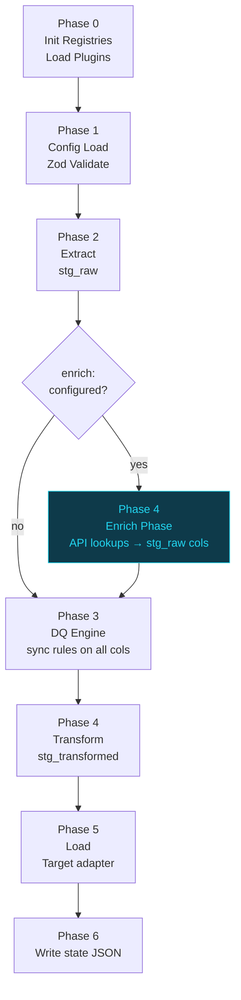
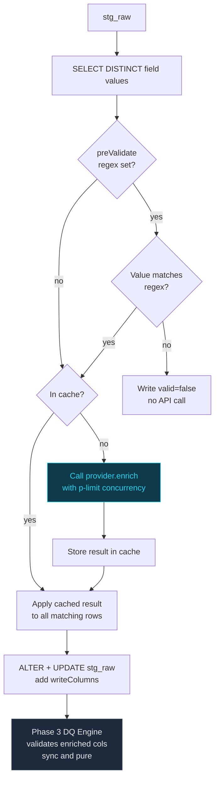

# Sluice — Phase 4: External Validation / Enrich Phase
# npm package: @caracal-lynx/sluice-enrich  ⚠️ PRIVATE — NOT OPEN SOURCE
# Owner: Michael Scott, Caracal Lynx Ltd. (SC826823)
# Depends on: CLAUDE.md (Phase 1 complete), archive/PHASE2-EXTENSIONS.md (Phase 3 complete)
# Last updated: 2026-05-01

---

> ## ⚠️ PRIVATE COMMERCIAL SERVICE
>
> **The entire Enrich subsystem is a private, commercially-licenced offering from Caracal Lynx Ltd.**
> It is developed and maintained in the **private** `caracal-lynx/sluice-enrich` repository
> and published as the **private** npm package `@caracal-lynx/sluice-enrich`.
>
> **It is NOT part of the open-source `@caracal-lynx/sluice` core.**
>
> The open-source core (`@caracal-lynx/sluice`) contains only:
> - `EnrichPlugin`, `EnrichResult`, `EnrichOptions` **interface types** (for third-party plugin authors)
> - `EnrichSchema`, `EnrichLookupSchema` **Zod stubs** (for config validation)
> - The `registerEnrichPhase()` **injection hook** in `PipelineRunner` (one function, no logic)
>
> Everything else — `EnrichRegistry`, `EnrichmentRunner`, `EnrichCache`, the plugin loader,
> all built-in providers (vies, hmrc-vat, uk-trade-tariff), and all CLI extensions — lives
> **exclusively** in `@caracal-lynx/sluice-enrich`.
>
> Clients purchase access to `@caracal-lynx/sluice-enrich` as part of a paid engagement.
> Third-party developers may write their own `EnrichPlugin` implementations using only the
> public interface types exported from `@caracal-lynx/sluice`.

---

## Overview

Phase 4 adds an **Enrich Phase** (Phase 4a) that sits between Extract (Phase 2)
and DQ (Phase 3). It calls external REST APIs to validate data values — such as
VAT registration numbers and HS commodity codes — and writes the results back as
new columns in `stg_raw`. The DQ engine then validates those enriched columns using
its existing synchronous rule set, completely unchanged.

This phase is **optional and additive**: pipelines without an `enrich:` section are
unaffected. No existing phases, plugin interfaces, or test suites are modified.

### Why a separate phase?

Phase 2 plugins (`RulePlugin`, `TransformPlugin`) are contractually synchronous
and pure — no I/O. External API calls are inherently async and network-bound.
Embedding them in the DQ or transform engines would break that contract and
introduce non-determinism into the core pipeline. The Enrich Phase is isolated,
runs before the DQ engine, and writes its results into `stg_raw` so the rest of
the pipeline sees only plain column data.

### Two-gate validation pattern

For any externally-validated field, the recommended YAML pattern is:

```
Gate 1 (Phase 3 DQ — sync, free):   format check via ukVatNumber composite rule
Gate 2 (Phase 4 Enrich — async):    existence check via VIES / HMRC API
```

Gate 1 catches obviously malformed values before they consume API quota.
Gate 2 confirms the value is actually registered with the authority.
Both results are captured in the DQ rejection CSV with their own rule names.

### Constraint: onError must default to `flag`, not `fail`

External APIs are outside the pipeline's control. A VIES outage must not abort
a migration run. The default `onError` is `flag` (write `valid: false`, continue).
Operators must explicitly opt in to `fail` behaviour.

---

## New files and changes to existing files

### Open-source core changes (`@caracal-lynx/sluice`)

These are the **only** changes to the open-source package. They are minimal by design.

```
src/
├── enrich/
│   └── types.ts           ← EnrichPlugin, EnrichResult, EnrichOptions INTERFACES ONLY
│                            (no class, no logic — for third-party plugin authors)

src/config/
├── schema.ts              ← add EnrichSchema, EnrichLookupSchema Zod stubs
│                            add enrich: EnrichSchema.optional() to PipelineSchema
└── loader.ts              ← resolve enrich.lookups[].field references (validation only)

src/runner.ts              ← add registerEnrichPhase() hook function ONLY
                             no direct imports of EnrichRegistry or EnrichmentRunner
src/cli.ts                 ← add --no-enrich flag
```

### Private package — new repository (`@caracal-lynx/sluice-enrich`)

All implementation lives here. This is developed in `caracal-lynx/sluice-enrich` (private repo).

#### Phase 4a — Enrich framework (develop first)

```
src/
├── registry.ts            ← EnrichRegistry class
├── cache.ts               ← EnrichCache (in-memory; optional DuckDB persistence)
├── runner.ts              ← EnrichmentRunner — orchestrates all enrich lookups
├── loader.ts              ← loadEnrichPlugins() — discovers *.enrich.ts files
├── index.ts               ← package entry — exports registerEnrichPhase factory
└── providers/
    └── index.ts           ← placeholder — providers added in Phase 4b
```

Also: implements the three `StagingStore` stub methods added during Phase 1 (Node 24 upgrade):
- `selectDistinct()` — reads distinct non-null field values from stg_raw
- `addColumnIfNotExists()` — adds a column to stg_raw for enrich results
- `batchUpdateColumns()` — writes enrich results back to stg_raw rows

These stubs are defined in the open-source `StagingStore` (throwing `'not yet implemented'`).
The private `sluice-enrich` package extends `StagingStore` or patches it at runtime.

#### Phase 4b — Built-in providers (develop separately, after Phase 4a)

```
src/providers/
├── index.ts               ← registers all built-in providers
├── vies.ts                ← EU VIES VAT validation
├── hmrc-vat.ts            ← UK HMRC VAT validation
└── uk-trade-tariff.ts     ← UK Global Trade Tariff HS code validation
```

> **Phase 4b is a separate development phase.** The enrich framework (Phase 4a) ships
> and is usable before any built-in providers are available. Clients can use custom
> `*.enrich.ts` plugin files from their `plugins/` directory from Phase 4a onwards.
> Built-in providers are added incrementally as Phase 4b work.

### Modified files (open-source core — during Phase 1 / Node 24 upgrade)

```
src/staging/store.ts       ← add three stub methods (throw 'not yet implemented')
                             selectDistinct / addColumnIfNotExists / batchUpdateColumns

package.json               ← NO new dependencies for open-source core (stubs only)
```

### Private package dependencies (`sluice-enrich/package.json`)

```json
{
  "dependencies": {
    "@caracal-lynx/sluice": "^1.0.0",
    "p-limit": "^5.0.0"
  }
}
```

---

## ═══════════════════════════════════════════════════════════
## ZOD SCHEMA ADDITIONS
## ═══════════════════════════════════════════════════════════

### New schemas (src/config/schema.ts)

```typescript
// ── Enrich ────────────────────────────────────────────────────────────────────

/**
 * writeColumns maps logical result keys to stg_raw column names.
 * The 'valid' key is mandatory — it maps to a boolean column.
 * Any additional keys map from EnrichResult.data fields.
 *
 * Example:
 *   writeColumns:
 *     valid:   vat_valid        ← bool: true if API confirms registration
 *     name:    vat_company_name ← string: company name from API response
 *     country: vat_country      ← string: country code from API response
 */
const EnrichWriteColumnsSchema = z
  .object({ valid: z.string() })   // 'valid' key is required
  .catchall(z.string());           // additional data-field mappings are optional

const EnrichLookupSchema = z.object({
  field:        z.string(),        // source column in stg_raw
  provider:     z.string(),        // built-in id or EnrichPlugin id
  writeColumns: EnrichWriteColumnsSchema,
  preValidate:  z.string().optional(),  // regex; skip API call if value does not match
  onError:      z.enum(['flag', 'skip', 'fail']).optional(),  // overrides global default
  cache:        z.boolean().optional(),
  //   Per-lookup cache override.
  //   true  = use cache (inherits global setting — default behaviour)
  //   false = NEVER cache this lookup; always call the API fresh each run.
  //           Use this for lookups that return run-specific reference values
  //           (e.g. HMRC consultationNumber) that must not be reused across runs.
  options:      z.record(z.unknown()).optional(),  // passed to provider.enrich()
});

export const EnrichSchema = z.object({
  cache:   z.union([z.boolean(), z.literal('persist')]).default(true),
  //         true     = in-memory cache for this run (default)
  //         false    = no caching; always call the API
  //         'persist'= cache stored in DuckDB enrich_cache table; survives between runs
  onError: z.enum(['flag', 'skip', 'fail']).default('flag'),
  //         flag  = write valid: false for API failures; continue pipeline (default)
  //         skip  = move failed rows to rejection CSV; continue with remaining rows
  //         fail  = throw EnrichError; abort pipeline immediately
  lookups: z.array(EnrichLookupSchema).min(1),
});

export type EnrichConfig       = z.infer<typeof EnrichSchema>;
export type EnrichLookupConfig = z.infer<typeof EnrichLookupSchema>;
```

### PipelineSchema addition

```typescript
export const PipelineSchema = z.object({
  pipeline:  { /* ... unchanged ... */ },
  source:    SourceSchema,
  enrich:    EnrichSchema.optional(),   // ← NEW — Phase 4
  dq:        DqSchema,
  transform: TransformSchema,
  target:    TargetSchema,
  run:       RunSchema.default({}),
});
```

### RunSchema additions

```typescript
export const RunSchema = z.object({
  // ... existing fields unchanged ...
  enrichConcurrency: z.number().int().positive().default(5),
  //   Max parallel API calls across all providers. Default: 5.
  enrichTimeoutMs:   z.number().int().positive().default(5000),
  //   Per-call timeout in milliseconds. Default: 5000.
  enrichMaxRetries:  z.number().int().min(0).max(5).default(3),
  //   Retries per call (uses axios-retry exponential backoff). Default: 3.
});
```

---

## ═══════════════════════════════════════════════════════════
## YAML SPEC — enrich section
## ═══════════════════════════════════════════════════════════

### Full annotated example

```yaml
# ── ENRICH (Phase 4) ──────────────────────────────────────────────────────────
# Runs after Extract, before DQ. Calls external REST APIs and writes
# result columns back into stg_raw. DQ rules reference those columns
# using standard checks (notNull, allowedValues, etc.).

enrich:
  cache: true                  # true (default) | false | persist
  onError: flag                # flag (default) | skip | fail

  lookups:

    # ── VAT number validation (HMRC — with consultation reference) ────
    - field: VAT_NUMBER         # source column in stg_raw
      provider: hmrc-vat        # built-in provider id
      preValidate: "^GB([0-9]{9}|[0-9]{12}|(GD|HA)[0-9]{3})$"
      #  Optional regex. If the value does not match, skip the API call
      #  and write valid: false immediately (saves API quota).
      cache: false
      #  IMPORTANT: must be false when writeColumns includes consultation_ref.
      #  The HMRC API issues a new reference on every call — persisting a stale
      #  reference from a previous run would invalidate the audit trail.
      writeColumns:
        valid:            vat_valid         # bool — true if HMRC confirms registration
        name:             vat_name          # string — registered business name
        address_line1:    vat_address1      # string — first line of registered address
        address_line2:    vat_address2      # string — second line (may be empty)
        address_postcode: vat_postcode      # string — registered postcode
        consultation_ref: vat_consult_ref   # string — HMRC reference proving the check
        processing_date:  vat_checked_at    # string — ISO timestamp of the check
      onError: flag             # override global default for this lookup
      options:
        bearerToken: ${HMRC_BEARER_TOKEN}   # OAuth2 token — resolved from .env at runtime

    # ── HS code validation (UK Trade Tariff) ───────────────────────────
    - field: HS_CODE
      provider: uk-trade-tariff
      writeColumns:
        valid:       hs_code_valid    # bool — true if commodity code exists in tariff
        description: hs_description  # string — goods description from tariff API
      onError: flag

    # ── Custom provider (Tier 2 plugin) ───────────────────────────────
    - field: SUPPLIER_DUNS
      provider: dnb-duns              # *.enrich.ts plugin file in client plugins/
      writeColumns:
        valid: duns_valid
      onError: skip                   # move invalid rows to rejection CSV
```

### DQ rules that consume enriched columns

```yaml
# These DQ rules run AFTER the Enrich phase. All writeColumns values are
# plain stg_raw columns by this point — the DQ engine has no awareness
# of where they came from.

dq:
  rules:
    # Gate 1 — format check (sync, free, always runs even if enrich is disabled)
    - field: VAT_NUMBER
      checks:
        - { type: ukVatNumber, severity: warning }    # composite rule from shared/rules.yaml

    # Gate 2 — HMRC existence check
    - field: vat_valid
      checks:
        - { type: notNull,       severity: warning }
        - { type: allowedValues, value: [true], severity: warning,
            message: "VAT number not confirmed by HMRC — check manually before migrating" }

    # Consultation reference — proves the check was performed for this run
    - field: vat_consult_ref
      checks:
        - { type: notNull, severity: warning,
            message: "No HMRC consultation reference — VAT check may not have completed" }

    # HS code existence check
    - field: hs_code_valid
      checks:
        - { type: notNull,       severity: critical }
        - { type: allowedValues, value: [true], severity: critical,
            message: "HS code not found in UK Trade Tariff — shipment will be blocked at customs" }
```

### Transform fields consuming enriched columns

```yaml
# Enriched columns are available in transform.fields exactly like source columns.
# The YAML author decides which flow through to the target record.

transform:
  fields:
    # Use HMRC-verified name as the authoritative business name in the target
    - { from: vat_name,         to: VerifiedName,    type: string,  optional: true }

    # Carry the consultation reference into the ERP record as audit evidence
    - { from: vat_consult_ref,  to: VatConsultRef,   type: string,  optional: true }

    # Carry the check timestamp
    - { from: vat_checked_at,   to: VatCheckedAt,    type: string,  optional: true }

    # Address fields — use as-is or combine via concat
    - from: [vat_address1, vat_address2]
      to:   VerifiedAddress
      type: concat
      separator: ", "
      optional: true

    - { from: vat_postcode,     to: VerifiedPostcode, type: string, optional: true }
```

---

## ═══════════════════════════════════════════════════════════
## ENRICHPLUGIN INTERFACE  (open-source: src/enrich/types.ts)
## ═══════════════════════════════════════════════════════════

> **Location:** `@caracal-lynx/sluice` open-source core — `src/enrich/types.ts`
> These interfaces are public. Third-party plugin authors use them to write custom `EnrichPlugin` implementations.

Unlike `RulePlugin` and `TransformPlugin`, `EnrichPlugin.enrich()` is **async**.
This is the ONLY plugin type in the Sluice system that may perform I/O.

```typescript
// open-source: src/enrich/types.ts

export interface EnrichPlugin {
  /**
   * Unique identifier. Must match the 'provider' key in pipeline YAML.
   * Use kebab-case: 'vies', 'hmrc-vat', 'uk-trade-tariff'
   */
  readonly id: string;

  /** Human-readable description for CLI output and error messages. */
  readonly description?: string;

  /**
   * Validate or enrich a single value against an external source.
   *
   * Called by EnrichmentRunner once per UNIQUE value (after deduplication).
   * Results are cached and applied to all rows sharing the same value.
   *
   * IMPORTANT RULES:
   * - MUST be async; MUST NOT block the event loop with synchronous I/O.
   * - MUST NOT mutate options.
   * - MUST return EnrichResult — never throw. Capture errors in result.error.
   * - MUST respect options.timeoutMs if provided.
   * - MUST handle HTTP 429 (rate limit) by throwing, not returning — the
   *   runner will retry with exponential backoff via axios-retry.
   * - MUST return { valid: false, error: '...' } for non-retryable failures
   *   (4xx except 429, parsing errors, empty responses).
   *
   * @param value   The raw string value from stg_raw (never null — nulls
   *                are short-circuited by the runner before calling enrich).
   * @param options Merged object: EnrichLookupConfig.options + run-level
   *                enrichTimeoutMs and enrichMaxRetries.
   */
  enrich(value: string, options: EnrichOptions): Promise<EnrichResult>;
}

export interface EnrichResult {
  /** True if the external source confirms the value is valid/registered. */
  valid: boolean;

  /**
   * Additional data fields from the API response.
   * Keys must match the logical names used in writeColumns (excluding 'valid').
   * Example: { name: 'Acme Ltd', country: 'GB' }
   */
  data?: Record<string, unknown>;

  /**
   * Set when the API call failed (timeout, 5xx, parse error).
   * Must NOT be set when valid is false due to a successful "not found"
   * response — that is a legitimate validation result, not an error.
   */
  error?: string;

  /** Set by EnrichCache — not populated by plugins. */
  fromCache?: boolean;
}

export interface EnrichOptions extends Record<string, unknown> {
  timeoutMs:  number;
  maxRetries: number;
}
```

---

## ═══════════════════════════════════════════════════════════
## ENRICHREGISTRY  (PRIVATE — sluice-enrich/src/registry.ts)
## ═══════════════════════════════════════════════════════════

> **Location:** `@caracal-lynx/sluice-enrich` private package — `src/registry.ts`
> Not part of the open-source core.

```typescript
// private: sluice-enrich/src/registry.ts
import type { EnrichPlugin } from '@caracal-lynx/sluice';
import { ConfigError } from '@caracal-lynx/sluice/utils';

export class EnrichRegistry {
  private readonly plugins = new Map<string, EnrichPlugin>();

  register(plugin: EnrichPlugin): void {
    if (this.plugins.has(plugin.id)) {
      throw new ConfigError(
        `Duplicate enrich provider id "${plugin.id}". ` +
        `Check plugins/ folder for conflicts with built-in providers.`
      );
    }
    this.plugins.set(plugin.id, plugin);
  }

  get(id: string): EnrichPlugin | undefined {
    return this.plugins.get(id);
  }

  has(id: string): boolean {
    return this.plugins.has(id);
  }

  list(): string[] {
    return [...this.plugins.keys()];
  }
}
```

---

## ═══════════════════════════════════════════════════════════
## ENRICHCACHE  (PRIVATE — sluice-enrich/src/cache.ts)
## ═══════════════════════════════════════════════════════════

> **Location:** `@caracal-lynx/sluice-enrich` private package — `src/cache.ts`
> Not part of the open-source core.

```typescript
// private: sluice-enrich/src/cache.ts
import type { EnrichResult } from '@caracal-lynx/sluice';

/**
 * Cache key: `${providerId}:${value}` (lowercased value for case-insensitive APIs)
 * In-memory by default; DuckDB persistence added when cache: 'persist'.
 */
export class EnrichCache {
  private readonly store = new Map<string, EnrichResult>();
  private readonly normalise: boolean;

  constructor(options: { normalise?: boolean } = {}) {
    // normalise = true lowercases cache keys; use for case-insensitive APIs
    this.normalise = options.normalise ?? false;
  }

  private key(providerId: string, value: string): string {
    const v = this.normalise ? value.toLowerCase() : value;
    return `${providerId}:${v}`;
  }

  get(providerId: string, value: string): EnrichResult | undefined {
    return this.store.get(this.key(providerId, value));
  }

  set(providerId: string, value: string, result: EnrichResult): void {
    this.store.set(this.key(providerId, value), { ...result, fromCache: true });
  }

  has(providerId: string, value: string): boolean {
    return this.store.has(this.key(providerId, value));
  }

  size(): number {
    return this.store.size;
  }

  /** Called by EnrichmentRunner when cache: 'persist'. */
  async loadFromDuckDB(db: unknown, pipelineName: string): Promise<void> {
    // Implementation: SELECT * FROM enrich_cache WHERE pipeline = pipelineName
    // Deserialise JSON result column into EnrichResult and populate this.store.
    // Table created if not exists. Noop if table is empty.
    //
    // Table DDL (created once by EnrichmentRunner on first persist):
    // CREATE TABLE IF NOT EXISTS enrich_cache (
    //   pipeline TEXT,
    //   provider TEXT,
    //   value    TEXT,
    //   result   JSON,
    //   cached_at TIMESTAMP DEFAULT now()
    // );
    //
    // DuckDB is accessed via the StagingStore instance injected into
    // EnrichmentRunner — NOT imported directly (see tech conventions).
    throw new Error('Not yet implemented — placeholder for DuckDB integration');
  }

  async flushToDuckDB(db: unknown, pipelineName: string): Promise<void> {
    // Implementation: UPSERT all store entries into enrich_cache table.
    throw new Error('Not yet implemented — placeholder for DuckDB integration');
  }
}
```

**Note for implementor:** DuckDB access must go through `StagingStore` (injected).
Never import DuckDB directly in enrich modules — that import is restricted to
`src/staging/store.ts` per the project conventions.

---

## ═══════════════════════════════════════════════════════════
## ENRICHMENTRUNNER  (PRIVATE — sluice-enrich/src/runner.ts)
## ═══════════════════════════════════════════════════════════

> **Location:** `@caracal-lynx/sluice-enrich` private package — `src/runner.ts`
> Not part of the open-source core.

```typescript
// private: sluice-enrich/src/runner.ts
import pLimit from 'p-limit';
import type { EnrichConfig, EnrichLookupConfig, EnrichResult, EnrichOptions } from '@caracal-lynx/sluice';
import type { EnrichRegistry } from './registry';
import type { EnrichCache } from './cache';
import type { StagingStore } from '@caracal-lynx/sluice/staging';
import { logger } from '@caracal-lynx/sluice/utils';
import { EnrichError } from '@caracal-lynx/sluice/utils';

export class EnrichmentRunner {
  constructor(
    private readonly registry: EnrichRegistry,
    private readonly cache:    EnrichCache,
    private readonly staging:  StagingStore,
    private readonly concurrency: number = 5,
    private readonly timeoutMs:   number = 5000,
    private readonly maxRetries:  number = 3,
  ) {}

  async run(config: EnrichConfig): Promise<EnrichSummary> {
    const summary: EnrichSummary = { lookups: [] };

    for (const lookup of config.lookups) {
      const result = await this.runLookup(lookup, config);
      summary.lookups.push(result);

      // If onError: fail and any errors occurred, abort immediately
      const onError = lookup.onError ?? config.onError;
      if (onError === 'fail' && result.errorCount > 0) {
        throw new EnrichError(
          `Enrich lookup for field "${lookup.field}" via provider "${lookup.provider}" ` +
          `failed ${result.errorCount} row(s) and onError is set to "fail".`
        );
      }
    }

    return summary;
  }

  private async runLookup(
    lookup:       EnrichLookupConfig,
    globalConfig: EnrichConfig,
  ): Promise<LookupSummary> {
    const provider = this.registry.get(lookup.provider);
    if (!provider) {
      throw new EnrichError(
        `Unknown enrich provider "${lookup.provider}". ` +
        `Available providers: ${this.registry.list().join(', ')}. ` +
        `Add a *.enrich.ts plugin file to the client plugins/ directory for custom providers.`
      );
    }

    // Step 1: Read distinct non-null values from stg_raw for this field
    const distinctValues = await this.staging.selectDistinct(lookup.field);
    // Nulls and empty strings are short-circuited: write valid: null, skip API

    logger.info(
      { provider: lookup.provider, field: lookup.field, distinctValues: distinctValues.length },
      'Enrich lookup starting'
    );

    // Step 2: Determine which values need API calls (not in cache, pass preValidate)
    const preValidateRegex = lookup.preValidate ? new RegExp(lookup.preValidate) : null;
    const toFetch: string[] = [];

    for (const value of distinctValues) {
      if (!this.cache.has(provider.id, value)) {
        if (preValidateRegex && !preValidateRegex.test(value)) {
          // Fails format check — cache as invalid immediately, no API call
          this.cache.set(provider.id, value, { valid: false });
          logger.debug({ field: lookup.field, value }, 'preValidate failed — skipping API call');
        } else {
          toFetch.push(value);
        }
      }
    }

    logger.info(
      { provider: lookup.provider, toFetch: toFetch.length, fromCache: distinctValues.length - toFetch.length },
      'Enrich cache status'
    );

    // Step 3: Fetch uncached values with controlled concurrency
    const limit = pLimit(this.concurrency);
    const options = {
      ...(lookup.options ?? {}),
      timeoutMs:  this.timeoutMs,
      maxRetries: this.maxRetries,
    };

    await Promise.allSettled(
      toFetch.map(value =>
        limit(async () => {
          const result = await provider.enrich(value, options);
          this.cache.set(provider.id, value, result);
          if (result.error) {
            logger.warn({ provider: provider.id, field: lookup.field, value, error: result.error },
              'Enrich API call failed');
          }
        })
      )
    );

    // Step 4: Read ALL rows from stg_raw and apply enrichment results
    const onError = lookup.onError ?? globalConfig.onError;
    const stats = await this.applyResults(lookup, provider.id, onError);

    logger.info(
      { provider: lookup.provider, field: lookup.field, ...stats },
      'Enrich lookup complete'
    );

    return {
      provider:   lookup.provider,
      field:      lookup.field,
      totalRows:  stats.totalRows,
      validCount: stats.validCount,
      errorCount: stats.errorCount,
      skipCount:  stats.skipCount,
      cacheHits:  stats.cacheHits,
    };
  }

  /**
   * Reads each row from stg_raw, looks up the cached result for its field value,
   * then writes the writeColumns back to stg_raw via StagingStore.
   *
   * Column creation:
   *   - All writeColumns are added to stg_raw via ALTER TABLE ADD COLUMN IF NOT EXISTS
   *     before the UPDATE pass.
   *   - valid column: BOOLEAN
   *   - all other data columns: VARCHAR
   *
   * onError behaviour:
   *   - flag: write valid=false for errored rows; those rows remain in stg_raw
   *   - skip: write valid=false; mark row with _enrich_skip=true; DQ engine
   *           will send skip-marked rows to the rejection CSV
   *   - fail: handled by caller (EnrichmentRunner.run) after this method returns
   */
  private async applyResults(
    lookup:    EnrichLookupConfig,
    providerId: string,
    onError:   'flag' | 'skip' | 'fail',
  ): Promise<ApplyStats> {
    // Implementation detail: use StagingStore batch update API
    // Pseudocode:
    //
    // 1. ALTER TABLE stg_raw ADD COLUMN IF NOT EXISTS <validCol> BOOLEAN
    // 2. For each additional writeColumn: ADD COLUMN IF NOT EXISTS <col> VARCHAR
    // 3. If onError === 'skip': ADD COLUMN IF NOT EXISTS _enrich_skip BOOLEAN
    //
    // 4. SELECT rowid, <field> FROM stg_raw
    //    For each row:
    //      value = row[field] ?? null
    //      if (value === null || value === ''):
    //        result = { valid: null }   ← let DQ notNull handle this
    //      else:
    //        result = cache.get(providerId, value) ?? { valid: false, error: 'not in cache' }
    //
    //      if (result.error && onError === 'skip'):
    //        set _enrich_skip = true, valid = false
    //
    //      UPDATE stg_raw SET
    //        <validCol> = result.valid,
    //        [additional data cols from result.data mapped via writeColumns]
    //      WHERE rowid = row.rowid
    //
    // 5. Return stats: { totalRows, validCount, errorCount, skipCount, cacheHits }
    throw new Error('Not yet implemented');
  }
}

export interface EnrichSummary {
  lookups: LookupSummary[];
}

export interface LookupSummary {
  provider:   string;
  field:      string;
  totalRows:  number;
  validCount: number;
  errorCount: number;
  skipCount:  number;
  cacheHits:  number;
  /**
   * Populated when writeColumns includes a key whose logical name ends in
   * '_ref' or 'consultation_ref' (i.e. any reference value that must appear
   * in the audit trail). Maps source field value → reference string.
   *
   * Example:
   *   { "GB553557881": "K6S4S0PT", "GB123456789": "M2T9X1KR" }
   *
   * This map is written into the run state file under enrichSummary so the
   * auditor can cross-reference any VAT number to its consultation reference
   * without opening the output file.
   *
   * Only populated for lookups where at least one writeColumns value is the
   * 'consultation_ref' logical key. Empty object otherwise.
   */
  consultationRefs: Record<string, string>;
}

interface ApplyStats {
  totalRows:  number;
  validCount: number;
  errorCount: number;
  skipCount:  number;
  cacheHits:  number;
  /** Populated from result.data.consultation_ref keyed by source value. */
  consultationRefs: Record<string, string>;
}
```

### StagingStore additions required

> **Note:** These methods are added as **throwing stubs** to `src/staging/store.ts` (open-source core)
> during the **Phase 1 (Node 24) upgrade**. The full implementation is provided by `@caracal-lynx/sluice-enrich`
> during Phase 4a. Until `sluice-enrich` is installed, calling these methods throws
> `'not yet implemented — install @caracal-lynx/sluice-enrich'`.

The following method signatures must be present in `src/staging/store.ts`:

```typescript
/** Returns distinct non-null, non-empty values for a column in stg_raw. */
async selectDistinct(field: string): Promise<string[]>;

/** Adds a column to stg_raw if it does not already exist. */
async addColumnIfNotExists(column: string, type: 'BOOLEAN' | 'VARCHAR'): Promise<void>;

/**
 * Batch-updates stg_raw. Updates is a Map<rowid, Record<column, value>>.
 * Uses a prepared statement for efficiency.
 */
async batchUpdateColumns(updates: Map<number, Record<string, unknown>>): Promise<void>;
```

---

## ═══════════════════════════════════════════════════════════
## BUILT-IN PROVIDERS  (PRIVATE — Phase 4b)
## ═══════════════════════════════════════════════════════════

> **Location:** `@caracal-lynx/sluice-enrich` private package — `src/providers/`
> **Phase:** 4b — separate development after Phase 4a framework is complete and tested.
>
> Built-in providers are **not** part of Phase 4a. The enrich framework ships first.
> Providers are added to `sluice-enrich` incrementally as Phase 4b work proceeds.
> Clients can use custom `*.enrich.ts` plugin files from their `plugins/` directory
> from Phase 4a onwards — they do not need to wait for built-in providers.
>
> All three built-in providers are **private and commercially licenced**. They are
> not open-source and are not available without a paid Caracal Lynx engagement.

All built-in providers live under `sluice-enrich/src/providers/`. They are registered
by `src/providers/index.ts` into the EnrichRegistry at startup, before
any client plugin files are loaded.

### Provider: `vies`  (sluice-enrich/src/providers/vies.ts)

EU VAT Information Exchange System — validates VAT numbers for all EU member states.

```
Endpoint: GET https://ec.europa.eu/taxation_customs/vies/rest-api/ms/{countryCode}/vat/{vatNumber}
Auth:     None
Sandbox:  No official sandbox. Use countryCode=DE, vatNumber=100 for a known-valid test value.

Request:  GET /ms/GB/vat/123456789
Response: {
  "isValid":     true,
  "requestDate": "2026-04-29T10:00:00Z",
  "name":        "ACME LTD",
  "address":     "1 HIGH ST, LONDON",
  "vatNumber":   "123456789",
  "countryCode": "GB"
}

Status codes:
  200 OK       — request succeeded; check isValid for result
  400          — malformed VAT number format
  404          — member state not found
  429          — rate limited; retry
  5xx          — VIES service error; retry
```

```typescript
// src/enrich/providers/vies.ts
import axios from 'axios';
import axiosRetry from 'axios-retry';
import type { EnrichPlugin, EnrichResult, EnrichOptions } from '../types';

export const vies: EnrichPlugin = {
  id: 'vies',
  description: 'EU VIES VAT validation — validates VAT numbers against EU member state registries',

  async enrich(value: string, options: EnrichOptions): Promise<EnrichResult> {
    // Extract country code prefix (first two alpha chars) or use options.countryCode
    const countryCode = (options.countryCode as string | undefined)
      ?? value.replace(/[^A-Z]/g, '').substring(0, 2);
    const vatNumber = value.replace(/^[A-Z]{2}/, '');  // strip country prefix

    const client = axios.create({ timeout: options.timeoutMs });
    axiosRetry(client, {
      retries:      options.maxRetries,
      retryDelay:   axiosRetry.exponentialDelay,
      retryCondition: e => axiosRetry.isNetworkOrIdempotentRequestError(e)
        || e.response?.status === 429
        || (!!e.response?.status && e.response.status >= 500),
    });

    try {
      const url = `https://ec.europa.eu/taxation_customs/vies/rest-api/ms/${countryCode}/vat/${vatNumber}`;
      const res = await client.get<ViesResponse>(url);
      return {
        valid: res.data.isValid,
        data: {
          name:    res.data.name    ?? null,
          country: res.data.countryCode ?? countryCode,
        },
      };
    } catch (err: unknown) {
      if (axios.isAxiosError(err) && err.response?.status === 400) {
        // 400 = format rejected by VIES — not an error, just invalid
        return { valid: false };
      }
      return { valid: false, error: String(err) };
    }
  },
};

interface ViesResponse {
  isValid:     boolean;
  name?:       string;
  address?:    string;
  vatNumber?:  string;
  countryCode?: string;
}
```

### Provider: `hmrc-vat`  (sluice-enrich/src/providers/hmrc-vat.ts)

UK HMRC "Check a UK VAT number" API — confirms registration, returns business name,
registered address, and a consultation reference number as proof the check was made.

```
Endpoint: GET https://api.service.hmrc.gov.uk/organisations/vat/check-vat-number/lookup/{targetVrn}
Auth:     OAuth2 Bearer token (required to receive consultationNumber)
          Pass via options.bearerToken (resolved from ${HMRC_BEARER_TOKEN} env var).
          Without a token the API still responds but omits consultationNumber.
Sandbox:  https://test-api.service.hmrc.gov.uk — same path, no real VRNs needed.
Test VRN: 553557881 (accepted by sandbox as valid)

Request:  GET /organisations/vat/check-vat-number/lookup/553557881
          Authorization: Bearer <token>

Response (200 OK — registered):
{
  "target": {
    "name":      "ACME WIDGETS LTD",
    "vatNumber": "553557881",
    "address": {
      "line1":       "1 HIGH STREET",
      "line2":       "ANYTOWN",
      "line3":       "",
      "postcode":    "SW1A 1AA",
      "countryCode": "GB"
    }
  },
  "consultationNumber": "K6S4S0PT",
  "processingDate":     "2026-04-29T10:00:00Z"
}

Response (404 — not registered):
{
  "code":    "NOT_FOUND",
  "message": "targetVatNumber 123456789 not found."
}

Status codes:
  200       — registered; valid=true
  400       — invalid VRN format; valid=false (NOT an error)
  401       — missing or invalid bearer token; valid=false, error set
  404       — not registered; valid=false (NOT an error)
  429       — rate limited; retry with exponential backoff
  5xx       — HMRC service error; retry

Result data keys returned (for use in writeColumns):
  name             — registered business name
  address_line1    — first line of registered address
  address_line2    — second line (may be empty string)
  address_postcode — registered postcode
  consultation_ref — HMRC reference number proving this check was performed
                     Only present when a valid bearer token was supplied.
  processing_date  — ISO timestamp of the check from HMRC

IMPORTANT — cache: false required:
  consultationNumber is issued fresh on every API call. It must not be reused
  across pipeline runs. Always set cache: false on any lookup using hmrc-vat
  when writeColumns includes consultation_ref.
```

```typescript
// src/enrich/providers/hmrc-vat.ts
import axios from 'axios';
import axiosRetry from 'axios-retry';
import type { EnrichPlugin, EnrichResult, EnrichOptions } from '../types';

export const hmrcVat: EnrichPlugin = {
  id: 'hmrc-vat',
  description: 'HMRC "Check a UK VAT number" — registration, name, address, consultation reference',

  async enrich(value: string, options: EnrichOptions): Promise<EnrichResult> {
    // Strip GB prefix and any whitespace — HMRC expects the 9-digit VRN only
    const vrn = value.replace(/^GB/i, '').replace(/\s/g, '');

    const bearerToken = options.bearerToken as string | undefined;

    const headers: Record<string, string> = {
      Accept: 'application/vnd.hmrc.1.0+json',
    };
    if (bearerToken) {
      headers['Authorization'] = `Bearer ${bearerToken}`;
    }

    const client = axios.create({ timeout: options.timeoutMs, headers });
    axiosRetry(client, {
      retries:    options.maxRetries,
      retryDelay: axiosRetry.exponentialDelay,
      retryCondition: e => axiosRetry.isNetworkOrIdempotentRequestError(e)
        || e.response?.status === 429
        || (!!e.response?.status && e.response.status >= 500),
    });

    try {
      const baseUrl = (options.baseUrl as string | undefined)
        ?? 'https://api.service.hmrc.gov.uk';
      const url = `${baseUrl}/organisations/vat/check-vat-number/lookup/${vrn}`;
      const res = await client.get<HmrcVatResponse>(url);

      const addr = res.data.target?.address;
      return {
        valid: true,
        data: {
          name:             res.data.target?.name             ?? null,
          address_line1:    addr?.line1                       ?? null,
          address_line2:    addr?.line2 || null,   // coerce empty string → null
          address_postcode: addr?.postcode                    ?? null,
          consultation_ref: res.data.consultationNumber       ?? null,
          processing_date:  res.data.processingDate           ?? null,
        },
      };
    } catch (err: unknown) {
      if (axios.isAxiosError(err)) {
        const status = err.response?.status;
        // 404 = not registered, 400 = bad VRN format — legitimate validation results
        if (status === 404 || status === 400) return { valid: false };
        // 401 = auth problem — this is a configuration error, not a validation result
        if (status === 401) {
          return {
            valid: false,
            error: 'HMRC API returned 401 Unauthorised — check options.bearerToken is set and valid',
          };
        }
      }
      return { valid: false, error: String(err) };
    }
  },
};

interface HmrcVatAddress {
  line1?:       string;
  line2?:       string;
  line3?:       string;
  postcode?:    string;
  countryCode?: string;
}

interface HmrcVatResponse {
  target?: {
    name?:       string;
    vatNumber?:  string;
    address?:    HmrcVatAddress;
  };
  consultationNumber?: string;
  processingDate?:     string;
}
```

**Options reference for `hmrc-vat`:**

| Option key    | Type   | Required | Description |
|---------------|--------|----------|-------------|
| `bearerToken` | string | No*      | OAuth2 bearer token. Required to receive `consultationNumber`. Resolve from env var: `${HMRC_BEARER_TOKEN}`. Without it the API still responds but `consultation_ref` will be null. |
| `baseUrl`     | string | No       | Override API base URL. Default: `https://api.service.hmrc.gov.uk`. Set to `https://test-api.service.hmrc.gov.uk` for sandbox testing. |

### Provider: `uk-trade-tariff`  (sluice-enrich/src/providers/uk-trade-tariff.ts)

UK Global Trade Tariff — validates HS/commodity codes against the UK tariff schedule.

```
Endpoint: GET https://www.trade-tariff.service.gov.uk/api/v2/commodities/{commodityCode}
Auth:     None
Test code: 0101210000 (live horses — known valid)

Request:  GET /api/v2/commodities/0101210000
Response (200 OK — valid code):
{
  "data": {
    "id":   "0101210000",
    "type": "commodity",
    "attributes": {
      "description":        "Pure-bred breeding animals",
      "formatted_description": "Pure-bred breeding animals",
      "goods_nomenclature_item_id": "0101210000"
    }
  }
}
Response (404 — invalid code):
{ "errors": [{ "detail": "commodity not found" }] }

Status codes:
  200    — commodity exists; valid
  404    — commodity not found; valid=false (NOT an error)
  5xx    — API error; retry
```

```typescript
// src/enrich/providers/uk-trade-tariff.ts
import axios from 'axios';
import axiosRetry from 'axios-retry';
import type { EnrichPlugin, EnrichResult, EnrichOptions } from '../types';

export const ukTradeTariff: EnrichPlugin = {
  id: 'uk-trade-tariff',
  description: 'UK Trade Tariff — validates HS/commodity codes against the UK tariff schedule',

  async enrich(value: string, options: EnrichOptions): Promise<EnrichResult> {
    const code = String(value).replace(/\s/g, '');

    const client = axios.create({ timeout: options.timeoutMs });
    axiosRetry(client, {
      retries:    options.maxRetries,
      retryDelay: axiosRetry.exponentialDelay,
      retryCondition: e => axiosRetry.isNetworkOrIdempotentRequestError(e)
        || (!!e.response?.status && e.response.status >= 500),
    });

    try {
      const url = `https://www.trade-tariff.service.gov.uk/api/v2/commodities/${code}`;
      const res = await client.get<TariffResponse>(url);
      return {
        valid: true,
        data:  {
          description: res.data.data?.attributes?.formatted_description
            ?? res.data.data?.attributes?.description
            ?? null,
        },
      };
    } catch (err: unknown) {
      if (axios.isAxiosError(err) && err.response?.status === 404) {
        return { valid: false };   // commodity not found — not an error
      }
      return { valid: false, error: String(err) };
    }
  },
};

interface TariffResponse {
  data?: { attributes?: { description?: string; formatted_description?: string } };
}
```

### Provider registration  (sluice-enrich/src/providers/index.ts)

```typescript
// private: sluice-enrich/src/providers/index.ts
import type { EnrichRegistry } from '../registry';
import { vies }         from './vies';
import { hmrcVat }      from './hmrc-vat';
import { ukTradeTariff } from './uk-trade-tariff';

export function registerBuiltInProviders(registry: EnrichRegistry): void {
  registry.register(vies);
  registry.register(hmrcVat);
  registry.register(ukTradeTariff);
}
```

---

## ═══════════════════════════════════════════════════════════
## PLUGIN FILE LOADER  (PRIVATE — sluice-enrich/src/loader.ts)
## ═══════════════════════════════════════════════════════════

> **Location:** `@caracal-lynx/sluice-enrich` private package — `src/loader.ts`
> Not part of the open-source core.

```typescript
// private: sluice-enrich/src/loader.ts
import path from 'path';
import fs   from 'fs';
import { glob } from 'glob';
import { logger } from '@caracal-lynx/sluice/utils';
import { ConfigError } from '@caracal-lynx/sluice/utils';
import type { EnrichRegistry } from './registry';

/**
 * Discovers and loads *.enrich.ts plugin files from pluginDir.
 * Each file must export: export const enricher: EnrichPlugin
 *
 * File naming convention: <description>.enrich.ts
 * Example: dnb-duns.enrich.ts
 *
 * Silently no-ops if pluginDir does not exist (consistent with Phase 2 loader).
 */
export async function loadEnrichPlugins(
  pluginDir: string,
  registry:  EnrichRegistry,
): Promise<void> {
  if (!fs.existsSync(pluginDir)) return;

  const files = await glob('**/*.enrich.ts', { cwd: pluginDir, absolute: true });

  for (const file of files) {
    try {
      const mod = await import(file);
      if (!mod.enricher?.id) {
        throw new Error('Missing export: export const enricher: EnrichPlugin');
      }
      registry.register(mod.enricher);
      logger.debug({ provider: mod.enricher.id, file }, 'Registered enrich plugin');
    } catch (err) {
      throw new ConfigError(`Failed to load enrich plugin ${file}: ${err}`);
    }
  }

  logger.info({ enrichProviders: registry.list().length }, 'Enrich plugins loaded');
}
```

### Example client plugin file

```typescript
// clients/acme-corp/plugins/dnb-duns.enrich.ts
// D&B DUNS number validation via the D&B Direct+ API.
// Requires options.apiKey set via pipeline YAML or sluice.config.yaml.

import axios from 'axios';
import axiosRetry from 'axios-retry';
import type { EnrichPlugin, EnrichResult, EnrichOptions } from '@caracal-lynx/sluice';

export const enricher: EnrichPlugin = {
  id: 'dnb-duns',
  description: 'D&B DUNS number validation via D&B Direct+ API',

  async enrich(value: string, options: EnrichOptions): Promise<EnrichResult> {
    const apiKey = options.apiKey as string | undefined;
    if (!apiKey) return { valid: false, error: 'dnb-duns provider requires options.apiKey' };

    const client = axios.create({
      timeout: options.timeoutMs,
      headers: { Authorization: `Bearer ${apiKey}` },
    });
    axiosRetry(client, {
      retries:    options.maxRetries,
      retryDelay: axiosRetry.exponentialDelay,
    });

    try {
      const res = await client.get(`https://plus.dnb.com/v1/data/duns/${value}`);
      return {
        valid: res.data?.organization !== undefined,
        data:  { name: res.data?.organization?.primaryName ?? null },
      };
    } catch (err: unknown) {
      if (axios.isAxiosError(err) && err.response?.status === 404) {
        return { valid: false };
      }
      return { valid: false, error: String(err) };
    }
  },
};
```

---

## ═══════════════════════════════════════════════════════════
## RUNNER CHANGES  (open-source src/runner.ts — hook only)
## ═══════════════════════════════════════════════════════════

> **Open-source runner change:** The runner only gains a `registerEnrichPhase()` hook.
> No `EnrichRegistry`, `EnrichmentRunner`, or `EnrichCache` are imported by the open-source runner.
> The full implementation is injected at startup by `@caracal-lynx/sluice-enrich` when installed.

### Open-source core — `src/runner.ts`

```typescript
// open-source: src/runner.ts

import type { EnrichPhaseFactory } from './enrich/types.js';

// Module-level registration slot — undefined until sluice-enrich calls registerEnrichPhase()
let _enrichPhaseFactory: EnrichPhaseFactory | undefined;

/**
 * Called by @caracal-lynx/sluice-enrich on import to inject the enrich phase.
 * If not called (i.e. sluice-enrich is not installed), the enrich phase is skipped.
 */
export function registerEnrichPhase(factory: EnrichPhaseFactory): void {
  _enrichPhaseFactory = factory;
}

export async function runPipeline(
  yamlPath:      string,
  cliOverrides?: Partial<RunConfig>,
): Promise<RunResult> {

  // ── 0. Initialise registries ─────────────────────────────────────────
  const ruleRegistry      = new RuleRegistry();
  const transformRegistry = new TransformRegistry();

  // ── 0a. Load npm plugin packages (sluice.config.yaml) ───────────────
  const toolkitConfigPath = path.join(process.cwd(), 'sluice.config.yaml');
  await loadNpmPlugins(toolkitConfigPath, ruleRegistry, transformRegistry);

  // ── 0b. Load plugin files from client plugins/ folder ────────────────
  const pluginDir = path.join(path.dirname(yamlPath), 'plugins');
  await loadPlugins(pluginDir, ruleRegistry, transformRegistry);
  // Note: enrich plugin file loading is handled inside sluice-enrich's factory

  // ── 1. Load + validate config ────────────────────────────────────────
  const config = await ConfigLoader.load(yamlPath, cliOverrides);

  // ── 2. Extract → stg_raw ─────────────────────────────────────────────
  // ... existing extract phase unchanged ...

  // ── 4. Enrich (optional) — only runs if sluice-enrich is installed ──────
  if (_enrichPhaseFactory && config.enrich && !cliOverrides?.skipEnrich) {
    const enrichSummary = await _enrichPhaseFactory(
      config.enrich,
      config.run,
      stagingStore,
      pluginDir,
      logger,
    ).run();
    logger.info({ enrichSummary }, 'Phase 4 (Enrich) complete');
    runResult.enrichSummary = enrichSummary;
  }
  // ── 3–6. DQ, Transform, Load, State — unchanged ──────────────────────
  // ...
}
```

### `EnrichPhaseFactory` type (open-source: `src/enrich/types.ts`)

Add this type to the open-source types file alongside `EnrichPlugin`:

```typescript
// The factory type is all the open-source runner needs to know about sluice-enrich.
// The private package implements this and registers it via registerEnrichPhase().
export interface EnrichPhaseFactory {
  (
    config:     EnrichConfig,
    runConfig:  RunConfig,
    staging:    StagingStore,
    pluginDir:  string,
    logger:     Logger,
  ): { run(): Promise<EnrichSummary> };
}
```

### How `sluice-enrich` wires itself in (private package entry point)

```typescript
// private: sluice-enrich/src/index.ts
import { registerEnrichPhase } from '@caracal-lynx/sluice';
import { createEnrichPhase }   from './phase.js';

// Called once at import time — self-registers into the open-source runner
registerEnrichPhase(createEnrichPhase);

export { EnrichRegistry } from './registry.js';
export { EnrichCache }    from './cache.js';
// ... other exports
```

Clients install `sluice-enrich` and import it in their `sluice.config.yaml` plugin list,
or add `import '@caracal-lynx/sluice-enrich'` to their entry point. No other wiring needed.

### State file shape (output/{name}-state.json)

The existing Phase 6 state file gains an `enrichSummary` block. Example output
for a pipeline using `hmrc-vat` with `consultation_ref`:

```json
{
  "pipeline":   "acme-corp-customers",
  "runAt":      "2026-04-29T10:00:00Z",
  "status":     "ok",
  "dqSummary":  { "...": "unchanged" },
  "enrichSummary": {
    "lookups": [
      {
        "provider":   "hmrc-vat",
        "field":      "VAT_NUMBER",
        "totalRows":  142,
        "validCount": 138,
        "errorCount": 2,
        "skipCount":  0,
        "cacheHits":  0,
        "consultationRefs": {
          "GB553557881": "K6S4S0PT",
          "GB123456789": "M2T9X1KR",
          "GB987654321": "P8Q2W5LN"
        }
      }
    ]
  }
}
```

The `consultationRefs` map gives an auditor a complete lookup table: given any
VAT number in the migration, they can instantly find the HMRC reference that
proves it was checked during this run — without opening the output CSV.

### --no-enrich CLI flag

```typescript
// src/cli.ts — add to 'run' command options:
.option('--no-enrich', 'Skip the Enrich phase (Phase 4) even if enrich: is configured')
```

When `--no-enrich` is passed, set `cliOverrides.skipEnrich = true`.

---

## ═══════════════════════════════════════════════════════════
## ERROR HANDLING MATRIX
## ═══════════════════════════════════════════════════════════

| Scenario                          | onError: flag         | onError: skip          | onError: fail           |
|-----------------------------------|-----------------------|------------------------|-------------------------|
| API returns valid: false (404)    | valid=false written   | valid=false, row kept  | valid=false written (1) |
| API returns error (5xx, timeout)  | valid=false written   | row → rejection CSV    | EnrichError thrown      |
| preValidate regex fails           | valid=false written   | valid=false, row kept  | valid=false written (1) |
| Source field is null / empty      | valid=null written    | valid=null, row kept   | valid=null written      |
| Provider not found in registry    | ConfigError thrown    | ConfigError thrown     | ConfigError thrown      |
| All retries exhausted             | valid=false written   | row → rejection CSV    | EnrichError thrown      |

(1) `onError: fail` only triggers on error conditions — a legitimate "not found" response
from the API is not an error; it's a valid validation result.

---

## ═══════════════════════════════════════════════════════════
## UPDATED ERRORS UTILITY  (src/utils/errors.ts)
## ═══════════════════════════════════════════════════════════

Add the following error class:

```typescript
/** Thrown when an Enrich phase lookup fails and onError is set to 'fail'. */
export class EnrichError extends SluiceError {
  readonly code = 'ENRICH_ERROR';
}
```

Exit code for `EnrichError`: **exit 4** (new code — add to CLI and README).

```
exit 0 = ok
exit 1 = runtime error
exit 2 = DQ critical failures
exit 3 = config error
exit 4 = enrich error (Phase 4)     ← NEW
```

---

## ═══════════════════════════════════════════════════════════
## CLI ADDITIONS
## ═══════════════════════════════════════════════════════════

```
New flag on sluice run:
  --no-enrich       Skip the Enrich phase even if enrich: is configured in the YAML.
                    Useful for dry runs, CI environments without internet access,
                    or when re-running a pipeline where enrichment is already cached.

New command:
  sluice enrich <yaml>
    Run only the Enrich phase (Phase 4) for a pipeline — no extract, DQ,
    transform, or load. Useful for pre-populating the persistent cache before
    a migration run, or for debugging provider connectivity.

    Options:
      --provider <id>   Only run lookups for this provider (can be repeated)
      --dry-run         Print the distinct values that would be sent to each
                        provider, without making any API calls.
```

`sluice enrich --dry-run` output:

```
Enrich dry run — acme-corp-customers.pipeline.yaml
──────────────────────────────────────────────────
Provider : vies
Field    : VAT_NUMBER
Values   : 142 distinct (87 in cache, 55 to fetch)
Sample   : GB123456789, GB987654321, ...

Provider : uk-trade-tariff
Field    : HS_CODE
Values   : 31 distinct (0 in cache, 31 to fetch)
Sample   : 0101210000, 0201100000, ...
──────────────────────────────────────────────────
Total API calls: 86
```

---

## ═══════════════════════════════════════════════════════════
## PACKAGE DEPENDENCY
## ═══════════════════════════════════════════════════════════

**Open-source `@caracal-lynx/sluice`** — no new runtime dependencies added for the enrich feature.
The three `StagingStore` stub methods added during Phase 1 (Node 24 upgrade) have no new deps.

**Private `@caracal-lynx/sluice-enrich`** — add to `sluice-enrich/package.json`:

```json
{
  "dependencies": {
    "@caracal-lynx/sluice": "^1.0.0",
    "p-limit": "^5.0.0"
  }
}
```

`p-limit` v5 is ESM-only. If the project targets CommonJS (`"type": "commonjs"`
in package.json), use `p-limit@4` instead (latest CJS-compatible version).
Verify with `cat package.json | grep '"type"'` before installing.

**Client installations** — add to client `package.json`:

```json
{
  "dependencies": {
    "@caracal-lynx/sluice": "^1.0.0",
    "@caracal-lynx/sluice-enrich": "^1.0.0"
  }
}
```

---

## ═══════════════════════════════════════════════════════════
## TESTING
## ═══════════════════════════════════════════════════════════

### New test files

```
tests/
├── unit/
│   └── enrich/
│       ├── registry.test.ts
│       ├── cache.test.ts
│       ├── runner.test.ts
│       ├── loader.test.ts
│       └── providers/
│           ├── vies.test.ts
│           ├── hmrc-vat.test.ts
│           └── uk-trade-tariff.test.ts
└── fixtures/
    └── plugins/
        └── test-provider.enrich.ts    ← fixture plugin for loader tests
```

### Required test cases

**EnrichRegistry:**
- Register a provider and retrieve by id
- Duplicate id throws `ConfigError`
- `list()` returns all registered ids
- `has()` returns false for unknown id

**EnrichCache:**
- `get()` returns undefined for uncached value
- `set()` then `get()` returns cached result with `fromCache: true`
- `has()` returns true after `set()`
- Keys are distinct per provider id (vies:GB123 ≠ hmrc-vat:GB123)
- `size()` returns correct count

**Enrich plugin loader:**
- Discovers `*.enrich.ts` files in plugins directory
- Non-existent plugins directory is silently ignored
- File missing `enricher` export throws `ConfigError`
- File with `enricher` missing `id` throws `ConfigError`

**EnrichmentRunner:**
- Throws `ConfigError` for unknown provider id (good error message listing available)
- `preValidate` regex failure writes `valid: false` without calling provider.enrich
- Null source value writes `valid: null` without calling provider.enrich
- Cache hit prevents second call to provider.enrich (mock provider called once)
- Concurrency limit is respected (p-limit integration test)
- `onError: fail` throws `EnrichError` when errorCount > 0
- `onError: flag` continues when errors occur
- `onError: skip` marks rows correctly
- `writeColumns` mapping correctly names stg_raw columns
- Additional `data` fields are written to correct columns per `writeColumns`

**Built-in providers (all use nock or axios mock adapter — no live API calls in tests):**

`vies`:
- 200 response with `isValid: true` → `{ valid: true, data: { name: 'ACME LTD', country: 'GB' } }`
- 200 response with `isValid: false` → `{ valid: false }`
- 400 response → `{ valid: false }` (bad format)
- 429 response → triggers retry; success on second attempt → `{ valid: true }`
- 500 response (all retries exhausted) → `{ valid: false, error: '...' }`
- Timeout → `{ valid: false, error: '...' }`

`hmrc-vat`:
- 200 response with all fields → `{ valid: true, data: { name, address_line1, address_line2, address_postcode, consultation_ref, processing_date } }`
- 200 response without consultationNumber (no bearer token) → `consultation_ref` is null
- 404 response → `{ valid: false }` (not registered — not an error)
- 400 response → `{ valid: false }` (bad format — not an error)
- 401 response → `{ valid: false, error: '...Unauthorised...' }` (config error)
- VRN with GB prefix is stripped before URL construction (`GB553557881` → `553557881`)
- VRN with spaces is stripped (`553 557 881` → `553557881`)
- address.line2 empty string is coerced to null
- 429 + retry succeeds → `{ valid: true, data: { ... } }`
- options.baseUrl overrides default base URL (sandbox testing)
- No bearerToken → request sent without Authorization header (not an error)

`uk-trade-tariff`:
- 200 response → `{ valid: true, data: { description: '...' } }`
- 404 response → `{ valid: false }` (commodity not found — not an error)
- 5xx + retries exhausted → `{ valid: false, error: '...' }`

**Per-lookup cache override:**
- `cache: false` on a lookup bypasses the in-memory cache — provider.enrich called every time
- `cache: false` on a lookup with global `cache: persist` does NOT write that lookup's results to DuckDB
- Other lookups in the same pipeline with no `cache` override still use the global setting
- Zod schema: `cache: false` accepted; `cache: 'persist'` on a lookup is rejected (only boolean allowed at lookup level)

**EnrichSummary and consultationRefs:**
- `consultationRefs` is populated in `LookupSummary` when `writeColumns` includes `consultation_ref` key
- `consultationRefs` is an empty object `{}` for lookups without a `consultation_ref` mapping
- `consultationRefs` maps source field value → consultation reference string
- Multiple rows with the same VAT number share one consultation reference entry in the map
- `enrichSummary` written to `{outputDir}/{name}-state.json` under `enrichSummary` key
- State file `enrichSummary` is omitted when no `enrich:` section is configured

**Integration: Enrich phase in full pipeline run:**
- Pipeline with `enrich:` section runs enrichment before DQ
- Pipeline without `enrich:` section skips enrichment entirely and omits `enrichSummary` from state file
- `--no-enrich` flag bypasses enrichment even when config has `enrich:` section
- Enriched columns appear in stg_raw before DQ engine runs
- `cache: persist` round-trip: flush and reload from DuckDB produces same results
- Exit code 4 when `onError: fail` and API errors occur

---

## ═══════════════════════════════════════════════════════════
## BUILD ORDER FOR CLAUDE CODE
## ═══════════════════════════════════════════════════════════

Phase 4 is split across two repositories and two development phases (4a and 4b).
Read the full architecture section at the top of this document before starting.

**Prerequisites:** Phase 1 (Node v24 + DuckDB Neo) must be complete.
Phase 3 (Plugin System) must be complete — both are prerequisites for Phase 4.

Work step by step; do not proceed until tests pass at each step.

---

### Phase 4a — Open-source core changes (in `caracal-lynx/sluice`)

These changes are made to the **open-source core** FIRST.

1. **EnrichError** — Add `EnrichError` to `src/utils/errors.ts`. Add exit code 4
   to CLI exit code handling in `src/cli.ts`. Unit test: `new EnrichError(...)`
   is instanceof `SluiceError`.

2. **Types** — Create `src/enrich/types.ts` with `EnrichPlugin`, `EnrichResult`,
   `EnrichOptions`, `EnrichPhaseFactory`, `EnrichSummary` interfaces/types.
   No logic — types and interfaces only.

3. **Zod schema** — Add `EnrichSchema`, `EnrichLookupSchema`, `EnrichWriteColumnsSchema`
   to `src/config/schema.ts`. Add `enrich: EnrichSchema.optional()` to
   `PipelineSchema`. Add `enrichConcurrency`, `enrichTimeoutMs`, `enrichMaxRetries`
   to `RunSchema`. Export `EnrichConfig`, `EnrichLookupConfig` types.
   Unit tests: valid enrich YAML parses correctly; writeColumns without 'valid'
   key fails Zod; unknown fields rejected.

4. **registerEnrichPhase hook** — Add `registerEnrichPhase()` function and
   `_enrichPhaseFactory` slot to `src/runner.ts`. Add the `if (_enrichPhaseFactory...)`
   block at Phase 4 position. Add `--no-enrich` flag to `src/cli.ts`.
   Unit test: without sluice-enrich installed, pipeline with `enrich:` section
   runs but skips the enrich phase (no error).

---

### Phase 4a — Private package (in `caracal-lynx/sluice-enrich`, new repo)

Work in the new private repository after open-source core changes are merged.

5. **Scaffold repository** — Create `caracal-lynx/sluice-enrich` private repo.
   Initialise `package.json` with `@caracal-lynx/sluice-enrich` name, private flag,
   TypeScript config mirroring core. Add `@caracal-lynx/sluice` and `p-limit` as deps.
   Confirm CJS vs ESM: `p-limit@5` (ESM) or `p-limit@4` (CJS) per package type.

6. **EnrichRegistry** — Create `src/registry.ts`.
   Unit tests: register, get, has, list, duplicate throws ConfigError.

7. **EnrichCache** — Create `src/cache.ts` (in-memory only; DuckDB
   persistence methods are stubs that throw 'Not yet implemented' for now).
   Unit tests: get/set/has/size/fromCache flag.

8. **StagingStore stub implementations** — Implement `selectDistinct()`,
   `addColumnIfNotExists()`, `batchUpdateColumns()`. These methods exist as stubs
   in the open-source `StagingStore` — the private package provides implementations
   (either by extending StagingStore or patching the prototype).
   Unit tests for each method.

9. **Enrich plugin loader** — Create `src/loader.ts`.
   Unit tests: discovers *.enrich.ts files; missing export throws ConfigError;
   missing dir is silently ignored. Use fixture plugin file.

10. **EnrichmentRunner** — Create `src/runner.ts`. Implement `run()` and
    `runLookup()` fully. Implement `applyResults()` using StagingStore methods.
    Unit tests: unknown provider, preValidate short-circuit, null short-circuit,
    cache hit, onError matrix, writeColumns mapping, data field mapping.
    Also test: `cache: false` on lookup bypasses cache; `consultationRefs` populated
    when `consultation_ref` key present in `writeColumns`; `enrichSummary` written
    to RunResult; multiple rows with same VAT number share one consultationRefs entry.

11. **Package entry point** — Create `src/index.ts` that calls `registerEnrichPhase()`
    on import. Export `EnrichRegistry`, etc.
    Integration test: import `@caracal-lynx/sluice-enrich` → `registerEnrichPhase` called →
    full pipeline run with mocked providers writes enriched columns to stg_raw before DQ runs.

12. **CLI additions** — Add `sluice enrich <yaml>` command with `--provider` and
    `--dry-run` options (extends the open-source CLI via Commander plugin mechanism).
    Test: `--no-enrich` bypasses enrichment; `--dry-run` prints values without
    calling provider.enrich.

13. **EnrichCache DuckDB persistence** — Implement `loadFromDuckDB()` and
    `flushToDuckDB()` in `src/cache.ts` using the injected StagingStore.
    Integration test: flush then reload produces identical cache state.

14. **Example pipeline** — Add `enrich:` section to
    `clients/acme-corp/customers.pipeline.yaml` with a mock provider on
    `VAT_NUMBER` field and matching DQ rules on `vat_valid` column.
    (Built-in providers not yet available — use a custom `*.enrich.ts` plugin.)

---

### Phase 4b — Built-in providers (in `caracal-lynx/sluice-enrich`, separate sprint)

Built-in providers are developed AFTER Phase 4a framework is complete and in use.

15. **`vies` provider** — Create `src/providers/vies.ts`.
    Unit tests: use nock or axios-mock-adapter — NO live API calls.
    Test all status code paths listed in the testing section above.

16. **`hmrc-vat` provider** — Create `src/providers/hmrc-vat.ts`.
    Unit tests: with and without bearer token; address flattening; empty `line2` → null;
    `options.baseUrl` override for sandbox; `consultation_ref` populated.

17. **`uk-trade-tariff` provider** — Create `src/providers/uk-trade-tariff.ts`.
    Unit tests: 200 valid; 404 not found; 5xx retry.

18. **Provider registration** — Create `src/providers/index.ts`.
    Update `src/index.ts` to call `registerBuiltInProviders()` before self-registering.

19. **Example pipeline update** — Update `clients/acme-corp/customers.pipeline.yaml`
    to use `hmrc-vat` (Phase 4b) in place of the Phase 4a mock provider.
    Verify `sluice check` passes. Verify `sluice enrich --dry-run` runs cleanly.
    Verify `sluice check` passes. Verify `sluice enrich --dry-run` runs cleanly.

---

## ═══════════════════════════════════════════════════════════
## WHAT NOT TO DO
## ═══════════════════════════════════════════════════════════

- **Do not add async to RulePlugin.validate() or TransformPlugin.apply().**
  Phase 2 plugin contracts remain synchronous and pure. The Enrich phase is
  the only async phase. These are separate systems.

- **Do not call external APIs from inside the DQ or transform engines.**
  The DQ engine sees enriched columns as plain data in stg_raw — it has no
  knowledge of where those values came from.

- **Do not import DuckDB directly in any enrich/ module.**
  DuckDB access is restricted to `src/staging/store.ts`. Use the injected
  StagingStore instance.

- **Do not make live API calls in tests.**
  Use nock or axios-mock-adapter. Tests must pass in CI without internet access.

- **Do not allow EnrichPlugin.enrich() to throw.**
  It must return `EnrichResult` even on failure (with `error` populated).
  The runner handles the error strategy. Only HTTP 429 should be thrown
  to trigger axios-retry's retry logic.

- **Do not allow a client plugin to shadow a built-in provider id.**
  The EnrichRegistry throws `ConfigError` on duplicate registration regardless
  of registration order. Built-in providers are registered first (step 0a in
  runner.ts); client plugins are registered in step 0c.

- **Do not add an `enrich` property to the Phase 2 plugin interfaces.**
  `EnrichPlugin` is a separate interface in `src/enrich/types.ts`.
  It is NOT an extension of `RulePlugin` or `TransformPlugin`.

- **Do not run the Enrich phase during `sluice validate`.**
  The `validate` command (DQ + transform dry run) must not make external API
  calls. Only `sluice run` and `sluice enrich` invoke the Enrich phase.

- **Do not make `onError: fail` the default.**
  External API availability is outside the pipeline's control. The default
  must be `flag` so that a VIES outage does not abort a migration run.

- **Do not use `cache: persist` on lookups that write consultation references.**
  The HMRC `consultationNumber` (and any similar run-specific reference value) is
  issued fresh on every API call. Persisting it to DuckDB means future runs will
  reuse a stale reference, invalidating the audit trail. Always set `cache: false`
  on any lookup whose `writeColumns` includes a `consultation_ref` key.

- **Do not omit `optional: true` on enriched columns in transform.fields.**
  Enriched columns such as `vat_name` and `vat_consult_ref` may be null for rows
  where the API call failed or the VAT number was not found. Transforms referencing
  these columns must set `optional: true` to avoid transform errors on invalid rows.

---

## ═══════════════════════════════════════════════════════════
## PIPELINE EXECUTION FLOW (UPDATED)
## ═══════════════════════════════════════════════════════════





---

*This file specifies Sluice Phase 4 (Enrich Phase) only.*
*Read CLAUDE.md for Phase 1 baseline and archive/PHASE2-EXTENSIONS.md for Phase 3 (plugin system, COMPLETE).*
*The enrich subsystem is a private commercial service — see SLUICE-IMPLEMENTATION-PLAN.md §8 for phase overview.*
*All three files must be present when working on Phase 4.*
