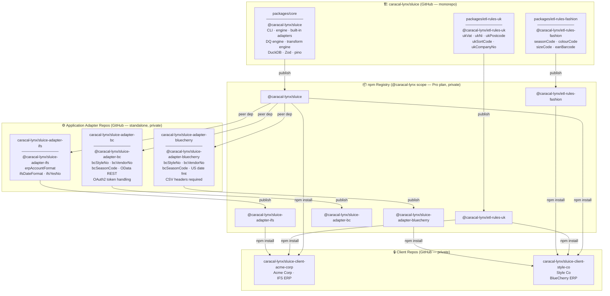
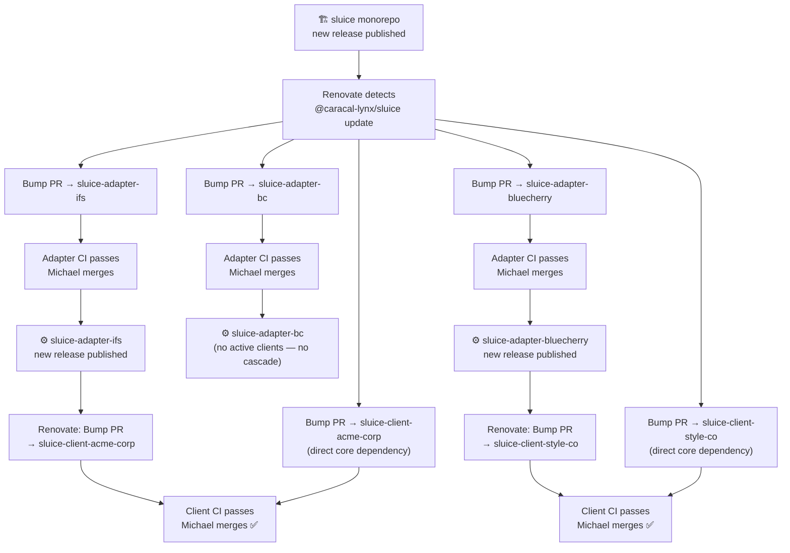
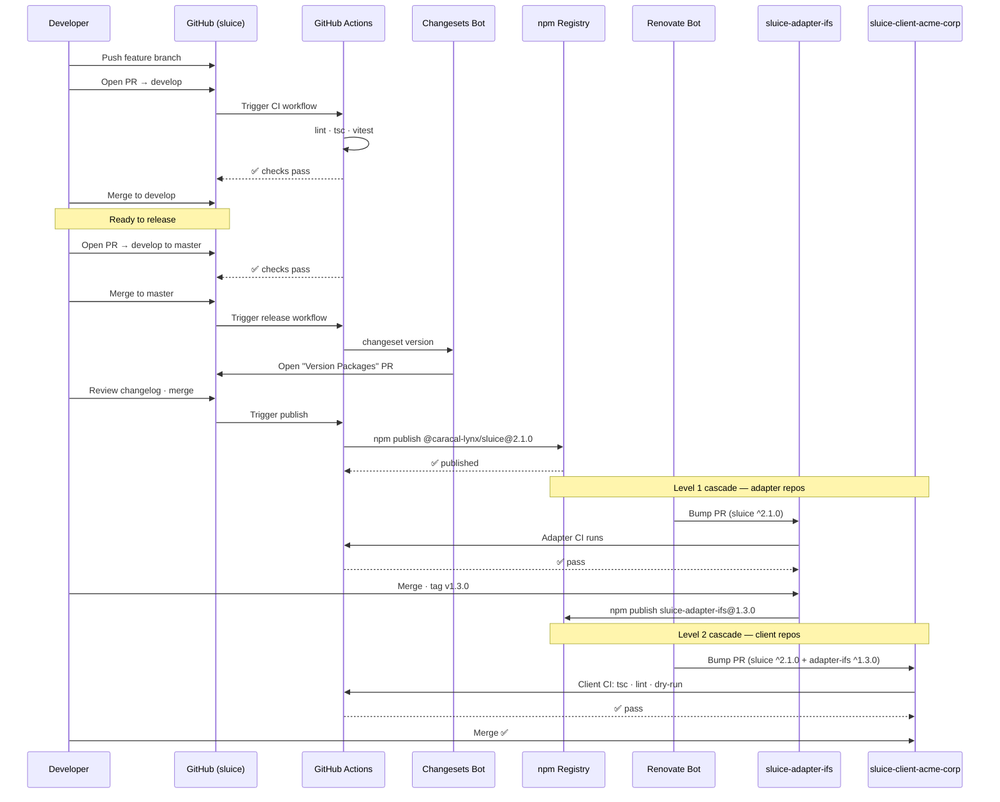
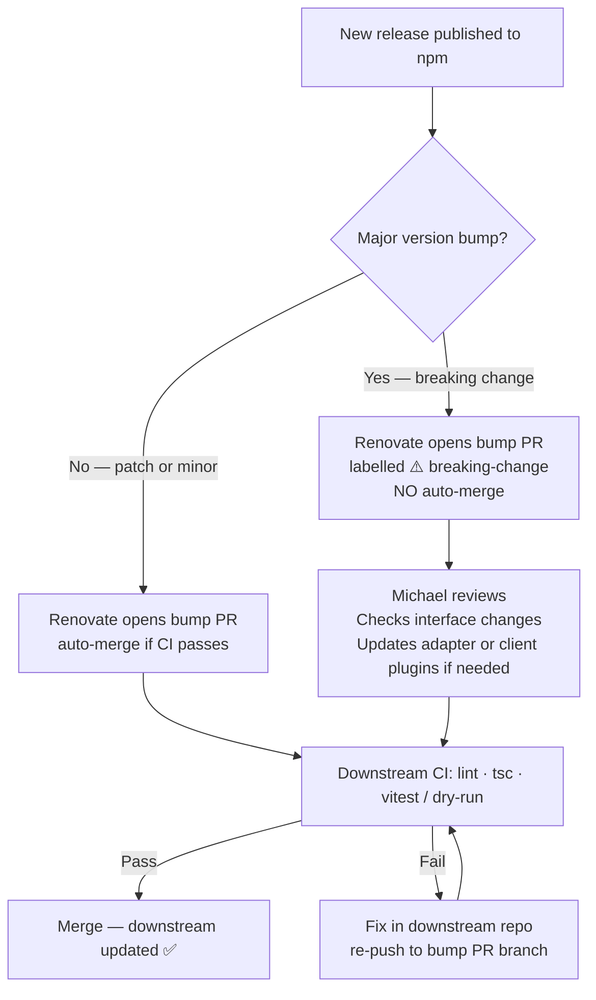
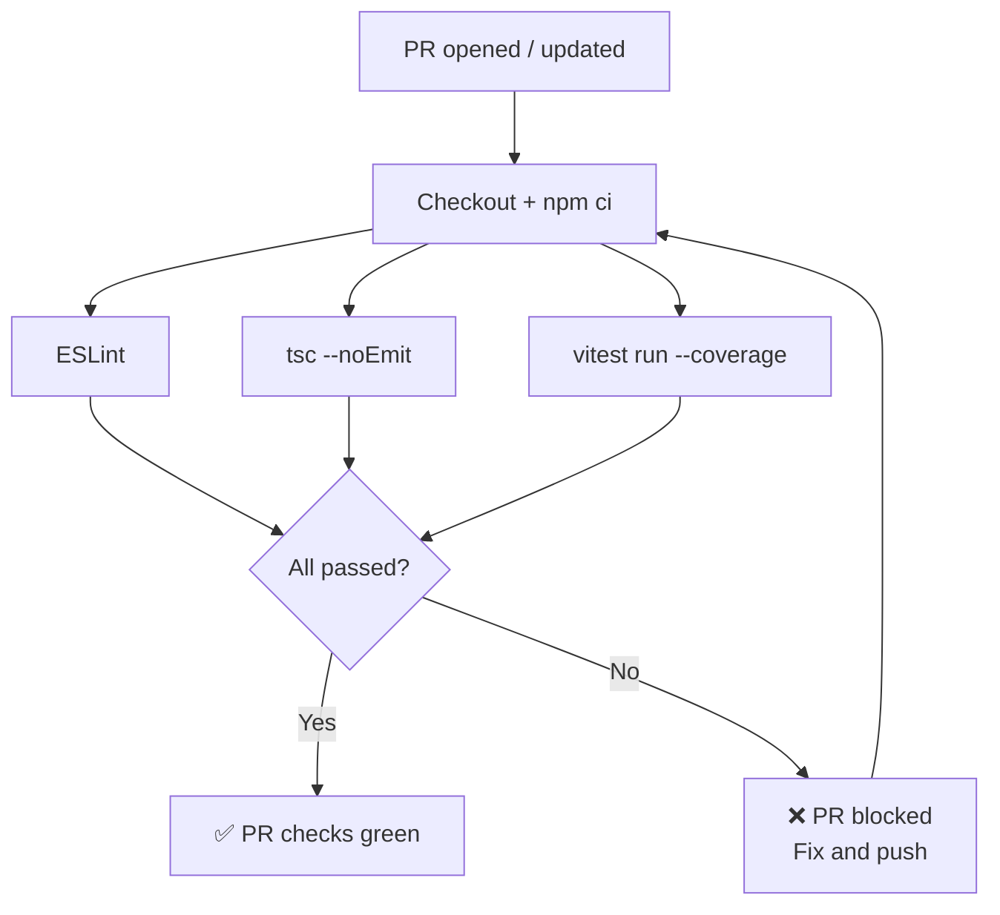
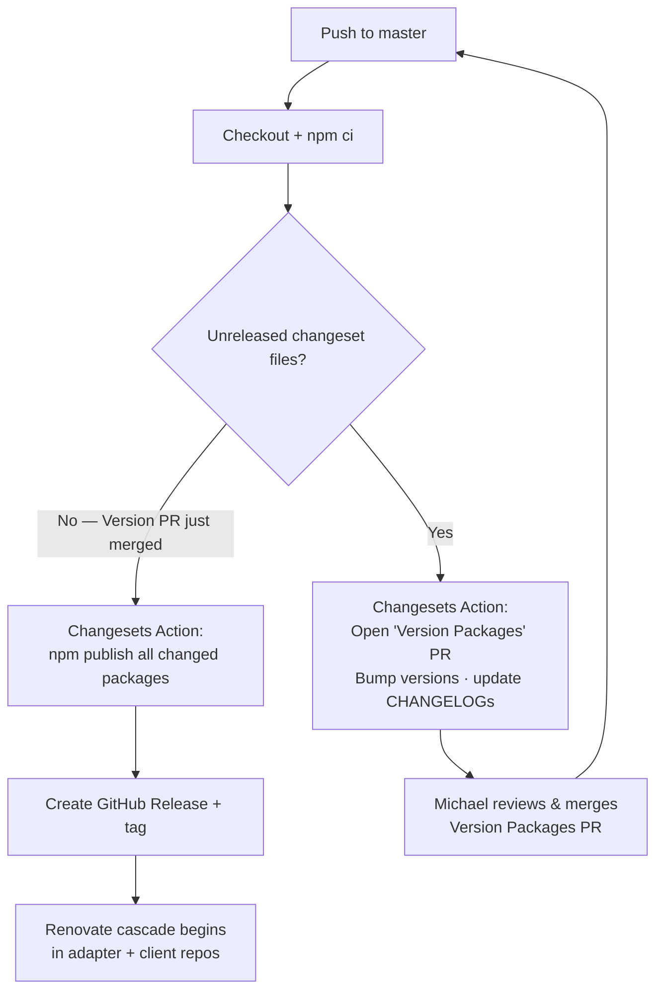
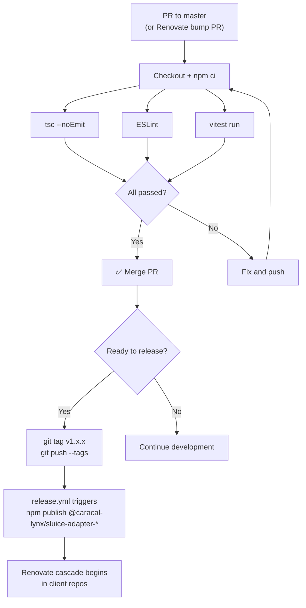
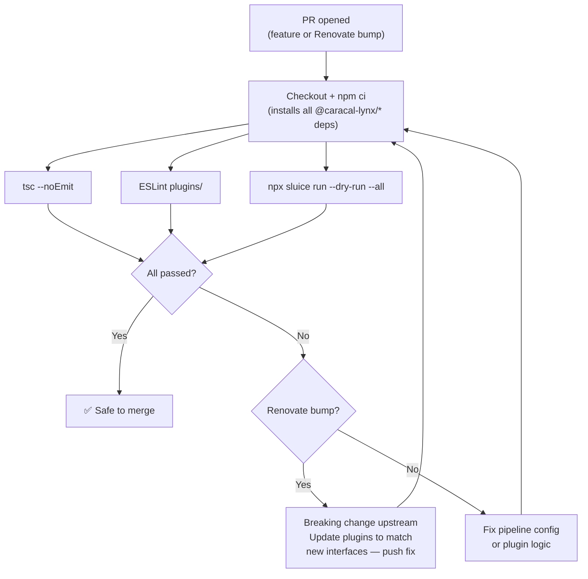
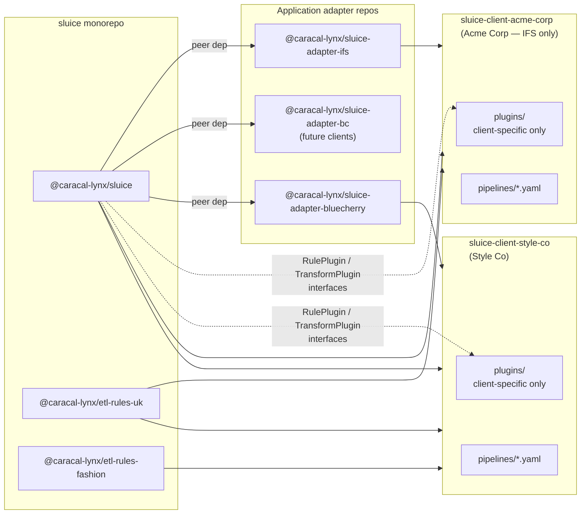
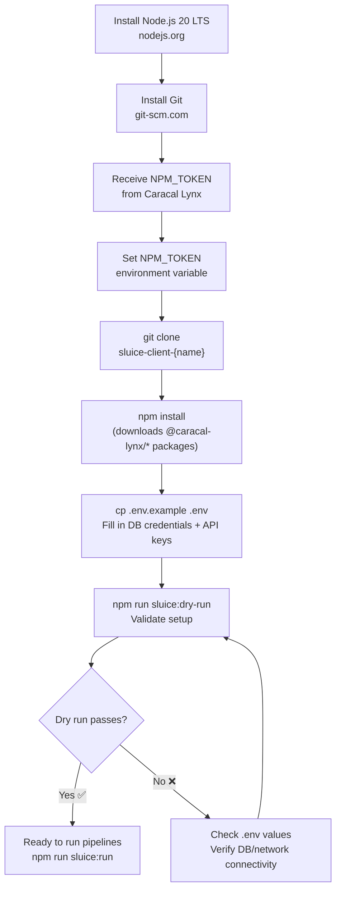

> ⚠️ **STALE — pending Phase 5 rewrite.** This file (`docs/PHASE-05-DEVELOPMENT-WORKFLOW.md`) is the placeholder for the canonical workflow doc. The content below is the pre-Phase-1 version (Node 20, old phase numbering, rule packages incorrectly placed in public monorepo) and must be reauthored during Phase 5 — see [SLUICE-IMPLEMENTATION-PLAN.md §9](SLUICE-IMPLEMENTATION-PLAN.md#9-phase-5--repo-restructure--open-source-launch).
>
> *The content below is retained for reference until Phase 5 supersedes it.*

---

# Sluice — Development Workflow & Implementation Guide

> **Caracal Lynx Limited** | Maintained by Michael Scott  
> Covers: Git/GitHub strategy, npm package publishing, release pipeline, adapter repo management, client repo management, client local setup, and implementation plan.

---

## Contents

1. [Overview](#1-overview)
2. [Repository Architecture](#2-repository-architecture)
3. [npm Package Strategy](#3-npm-package-strategy)
4. [Repository Structure](#4-repository-structure)
5. [Branching Strategy](#5-branching-strategy)
6. [Release Pipeline](#6-release-pipeline)
7. [CI/CD Pipeline](#7-cicd-pipeline)
8. [Client Package Dependencies](#8-client-package-dependencies)
9. [Implementation Plan](#9-implementation-plan)
10. [Tooling Reference](#10-tooling-reference)
11. [Client Local Setup](#11-client-local-setup)

---

## 1. Overview

Sluice is a YAML-controlled ETL and data quality pipeline CLI built in TypeScript. The development workflow separates concerns across four distinct repo types, each with its own release cadence and ownership boundary.

**Key principles:**

- The `sluice` monorepo contains the **core engine** plus all **country- and industry-specific rule/transform packages** — things reusable across many clients regardless of target application
- **Application adapters** (IFS, Business Central, BlueCherry) each live in their own standalone repo, with their own versioning and release cycle independent of the core
- Each **client engagement** lives in its own private GitHub repository, consuming whichever core, rule, and adapter packages it needs
- All packages are published to the **npm registry** under the `@caracal-lynx` scope (Pro plan — private packages)
- **Renovate** monitors the npm registry and automatically opens version-bump PRs downstream when any package is released
- **Changesets** manages versioning and changelogs inside the monorepo; adapter repos use a simpler tag-based release approach
- Breaking changes (major version bumps) require manual review at every downstream boundary

---

## 2. Repository Architecture

The system operates across four layers. The cascade flows top-to-bottom: core changes ripple through adapter repos, then down to client repos.



> **Note:** `@caracal-lynx/sluice-adapter-bc` (Business Central) exists as a maintained adapter available for future client engagements. It is not currently used by any active client.

---

## 3. npm Package Strategy

All packages are published under the `@caracal-lynx` scope to the public npm registry using an **npm Pro plan**, which allows unlimited private packages. No special registry overrides are needed — `npm install` works identically to any other dependency, authenticated via `NPM_TOKEN`.

### Package Catalogue

| Package | Source Repo | Description | Current Consumers |
|---|---|---|---|
| `@caracal-lynx/sluice` | `sluice` monorepo | Core CLI engine, built-in adapters, DQ engine, transform engine | All adapter repos · all client repos |
| `@caracal-lynx/etl-rules-uk` | `sluice` monorepo | UK validation rules: VAT, NI, postcode, sort code, company number | All UK client repos |
| `@caracal-lynx/etl-rules-fashion` | `sluice` monorepo | Fashion industry rules: season, colour, size, EAN barcode | Style Co |
| `@caracal-lynx/sluice-adapter-ifs` | `sluice-adapter-ifs` | IFS ERP format transforms and target adapter | Acme Corp |
| `@caracal-lynx/sluice-adapter-bc` | `sluice-adapter-bc` | Business Central OData REST adapter + format transforms | *(future clients)* |
| `@caracal-lynx/sluice-adapter-bluecherry` | `sluice-adapter-bluecherry` | BlueCherry CSV adapter + US date / header format transforms | Style Co |

> **Naming convention:** `@caracal-lynx/sluice` is the core engine. `@caracal-lynx/etl-rules-*` are reusable rule plugins. `@caracal-lynx/sluice-adapter-*` are full application adapters (target adapter + ERP-specific transforms in one package).

### npm Authentication Setup

One-time setup per developer machine and per CI environment:

```bash
# Authenticate with npm (once per machine)
npm login --scope=@caracal-lynx

# .npmrc at repo root (committed) — scope binding
@caracal-lynx:registry=https://registry.npmjs.org/
//registry.npmjs.org/:_authToken=${NPM_TOKEN}
```

The `NPM_TOKEN` is stored as:
- A **GitHub Actions secret** (`NPM_TOKEN`) in each repo's settings
- A **local environment variable** on developer machines (`~/.bashrc` / `~/.zshrc`)

For **client machines** a read-only token is generated from the `@caracal-lynx` npm org and distributed to the client. See [Section 11 — Client Local Setup](#11-client-local-setup).

---

## 4. Repository Structure

### 4.1 Sluice Monorepo (`caracal-lynx/sluice`)

Contains the core engine and all country- and industry-specific rule/transform packages.

```
sluice/
├── .changeset/                      # Changeset files (one per unreleased change)
│   └── config.json
├── .github/
│   └── workflows/
│       ├── ci.yml                   # Runs on every PR: lint · tsc · vitest
│       └── release.yml              # Runs on merge to master: changeset publish
├── packages/
│   ├── core/                        # @caracal-lynx/sluice
│   │   ├── src/
│   │   │   ├── adapters/            # Built-in source/target adapters
│   │   │   ├── config/              # YAML loader + Zod schemas
│   │   │   ├── dq/                  # DQ engine + built-in rules
│   │   │   ├── plugins/             # Plugin registry + loader (Phase 2)
│   │   │   ├── runner/              # PipelineRunner orchestrator
│   │   │   └── transform/           # Transform engine
│   │   ├── package.json
│   │   └── tsconfig.json
│   ├── etl-rules-uk/                # @caracal-lynx/etl-rules-uk
│   │   ├── src/
│   │   ├── package.json
│   │   └── tsconfig.json
│   └── etl-rules-fashion/           # @caracal-lynx/etl-rules-fashion
│       ├── src/
│       ├── package.json
│       └── tsconfig.json
├── docs/                            # Framework-level documentation
├── package.json                     # Root — workspaces: ["packages/*"]
├── tsconfig.base.json               # Shared TypeScript config
├── .eslintrc.js
└── vitest.config.ts
```

### 4.2 Application Adapter Repo (`caracal-lynx/sluice-adapter-{app}`)

Each ERP application has its own standalone repo. Structure is the same across all three.

```
sluice-adapter-ifs/
├── .github/
│   └── workflows/
│       ├── ci.yml                   # lint · tsc · vitest on every PR
│       └── release.yml              # npm publish on version tag push
├── src/
│   ├── adapter/                     # IFS target adapter implementation
│   ├── transforms/                  # IFS-specific transform plugins
│   │   ├── erpAccountFormat.transform.ts
│   │   ├── ifsDateFormat.transform.ts
│   │   └── ifsYesNo.transform.ts
│   └── index.ts                     # Public exports
├── test/
├── .npmrc                           # npm auth for @caracal-lynx scope
├── package.json                     # peerDependency: @caracal-lynx/sluice
├── tsconfig.json
└── renovate.json                    # Watches for @caracal-lynx/sluice updates
```

> The adapter repo declares `@caracal-lynx/sluice` as a **peer dependency** — it relies on the host client repo supplying the core engine, avoiding duplicate bundling.

### 4.3 Client Repository (`caracal-lynx/sluice-client-{name}`)

Contains YAML pipeline configs, Tier-1 composite rules, any bespoke Tier-2 plugins, and client documentation.

```
sluice-client-acme-corp/
├── .github/
│   └── workflows/
│       └── ci.yml                   # tsc · lint · dry-run on every PR + Renovate bumps
├── pipelines/
│   ├── customers.pipeline.yaml
│   ├── orders.pipeline.yaml
│   ├── products.pipeline.yaml
│   └── shared/
│       └── rules.yaml               # Tier-1 composite rule library
├── plugins/                         # Tier-2 bespoke plugins (not covered by adapter packages)
│   ├── acme-corpAccountCode.rule.ts
│   └── ...
├── docs/                            # Client-facing documentation
├── .env.example                     # Template of required environment variables
├── .npmrc                           # npm auth for @caracal-lynx scope
├── package.json                     # @caracal-lynx/sluice + adapter + rules packages
├── tsconfig.json
└── renovate.json
```

---

## 5. Branching Strategy

### 5.1 Sluice Monorepo Branching

```mermaid
gitGraph
    commit id: "initial"
    branch develop
    checkout develop

    branch feature/phase2-registry
    checkout feature/phase2-registry
    commit id: "add RuleRegistry"
    commit id: "add TransformRegistry"
    checkout develop
    merge feature/phase2-registry id: "merge: phase2 registry"

    branch feature/etl-rules-uk
    checkout feature/etl-rules-uk
    commit id: "ukVatNumber rule"
    commit id: "ukPostcode rule"
    checkout develop
    merge feature/etl-rules-uk id: "merge: etl-rules-uk"

    branch changeset/release
    checkout changeset/release
    commit id: "changeset: bump v2.1.0"
    checkout master
    merge changeset/release id: "release v2.1.0" tag: "v2.1.0"

    checkout develop
    branch hotfix/fix-dq-nullcheck
    checkout hotfix/fix-dq-nullcheck
    commit id: "fix null check in DQ"
    checkout master
    merge hotfix/fix-dq-nullcheck id: "hotfix v2.1.1" tag: "v2.1.1"
    checkout develop
    merge master id: "sync hotfix back"
```

### 5.2 Monorepo Branch Rules

| Branch | Purpose | Protected | PR Required | Who merges |
|---|---|---|---|---|
| `master` | Stable releases only | ✅ | ✅ | Michael |
| `develop` | Integration — all features land here first | ✅ | ✅ | Michael |
| `feature/*` | New functionality, branches from `develop` | ❌ | via develop | Developer |
| `fix/*` | Bug fixes, branches from `develop` | ❌ | via develop | Developer |
| `hotfix/*` | Critical production fixes, branches from `master` | ❌ | via master | Michael |

### 5.3 Adapter and Client Repo Branching

Adapter and client repos use a simpler flat model — no `develop` branch needed:

```
master        ← production; PRs and Renovate bump PRs target this
feature/*     ← new adapter functionality or new pipeline configs
fix/*         ← bug fixes
```

Releases in adapter repos are triggered by **pushing a version tag** (e.g. `git tag v1.2.0 && git push --tags`) rather than using Changesets.

---

## 6. Release Pipeline

### 6.1 Two-Level Cascade

A release in either the monorepo or an adapter repo triggers a downstream cascade. The two levels are independent — an IFS adapter release cascades only to repos that depend on it.



### 6.2 Full Monorepo Release Sequence



### 6.3 Breaking Change Handling



---

## 7. CI/CD Pipeline

### 7.1 Sluice Monorepo CI (`.github/workflows/ci.yml`)

Runs on every PR targeting `develop` or `master`.



### 7.2 Sluice Monorepo Release Workflow (`.github/workflows/release.yml`)



### 7.3 Adapter Repo CI + Release

Adapter repos use a simpler tag-based release — no Changesets needed.



### 7.4 Client Repo CI (`.github/workflows/ci.yml`)

Runs on every PR including Renovate bump PRs.



---

## 8. Client Package Dependencies



---

## 9. Implementation Plan

### Phase 0 — Monorepo Setup (Prerequisite)

> Restructures the existing `sluice` repo into a proper npm workspace monorepo. Must be complete before Phase 2 plugin work begins.

| Step | Task | Detail |
|---|---|---|
| 0.1 | Initialise npm workspaces | Add `"workspaces": ["packages/*"]` to root `package.json` |
| 0.2 | Move core source | Move `src/` → `packages/core/src/`; set `package.json` name to `@caracal-lynx/sluice` |
| 0.3 | Configure Changesets | `npx changeset init`; set `access: restricted` in `.changeset/config.json` |
| 0.4 | Shared TypeScript config | Create `tsconfig.base.json` at root; extend in each package |
| 0.5 | npm Pro plan | Upgrade `caracal-lynx` org on npmjs.com to Pro; create `NPM_TOKEN` secret in GitHub org settings |
| 0.6 | CI workflow | `.github/workflows/ci.yml` — lint · tsc · vitest |
| 0.7 | Release workflow | `.github/workflows/release.yml` — Changesets publish action |
| 0.8 | Branch protection | Protect `master` and `develop`; require PR + CI pass to merge |

### Phase 1 — Rule Package Scaffolding (in monorepo)

> Scaffold the country- and industry-specific rule packages inside the monorepo. Shell structure only — implementation logic comes in Phase 2.

| Step | Task | Detail |
|---|---|---|
| 1.1 | Scaffold `packages/etl-rules-uk` | `package.json` name `@caracal-lynx/etl-rules-uk`; peer dep on `@caracal-lynx/sluice` for `RulePlugin` types |
| 1.2 | Scaffold `packages/etl-rules-fashion` | Same pattern |
| 1.3 | Verify workspace linking | `npm install` from root; confirm cross-package resolution works locally |

### Phase 2 — Core Plugin System (PHASE2-EXTENSIONS.md)

> Implements the three-tier plugin architecture in `packages/core`. Follow the 10-step build order in `PHASE2-EXTENSIONS.md`.

| Step | Task | Detail |
|---|---|---|
| 2.1 | Registry classes | `src/plugins/registry.ts` + `src/plugins/types.ts` — `RuleRegistry` / `TransformRegistry` |
| 2.2 | Composite rule expansion | Extend `src/config/loader.ts` — expand `dq.rulesFile` composites (one level deep) |
| 2.3 | Plugin file loader | `src/plugins/loader.ts` — auto-discover `*.rule.ts` / `*.transform.ts` from `plugins/` |
| 2.4 | DQ engine extension | Pass `RuleRegistry` to `DQEngine` |
| 2.5 | Transform engine extension | Pass `TransformRegistry`; handle `type: custom` + `customOp` |
| 2.6 | Runner wiring | Init registries + load plugins before pipeline execution |
| 2.7 | npm plugin loading | `loadNpmPlugins()` — load packages declared in `sluice.config.yaml` `ToolkitConfig` |
| 2.8 | CLI additions | `sluice plugins` command + `--plugins` flag |
| 2.9 | Rule package implementation | Implement real logic in `packages/etl-rules-uk` and `packages/etl-rules-fashion` |
| 2.10 | Tests | Vitest tests for registry, loader, and each rule package |

### Phase 3 — Application Adapter Repos

> Create the three standalone adapter repos. Each implements its target adapter and ERP-specific transform plugins.

| Step | Task | Detail |
|---|---|---|
| 3.1 | Create `caracal-lynx/sluice-adapter-ifs` | Private GitHub repo; `package.json`, `.npmrc`, `renovate.json`; peer dep on `@caracal-lynx/sluice` |
| 3.2 | Implement IFS adapter | Port IFS target adapter + transforms from current codebase into `src/` |
| 3.3 | IFS CI + release workflow | `.github/workflows/ci.yml` + `release.yml` (tag-triggered publish) |
| 3.4 | Create `caracal-lynx/sluice-adapter-bc` | Same scaffolding; implement BC OData REST + OAuth2 adapter (no active client — for future use) |
| 3.5 | BC CI + release workflow | Same as 3.3 |
| 3.6 | Create `caracal-lynx/sluice-adapter-bluecherry` | Same scaffolding as 3.1 |
| 3.7 | Implement BlueCherry adapter | Port BlueCherry CSV adapter + US date formatting + transforms |
| 3.8 | BlueCherry CI + release workflow | Same as 3.3 |
| 3.9 | Install Renovate on all adapter repos | Watches for `@caracal-lynx/sluice` core updates |

### Phase 4 — Client Repo Extraction

> Extract client-specific configs and plugins from the monorepo into standalone private repos.

| Step | Task | Detail |
|---|---|---|
| 4.1 | Create `caracal-lynx/sluice-client-acme-corp` | Private repo; `package.json` with `@caracal-lynx/sluice` + `etl-rules-uk` + `sluice-adapter-ifs` |
| 4.2 | Migrate Acme Corp pipelines | Copy `clients/acme-corp/` YAML configs → `pipelines/` |
| 4.3 | Migrate Acme Corp plugins | Copy bespoke plugin files → `plugins/` |
| 4.4 | Add `.env.example` to Acme Corp repo | Document all required env vars (DB host, credentials, etc.) |
| 4.5 | Create `caracal-lynx/sluice-client-style-co` | Private repo; `package.json` with `sluice` + `etl-rules-uk` + `etl-rules-fashion` + `sluice-adapter-bluecherry` |
| 4.6 | Migrate Style Co pipelines + plugins | Same pattern as 4.2–4.3 |
| 4.7 | Add `.env.example` to Style Co repo | Document all required env vars |
| 4.8 | Add CI to each client repo | `.github/workflows/ci.yml` — tsc · lint · dry-run |
| 4.9 | Install Renovate on client repos | Watches for all `@caracal-lynx/*` updates |
| 4.10 | Remove `clients/` from monorepo | Clean up after verifying client repos are fully operational |

### Phase 5 — First Production Release

| Step | Task | Detail |
|---|---|---|
| 5.1 | Write changeset for Phase 2 | `npx changeset add` — minor bump; describe plugin system additions |
| 5.2 | Merge Version Packages PR | Review changelog; merge to trigger publish |
| 5.3 | Verify npm publish | Confirm all packages visible on `npmjs.com` under `@caracal-lynx` |
| 5.4 | Tag adapter repos | `git tag v1.0.0` on each adapter repo; verify publish workflows trigger |
| 5.5 | Verify Renovate cascade | Confirm bump PRs appear in adapter repos, then client repos |
| 5.6 | Merge all bump PRs | Review CI output; merge to complete first full cascade |

---

## 10. Tooling Reference

| Tool | Purpose | Config file |
|---|---|---|
| **npm workspaces** | Links monorepo packages locally during development | Root `package.json` `workspaces` field |
| **Changesets** | Version bumps and changelogs for monorepo packages | `.changeset/config.json` |
| **Git tags + release.yml** | Version and publish for standalone adapter repos | `.github/workflows/release.yml` |
| **Renovate** | Auto-opens dependency-bump PRs downstream on new releases | `renovate.json` in each adapter + client repo |
| **GitHub Actions** | CI (lint · tsc · vitest) and release automation | `.github/workflows/*.yml` |
| **Vitest** | Unit and integration testing | `vitest.config.ts` |
| **tsx** | TypeScript execution for CLI and scripts | `package.json` scripts |
| **pino** | Structured logging in the pipeline runner | `packages/core` |
| **Zod v3** | Runtime config validation (YAML schema) | `packages/core` |
| **DuckDB** | Embedded staging store (`stg_raw` → `stg_transformed`) | `packages/core` |
| **expr-eval** | Expression evaluation in transform `expression` fields | `packages/core` |

### Renovate Configuration (`renovate.json`)

Applies to all adapter repos and client repos:

```json
{
  "$schema": "https://docs.renovatebot.com/renovate-schema.json",
  "extends": ["config:base"],
  "packageRules": [
    {
      "matchPackagePrefixes": ["@caracal-lynx/"],
      "groupName": "Sluice packages",
      "labels": ["dependencies", "sluice-update"]
    },
    {
      "matchPackagePrefixes": ["@caracal-lynx/"],
      "matchUpdateTypes": ["patch", "minor"],
      "automerge": true,
      "automergeType": "pr",
      "requiredStatusChecks": ["CI"]
    },
    {
      "matchPackagePrefixes": ["@caracal-lynx/"],
      "matchUpdateTypes": ["major"],
      "automerge": false,
      "labels": ["dependencies", "sluice-update", "breaking-change"]
    }
  ]
}
```

### Changesets Config (`.changeset/config.json`) — monorepo only

```json
{
  "$schema": "https://unpkg.com/@changesets/config/schema.json",
  "changelog": "@changesets/cli/changelog",
  "commit": false,
  "linked": [],
  "access": "restricted",
  "baseBranch": "master",
  "updateInternalDependencies": "patch",
  "ignore": []
}
```

---

## 11. Client Local Setup

This section covers everything a client needs to install and run Sluice pipelines on their own laptop. The client does not need to understand the monorepo structure or the release pipeline — they only interact with their own client repo.

### 11.1 Prerequisites

The client machine needs the following installed before anything else:

| Tool | Version | Download |
|---|---|---|
| **Node.js** | 20 LTS (or later) | https://nodejs.org — use the LTS installer |
| **npm** | Comes with Node.js | (no separate install needed) |
| **Git** | Any recent version | https://git-scm.com |

To verify everything is in place after installation:

```bash
node --version    # should print v20.x.x or higher
npm --version     # should print 10.x.x or higher
git --version     # should print git version 2.x.x or higher
```

### 11.2 npm Authentication

All `@caracal-lynx` packages are private. The client needs a read-only npm access token to install them. Caracal Lynx generates this token from the `@caracal-lynx` npm organisation and provides it to the client — **the client does not need their own npm account**.

**Caracal Lynx generates the token (one-time, per client):**

1. Log in to npmjs.com as `caracal-lynx`
2. Go to **Access Tokens** → **Generate New Token** → **Granular Access Token**
3. Set: read-only access, scoped to the `@caracal-lynx` org
4. Copy the token and send it to the client securely (e.g. via 1Password share link or encrypted email)

**Client configures the token on their machine (one-time):**

```bash
# On Windows (PowerShell) — adds to your user profile permanently
[System.Environment]::SetEnvironmentVariable("NPM_TOKEN", "npm_xxxxxxxxxxxx", "User")

# On macOS / Linux — add to ~/.zshrc or ~/.bashrc
echo 'export NPM_TOKEN=npm_xxxxxxxxxxxx' >> ~/.zshrc
source ~/.zshrc
```

Then create (or confirm the existence of) a `.npmrc` file in the client repo root. This file is already committed to the repo — the client does not need to create it themselves:

```ini
# .npmrc (committed to the client repo — do not edit)
@caracal-lynx:registry=https://registry.npmjs.org/
//registry.npmjs.org/:_authToken=${NPM_TOKEN}
```

The `${NPM_TOKEN}` is read from the environment variable set above. The actual token value is **never committed to the repo**.

### 11.3 Cloning and Installing

```bash
# 1. Clone the client repo (replace acme-corp with the correct client name)
git clone https://github.com/caracal-lynx/sluice-client-acme-corp.git
cd sluice-client-acme-corp

# 2. Install all dependencies (this pulls @caracal-lynx/* packages from npm)
npm install

# 3. Verify the sluice CLI is available
npx sluice --version
```

`npm install` will download `@caracal-lynx/sluice` and all required adapter and rules packages into `node_modules/`. The `sluice` CLI is available via `npx sluice` — no global install is needed or recommended.

### 11.4 Environment Configuration

Sluice reads database credentials and other secrets from environment variables, never from YAML files. The client repo contains a `.env.example` file listing every variable required. The client copies this to `.env` and fills in their values.

```bash
# Copy the template
cp .env.example .env

# Open in any text editor and fill in your values
notepad .env        # Windows
open -a TextEdit .env   # macOS
```

A typical `.env.example` for a MSSQL → IFS pipeline looks like this:

```ini
# .env.example — copy to .env and fill in values
# .env is gitignored and must NEVER be committed

# Source database (MSSQL)
MSSQL_HOST=your-server.database.windows.net
MSSQL_PORT=1433
MSSQL_DATABASE=your_database_name
MSSQL_USER=your_username
MSSQL_PASSWORD=your_password

# IFS target (if using IFS REST adapter)
IFS_BASE_URL=https://your-ifs-instance.example.com
IFS_API_KEY=your_ifs_api_key

# Output directory for run results, rejection CSVs, and state files
SLUICE_OUTPUT_DIR=./output
```

> **Important:** The `.env` file contains passwords and API keys. It is listed in `.gitignore` and must never be committed to the repository or shared by email.

### 11.5 Running Pipelines

Once the `.env` is configured, the client can run pipelines using the `sluice` CLI:

```bash
# Dry run — validates config and simulates execution without writing any output
npx sluice run --dry-run --all

# Run a single pipeline
npx sluice run pipelines/customers.pipeline.yaml

# Run all pipelines in sequence
npx sluice run --all

# Run all pipelines and write output to a specific directory
npx sluice run --all --output ./output/2026-04-27

# List all available pipelines in the repo
npx sluice list
```

The client repo's `package.json` includes convenience scripts so the client can use `npm run` instead of typing `npx sluice` each time:

```json
{
  "scripts": {
    "sluice:dry-run":  "sluice run --dry-run --all",
    "sluice:run":      "sluice run --all",
    "sluice:list":     "sluice list",
    "sluice:validate": "sluice validate --all"
  }
}
```

```bash
# Equivalent shorthand commands
npm run sluice:dry-run
npm run sluice:run
npm run sluice:list
npm run sluice:validate
```

### 11.6 Output Files

After a run, Sluice writes the following to the configured output directory:

| File | Description |
|---|---|
| `{pipeline-name}-state.json` | Run summary: row counts, duration, status (passed / failed) |
| `{pipeline-name}-rejections.csv` | Rows that failed DQ validation, with the rule that rejected each row |
| `{pipeline-name}-dq-summary.json` | Aggregated DQ statistics: pass rate, failure counts per rule |

```bash
output/
├── customers-state.json
├── customers-rejections.csv
├── customers-dq-summary.json
├── orders-state.json
└── ...
```

### 11.7 Updating Sluice

When Caracal Lynx releases a new version of Sluice, the client repo will receive an automatic pull request via Renovate (or Caracal Lynx will send the client a notification). To apply the update:

```bash
# Pull the latest changes from the repo (after the bump PR has been merged)
git pull

# Re-install dependencies to get the new version
npm install

# Run a dry-run to confirm the update didn't break anything
npm run sluice:dry-run
```

The client does not need to manually change any version numbers — that is handled by the automated release pipeline.

### 11.8 Local Setup Flow



---

*Document maintained by Caracal Lynx Limited. Update this file when workflow decisions change.*
