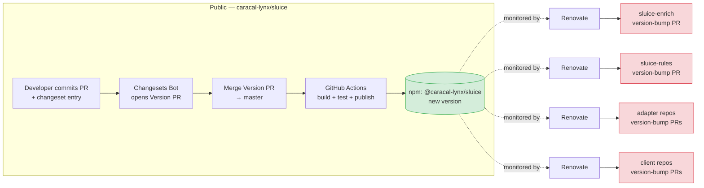

# Sluice — Phase 7: git/npm Workflow (Spec)

> ✅ **Status: COMPLETE — shipped 5 May 2026.** First Changesets-managed release `@caracal-lynx/sluice@0.1.3` published to npm with SLSA v1 provenance. Six PRs landed: [#29](https://github.com/caracal-lynx/sluice/pull/29) · [#31](https://github.com/caracal-lynx/sluice/pull/31) · [#33](https://github.com/caracal-lynx/sluice/pull/33) · [#34](https://github.com/caracal-lynx/sluice/pull/34) · [#35](https://github.com/caracal-lynx/sluice/pull/35) · [#36](https://github.com/caracal-lynx/sluice/pull/36). See the **Closing changelog** at the bottom of this document for deviations from the original spec and known follow-ups. The body of the spec below is retained verbatim as an implementation reference.
>
> **Owner:** Caracal Lynx Ltd. · Michael Scott
> **Estimated effort (planned vs. actual):** 1–2 weeks planned · ~2 hours actual (5 May 2026)
> **Master plan reference:** [SLUICE-IMPLEMENTATION-PLAN.md §11](./SLUICE-IMPLEMENTATION-PLAN.md#11-phase-7--gitnpm-workflow)

---

## Context

After Phase 5, the Sluice ecosystem is split across at least seven npm packages and at least seven GitHub repositories:

| Tier | Packages |
|---|---|
| Public core | `@caracal-lynx/sluice` |
| Private services | `@caracal-lynx/sluice-enrich`, `@caracal-lynx/sluice-mcp` |
| Private rules | `@caracal-lynx/etl-rules-uk`, `@caracal-lynx/etl-rules-fashion` |
| Private adapters | `@caracal-lynx/sluice-adapter-ifs`, `-bc`, `-bluecherry` |
| Private client repos | `sluice-client-acme-corp`, `sluice-client-style-co` |

Without automation, a patch to the core (e.g. a security fix in `axios`) requires manual version bumps in every downstream package and every client repo. That is unsustainable for a two-person consultancy.

Phase 7 wires up the **dependency cascade**: a release of `@caracal-lynx/sluice` automatically opens version-bump PRs in every downstream repo. Changesets handles versioning and changelog generation; GitHub Actions handles publication; Renovate handles propagation.

---

## Goals & non-goals

### Goals

- **Changesets** in the public `caracal-lynx/sluice` repo: developers add a `.changeset` per PR, the bot opens a "Version Packages" PR, merging that PR triggers a release.
- **Automated npm publish** on master merge: the publish workflow runs only when a changeset is present, builds, tests, and publishes with `--access public`.
- **Renovate** running in every downstream repo: monitors `@caracal-lynx/sluice` (and other `@caracal-lynx/*` packages where relevant), opens version-bump PRs.
- **Tested cascade**: a patch bump to core surfaces as a Renovate PR in `sluice-enrich` within 24 hours.
- **Breaking-change policy** documented and enforced: Renovate is `automerge: false` for major bumps; downstream maintainers manually review.

### Non-goals (deferred)

- Release calendar / cadence policy → out of scope; let Changesets dictate release timing.
- Custom changelog formatting beyond Changesets defaults → leave the default rendering.
- Slack / Teams release announcements → out of scope; if wanted later, add via a separate GitHub Action.
- Multi-version support / LTS branches → Sluice is single-active-version. Don't build infrastructure we don't need.
- Public `sluice-mcp` releases → MCP server is delivered to clients privately; doesn't go through this cascade until/unless that changes.

---

## Prerequisites (must be true before starting Phase 7)

| # | Prerequisite | Owned by | Verify with |
|---|---|---|---|
| 1 | Phase 5 complete; `caracal-lynx/sluice` is public on GitHub and `@caracal-lynx/sluice` is published to npm | Phase 5 | `npm view @caracal-lynx/sluice version` |
| 2 | Phase 5 hygiene files in place (`LICENSE`, `CONTRIBUTING.md`, etc.) | Phase 5 | `ls LICENSE CONTRIBUTING.md` |
| 3 | All private repos exist in the post-Phase-5 layout (`sluice-enrich`, `sluice-rules`, adapter repos, client repos) | Phase 5 / pre-Phase-5 | `gh repo list caracal-lynx --json name,visibility` |
| 4 | npm publish access for `@caracal-lynx` org confirmed | Phase 0 | `npm whoami && npm access list packages @caracal-lynx` |
| 5 | Renovate GitHub App installed at the org level (`caracal-lynx`) | **This phase** | https://github.com/organizations/caracal-lynx/settings/installations |
| 6 | An `NPM_TOKEN` secret available to the publish workflow (org-level secret, automation token with publish scope) | **This phase** | `gh secret list --org caracal-lynx` |

---

## Cascade architecture



---

## Component 1 — Changesets in `caracal-lynx/sluice`

### Files added

| File | Purpose |
|---|---|
| `.changeset/config.json` | Changesets configuration |
| `.changeset/README.md` | Brief explainer for contributors |
| `.github/workflows/release.yml` | Publish workflow triggered on master |
| `.github/PULL_REQUEST_TEMPLATE.md` | Update to remind contributors to add a changeset |

### `.changeset/config.json`

```json
{
  "$schema": "https://unpkg.com/@changesets/config@3.0.0/schema.json",
  "changelog": "@changesets/cli/changelog",
  "commit": false,
  "fixed": [],
  "linked": [],
  "access": "public",
  "baseBranch": "master",
  "updateInternalDependencies": "patch",
  "ignore": []
}
```

Key settings:
- `"baseBranch": "master"` — matches the existing branch convention.
- `"access": "public"` — instructs the publish step that this is a public package.
- `"commit": false` — Changesets won't auto-commit; the release workflow handles that.

### `package.json` script additions

```json
{
  "scripts": {
    "changeset": "changeset",
    "version": "changeset version && npm install --package-lock-only",
    "release": "npm run build && changeset publish"
  }
}
```

### Dev dependency

```bash
npm install -D @changesets/cli @changesets/changelog-github
```

### Contributor flow

1. Developer makes a code change and opens a PR.
2. Developer runs `npm run changeset` locally → answers prompts → commits the generated `.changeset/<random-name>.md`.
3. PR template asks "Have you added a changeset?" — link to docs explaining when one isn't needed (docs-only PRs, CI-only PRs).
4. Changesets bot watches master. When changesets accumulate, the bot opens a "Version Packages" PR that consumes them and bumps `package.json`.
5. Maintainer reviews and merges the Version PR.
6. Release workflow triggers on the master merge → publishes to npm.

---

## Component 2 — Publish workflow (`release.yml`)

```yaml
name: Release

on:
  push:
    branches: [master]

concurrency:
  group: release-${{ github.ref }}
  cancel-in-progress: false

jobs:
  release:
    name: Release
    runs-on: ubuntu-latest
    permissions:
      contents: write
      pull-requests: write
      id-token: write   # for npm provenance
    steps:
      - uses: actions/checkout@v4
        with:
          fetch-depth: 0

      - uses: actions/setup-node@v4
        with:
          node-version: '24'
          cache: 'npm'
          registry-url: 'https://registry.npmjs.org'

      - run: npm ci
      - run: npm run build
      - run: npm test

      - name: Create release PR or publish
        uses: changesets/action@v1
        with:
          publish: npm run release
          version: npm run version
          commit: 'chore(release): version packages'
          title: 'chore(release): version packages'
        env:
          GITHUB_TOKEN: ${{ secrets.GITHUB_TOKEN }}
          NPM_TOKEN: ${{ secrets.NPM_TOKEN }}
          NPM_CONFIG_PROVENANCE: true
```

**Key points:**
- `id-token: write` and `NPM_CONFIG_PROVENANCE: true` enable npm provenance attestations — free supply-chain signal that the package was built from this exact commit on GitHub Actions.
- The Changesets action handles both modes: if changesets exist, it opens a Version PR; if a Version PR was just merged, it publishes.
- `concurrency` prevents two releases from racing.

---

## Component 3 — Renovate configuration (downstream repos)

Each private downstream repo gets a `renovate.json`. The Renovate GitHub App must be installed at the org level (Prerequisite #5).

### `sluice-enrich/renovate.json`

```json
{
  "$schema": "https://docs.renovatebot.com/renovate-schema.json",
  "extends": ["config:recommended", ":semanticCommits"],
  "schedule": ["before 9am on monday"],
  "timezone": "Europe/London",
  "labels": ["dependencies"],
  "packageRules": [
    {
      "matchPackagePatterns": ["^@caracal-lynx/"],
      "groupName": "@caracal-lynx packages",
      "automerge": false
    },
    {
      "matchUpdateTypes": ["patch"],
      "matchPackagePatterns": ["^@caracal-lynx/"],
      "automerge": true,
      "automergeType": "branch"
    },
    {
      "matchUpdateTypes": ["major"],
      "automerge": false,
      "addLabels": ["major-bump"]
    }
  ]
}
```

**Policy:**
- `@caracal-lynx/*` patch bumps automerge.
- `@caracal-lynx/*` minor bumps open a PR for human review.
- Any major bump (Caracal Lynx or external) requires manual review and gets a `major-bump` label.

### `sluice-rules/renovate.json`

Identical to `sluice-enrich/renovate.json` — same policy.

### Adapter repos (`sluice-adapter-{ifs,bc,bluecherry}/renovate.json`)

Same template. The `@caracal-lynx/sluice` dependency is a peer dep for adapters; Renovate handles peer deps the same as regular deps.

### Client repos (`sluice-client-{acme-corp,style-co}/renovate.json`)

Same template, but client repos consume *all* `@caracal-lynx/*` packages, so the cascade is wider:

```json
{
  "extends": ["config:recommended", ":semanticCommits"],
  "schedule": ["before 9am on monday"],
  "timezone": "Europe/London",
  "labels": ["dependencies"],
  "packageRules": [
    {
      "matchPackagePatterns": ["^@caracal-lynx/"],
      "groupName": "@caracal-lynx packages",
      "automerge": false,
      "schedule": ["before 9am on monday"]
    },
    {
      "matchUpdateTypes": ["patch"],
      "matchPackagePatterns": ["^@caracal-lynx/"],
      "automerge": true,
      "automergeType": "pr"
    },
    {
      "matchUpdateTypes": ["major"],
      "automerge": false,
      "addLabels": ["major-bump", "client-impact"]
    }
  ]
}
```

`client-impact` label flags major bumps that need explicit client engagement before applying.

---

## Step-by-step execution checklist (hand to Claude Code)

> Run these sequentially. Stop at any step that doesn't pass its verification.

### Stage A — Setup (~1 day)

1. **Verify Prerequisites #1–#6.** If any fail, halt.
2. **Install Renovate GitHub App** at the `caracal-lynx` org level. Verify it's installed by visiting org settings.
3. **Create `NPM_TOKEN` secret** at the org level (or repo level for `caracal-lynx/sluice`). Use an npm automation token with publish scope only (not classic).

### Stage B — Changesets in `caracal-lynx/sluice` (~half day)

4. `cd` into the public sluice repo.
5. `npm install -D @changesets/cli @changesets/changelog-github`
6. `npx changeset init` — generates `.changeset/config.json` and `.changeset/README.md`.
7. Edit `.changeset/config.json` per the template above (`baseBranch: "master"`, `access: "public"`).
8. Add the three scripts (`changeset`, `version`, `release`) to `package.json`.
9. Update `.github/PULL_REQUEST_TEMPLATE.md` to add a "Have you added a changeset?" checkbox.
10. Commit and open PR; merge.

### Stage C — Publish workflow (~half day)

11. Add `.github/workflows/release.yml` per the template above.
12. **Sanity-check by running a deliberate patch release**: create a minor changelog-worthy change (e.g. README typo fix), add a changeset, merge to master, watch for the Version PR, merge that, watch for the npm publish.
13. Verify on npmjs.com: new version live, provenance attestation visible.

### Stage D — Renovate in private repos (~3–5 days, parallelisable)

For each of: `sluice-enrich`, `sluice-rules`, `sluice-adapter-ifs`, `sluice-adapter-bc`, `sluice-adapter-bluecherry`, `sluice-client-acme-corp`, `sluice-client-style-co`:

14. Add `renovate.json` per the appropriate template above.
15. Commit to master.
16. Within 24 hours of step 14, verify Renovate's onboarding PR appears in the repo. Merge it.
17. Verify Renovate dashboard issue is created (Renovate auto-creates one).

### Stage E — Cascade verification (~1 day, end-to-end test)

18. Cut a deliberate patch release of `@caracal-lynx/sluice` (a no-op change like a comment update — anything that produces a real version bump).
19. Within 24 hours, expect Renovate PRs to appear in `sluice-enrich`, `sluice-rules`, all adapter repos, and all client repos.
20. Spot-check a couple: confirm the version bump is correct, confirm CI passes on the Renovate PR.
21. Merge or close the test cascade PRs.

### Stage F — Documentation

22. Add a section to `docs/PHASE-05-DEVELOPMENT-WORKFLOW.md` (or its successor) documenting the cascade for future maintainers.
23. Update root `CONTRIBUTING.md` to document the changeset workflow for external contributors.

---

## Verification / done criteria

### From the master plan ([§11 Success Criteria](./SLUICE-IMPLEMENTATION-PLAN.md#11-phase-7--gitnpm-workflow))

- [ ] Changesets configured in `caracal-lynx/sluice`
- [ ] CI publish workflow working (test with a patch release)
- [ ] Renovate running on `sluice-enrich`, `sluice-rules`, adapter repos, and client repos
- [ ] Test cascade: patch bump to core → Renovate PR appears in sluice-enrich within 24h

### Additions from this spec

- [ ] npm provenance attestations live (visible on the npmjs.com package page)
- [ ] PR template enforces changeset awareness
- [ ] `NPM_TOKEN` is an automation token (not classic), scoped to publish only
- [ ] Major-bump policy documented in `CONTRIBUTING.md`
- [ ] Renovate dashboard issue exists in every downstream repo
- [ ] End-to-end cascade test: a patch to core surfaces Renovate PRs in all 7 downstream repos within 24 hours

---

## Open questions / risks

| # | Item | Risk | Mitigation |
|---|---|---|---|
| Q1 | Renovate noise | A weekly cadence across 7 repos can flood inboxes | Schedule defined as "before 9am on monday" — single weekly window |
| Q2 | Major-bump fan-out | A major bump to `@caracal-lynx/sluice` lands in 6+ downstream repos; co-ordinating updates becomes manual | Documented policy: major bumps are pre-announced via a tracking issue in `caracal-lynx/sluice`; downstream maintainers update sequentially |
| Q3 | npm token leakage | An NPM_TOKEN with publish scope is a real secret | Use automation token (revocable, narrowly scoped); store as org-level secret; rotate annually |
| Q4 | Provenance + private packages | Provenance only works for public packages on npm | Apply only to `@caracal-lynx/sluice`; private packages don't get provenance (npm limitation) |
| Q5 | Client repo auto-merge of patch bumps | A patch bump that breaks a client pipeline gets auto-merged before anyone notices | Client repos should have CI that runs `sluice check` against all their pipeline YAMLs — auto-merge only succeeds if CI passes |
| Q6 | Two-person team capacity | One person reviewing 7 repos' worth of Renovate PRs each week is still work | Acceptable — but if it becomes a burden, raise the patch-bump auto-merge threshold (only patch + non-`@caracal-lynx`) |

---

## Document inventory updates required

When this spec is created, update [SLUICE-IMPLEMENTATION-PLAN.md §16 Document Inventory](./SLUICE-IMPLEMENTATION-PLAN.md#16-document-inventory) to add a row for this file. Also update §11 of the master plan to reference this spec instead of `docs/PHASE-05-DEVELOPMENT-WORKFLOW.md` (which is a placeholder and currently the only thing §11 points at).

---

## Closing changelog (5 May 2026 — execution notes)

This section records what actually happened during execution and where reality deviated from the spec. The body above is retained as-written for traceability; the items below override or supplement it.

### What shipped

| PR | What | Stage |
|---|---|---|
| [#29](https://github.com/caracal-lynx/sluice/pull/29) | Changesets bootstrap + `@changesets/changelog-github` renderer + PR template + `CONTRIBUTING.md` update | B |
| [#31](https://github.com/caracal-lynx/sluice/pull/31) | `docs/templates/renovate-downstream{,client}.json` reference templates | D (templates) |
| [#33](https://github.com/caracal-lynx/sluice/pull/33) | `release.yml` initial publish workflow with `NPM_TOKEN` (later replaced — see #36) | C |
| [#34](https://github.com/caracal-lynx/sluice/pull/34) | First doc-fix release trigger: README paid-services email change with attached `patch` changeset | E.1 |
| [#35](https://github.com/caracal-lynx/sluice/pull/35) | Version Packages PR for `0.1.3` (opened manually — see deviation 5 below) | E.2 |
| [#36](https://github.com/caracal-lynx/sluice/pull/36) | **Switch from `NPM_TOKEN` to npm Trusted Publishing (OIDC)** + add `workflow_dispatch:` trigger | E.3 unblock |

### Deviations from the spec

1. **Real client repo names instead of placeholders.** Stage 0.3 created `sluice-client-cochran` and `sluice-client-eribe` rather than the spec's `sluice-client-acme-corp` / `sluice-client-style-co`. The placeholder names exist only in the public `caracal-lynx/sluice` repo (per the 2026-05-04 client-name scrub); the private client repos use real client names. Memory: [`project_client_name_mapping.md`](../../../Users/MichaelScott/.claude/projects/C--Dev-Projects-TypeScript-sluice/memory/project_client_name_mapping.md).

2. **Mend Renovate runs in Interactive mode** under the Community (Free) tier. The spec assumes Renovate auto-posts PRs; in practice updates queue on the Mend dashboard at <https://developer.mend.io/github/caracal-lynx> and require user approval before reaching GitHub. **Stage E.4 cascade verification is therefore deferred** — when the user approves the 7 pending `@caracal-lynx/sluice@^0.1.3` updates on the dashboard, the cascade fires across `sluice-enrich`, `sluice-rules`, three adapter repos, and the two client repos.

3. **`NPM_TOKEN` model superseded by Trusted Publishing.** The original spec called for a Classic Automation token. npm retired Classic tokens in November 2025. Three subsequent attempts using granular access tokens (package-scoped, scope-scoped, and bypass-2FA-attempted) all returned `404 Not Found - PUT /@caracal-lynx%2fsluice` because the user's account 2FA setting is *"Enabled for authorization and publishing"* and granular tokens cannot bypass that in the current npm UI. PR #36 switched to **npm Trusted Publishing (OIDC)** — the package's [Trusted Publishers list](https://www.npmjs.com/package/@caracal-lynx/sluice/access) authorises this repo + `release.yml` directly; no stored `NPM_TOKEN` secret is referenced or required. SLSA v1 provenance is preserved.

4. **`workflow_dispatch:` trigger added** to `release.yml` in PR #36 so manual reruns work via `gh workflow run release.yml -R caracal-lynx/sluice`. Useful for debug runs and out-of-cadence releases without needing an artificial commit.

5. **GitHub Actions PR-creation setting still needs enabling.** The first run of the release workflow against a changeset-bearing master successfully bumped the version, generated the CHANGELOG, and pushed the `changeset-release/master` branch — but failed at the *create PR* step with `HttpError: GitHub Actions is not permitted to create or approve pull requests`. PR #35 was therefore opened manually. **Future improvement:** toggle the setting at <https://github.com/caracal-lynx/sluice/settings/actions> → Workflow permissions → "Allow GitHub Actions to create and approve pull requests" so subsequent Version PRs land without intervention. Non-blocking; one-time setting change.

### Stacked-PR squash hazard (worked around)

PRs #29 → #30 → #31 were originally stacked: each based on the previous branch. When #29 squash-merged, GitHub deleted the `chore/phase-7-changesets` branch, which auto-closed #30 (its base no longer existed). Recovery: rebased the dependent branches onto the new master with `git rebase --onto master <old-base>`, force-pushed, then opened a fresh PR (#33) to replace #30 (closed PRs cannot be reopened with a different base). #31 was retargetable because it was still open at the time. Lesson for future stacked work: merge stacked PRs in dependency order *back-to-front* (templates first, release.yml second, Changesets third) — or use rebase-merge instead of squash-merge to preserve branch tips.

### Verification artefacts

- `npm view @caracal-lynx/sluice version` → `0.1.3`
- `npm view @caracal-lynx/sluice@0.1.3 dist.attestations` → `{ predicateType: 'https://slsa.dev/provenance/v1', url: 'https://registry.npmjs.org/-/npm/v1/attestations/@caracal-lynx%2fsluice@0.1.3' }`
- Release workflow run [25370737188](https://github.com/caracal-lynx/sluice/actions/runs/25370737188) — completed/success on the OIDC-authenticated path

---

*Caracal Lynx Ltd. — SC826823 — Gretna, Scotland*
*"Clean data flows through."*
