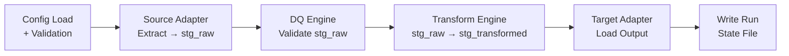

# Sluice — GitHub Pages Strategy

> **Context:** When `sluice-core` goes public (Phase 5 of the implementation plan), GitHub Pages becomes the product's front door. This document covers what to include and a full site structure with page-by-page content outlines.
>
> **Status:** Planned for Phase 7. See `SLUICE-IMPLEMENTATION-PLAN.md` for sequencing.

---

## What to Put in GitHub Pages

Think of it in two layers: **what you need** and **what makes it shine**.

### The Essentials

- A landing page that explains what Sluice is and why someone would use it
- A quickstart guide (install → write first YAML → run `sluice run`)
- Full documentation of the YAML pipeline schema — every key, every adapter, every DQ rule

The schema doc is your biggest asset because it's what developers will be searching for when they're stuck.

### What Elevates It

- A **live YAML schema reference** auto-generated from your Zod schemas — almost free since you have them already
- A **"how it works" architecture page** with a Mermaid diagram of the pipeline phases — appeals to the technical audience you're targeting
- A **changelog / release notes page** — signals the project is actively maintained, which matters more than people think

### For a Consultancy Specifically

- A *Use Cases* page covering the range of data migration scenarios Sluice supports — not limited to ERP (no client names)
- A *Commercial Support* page making it clear Caracal Lynx builds and supports this — GitHub Pages is a quiet but effective lead-generation channel

### Tooling Recommendation

| Tool | Notes |
|------|-------|
| **VitePress** | Current favourite for TypeScript project docs. Fast, Markdown-based, deploys to GitHub Pages trivially. |
| **Astro** | Also excellent — you're already familiar with it, so zero learning curve. |
| **TypeDoc** | Auto-generates API docs from TypeScript source. Near-free given your codebase. |

> **The single most important page:** the **Quickstart**. If someone can go from `npm install -g @caracal-lynx/sluice` to a working pipeline run in under 10 minutes, you'll get stars. If they can't, they'll leave.

---

## Site Structure

```
sluice docs/
├── Home (landing page)
├── Getting Started
│   ├── Installation
│   ├── Quickstart
│   └── Core Concepts
├── Pipeline Reference
│   ├── Pipeline YAML Schema
│   ├── Source Adapters
│   ├── Target Adapters
│   ├── Data Quality Rules
│   └── Transform Types
├── Guides
│   ├── Data Migration Patterns
│   ├── Writing a Pipeline YAML
│   ├── Using the Plugin System (Phase 2)
│   └── CI/CD Integration
├── Architecture
│   ├── How It Works
│   └── Extension Points (Phase 2)
├── Use Cases
├── API Reference (TypeDoc)
├── Changelog
└── Commercial Support
```

---

## Page-by-Page Content Outline

---

### Home (Landing Page)

**Goal:** Grab attention, explain the value proposition, and funnel visitors to the Quickstart.

**Content:**
- Hero: **elevator pitch** — lead with the problem (data quality is the hidden blocker for both migrations and AI adoption), the solution ("Sluice is a data migration and data quality tool that validates your data before it reaches its destination — not after"), and the value proposition ("Clean data flows through."). Use the full 30-second pitch: you tell it where the data comes from, the quality rules it has to pass, and how each field maps to the destination; Sluice validates before the load, handles all the reformatting and field mapping along the way, and loads the clean records to your destination. Also surface the AI readiness angle: AI tools amplify your data quality — for better or worse. Incorporate the full elevator pitch text here — pull verbatim from [`elevator-pitch.md`](elevator-pitch.md), the canonical pitch source. Phase 6 (README & Marketing) of [`SLUICE-IMPLEMENTATION-PLAN.md`](SLUICE-IMPLEMENTATION-PLAN.md) covers how the README incorporates the same content.
- Three-column value props:
  - **Config-driven** — pipelines defined in YAML, no code required for standard migrations
  - **Source & target agnostic** — built-in adapters for MSSQL, PostgreSQL, CSV, XLSX, REST; ERP connectors (IFS, BlueCherry, Business Central) available as paid add-ons
  - **Data quality first** — validate before you load; rejection CSVs and DQ summary reports built in
  - **AI data readiness** — use `sluice validate` as a pre-AI quality gate; know your data is fit for Copilot, Power BI, or any LLM tool before it causes damage
- A short YAML snippet showing a minimal pipeline config (something that fits in ~20 lines and looks approachable)
- Two CTAs: **Get Started** (→ Quickstart) and **View on GitHub**
- A "Built by Caracal Lynx" footer note with a link to the Commercial Support page

---

### Getting Started — Installation

**Goal:** Zero-to-installed in under two minutes.

**Content:**
- Prerequisites: Node.js 24 LTS
- Install via npm: `npm install -g @caracal-lynx/sluice`
- Verify: `sluice --version`
- Note on running locally in a project vs globally
- Link to the Quickstart

---

### Getting Started — Quickstart

**Goal:** Working pipeline run in under 10 minutes. This is the most important page on the site.

**Content:**
1. Create a minimal pipeline YAML (CSV source → CSV target, one transform, one DQ rule)
2. Run `sluice check pipeline.yaml` — validate config
3. Run `sluice run pipeline.yaml` — full run
4. Inspect the output: transformed CSV, rejection CSV, DQ summary JSON, state file
5. "What just happened?" — a brief explanation of the pipeline phases with a simple diagram
6. Next steps links: full schema reference, adding more adapters, DQ rules

---

### Getting Started — Core Concepts

**Goal:** Build a mental model before diving into the reference docs.

**Content:**
- **Pipeline** — the unit of work; one YAML file = one migration job
- **Source adapter** — where data comes from (`mssql`, `pg`, `csv`, `xlsx`, `rest`)
- **Staging** — data lands in an embedded DuckDB store between phases
- **Data Quality (DQ)** — rules validated against staged raw data; failures go to a rejection CSV
- **Transform** — field-level mapping from raw → output schema
- **Target adapter** — where data goes (`bc`, `ifs`, `bluecherry`, `csv`, `pg`)
- **Run state** — `{outputDir}/{name}-state.json` written at the end of every run
- Mermaid diagram of the six pipeline phases:



---

### Pipeline Reference — Pipeline YAML Schema

**Goal:** Definitive, searchable reference for every key in a pipeline YAML.

**Content:**
- Full annotated schema (auto-generated from Zod where possible, with human descriptions added)
- Organised by top-level section: `name`, `source`, `dq`, `transform`, `target`, `options`
- Each key: type, required/optional, default, description, example value
- A complete worked example at the bottom (the `customers.pipeline.yaml` canonical example, sanitised)

---

### Pipeline Reference — Source Adapters

**Goal:** Reference for every supported source adapter and its config keys.

**Adapters to document:**

| Adapter | Key config fields |
|---------|-------------------|
| `mssql` | `host`, `port`, `database`, `user`, `password`, `query` or `table` |
| `pg` | `connectionString`, `query` or `table` |
| `csv` | `path`, `delimiter`, `hasHeader`, `encoding` |
| `xlsx` | `path`, `sheet`, `headerRow` |
| `rest` | `url`, `method`, `headers`, `pagination`, `responseField` |

Each adapter gets: config key table, a minimal YAML example, and any gotchas (e.g. XLSX is read-only, REST pagination modes).

---

### Pipeline Reference — Target Adapters

**Goal:** Reference for every supported target adapter.

**Adapters to document:**

| Adapter | Notes |
|---------|-------|
| `bc` | OData REST + OAuth2; Business Central |
| `ifs` | CSV output, no header row |
| `bluecherry` | CSV output, US date format, headers required |
| `csv` | Generic CSV output |
| `pg` | PostgreSQL bulk insert |

Each adapter gets: config key table, a minimal YAML example, and format-specific notes (e.g. IFS no-header requirement, BlueCherry US date format).

---

### Pipeline Reference — Data Quality Rules

**Goal:** Reference for every built-in DQ rule.

**Rules to document:**

| Rule | Description |
|------|-------------|
| `notNull` | Field must have a value |
| `unique` | Field value must be unique across all rows |
| `pattern` | Field must match a regex |
| `email` | Field must be a valid email address |
| `ukPostcode` | Field must be a valid UK postcode |
| `maxLength` | Field length must not exceed N characters |
| `min` | Numeric value must be ≥ N |
| `max` | Numeric value must be ≤ N |
| `allowedValues` | Field must be one of a defined set of values |

Each rule gets: config syntax, what a failure looks like in the rejection CSV, and a YAML example.

**Also cover:**
- `severity` levels (`warn` vs `critical`) and their effect on exit codes
- The rejection CSV format
- The DQ summary JSON format

---

### Pipeline Reference — Transform Types

**Goal:** Reference for every field transform type.

**Types to document:**

| Type | Description |
|------|-------------|
| `string` | Cast to string |
| `number` | Cast to integer |
| `decimal` | Cast to decimal (with precision) |
| `boolean` | Cast to boolean |
| `date` | Parse and reformat dates (uses `dayjs`) |
| `lookup` | Map a value via a lookup table |
| `concat` | Concatenate multiple fields |
| `constant` | Output a fixed value |
| `expression` | Evaluate an `expr-eval` expression; `js:` prefix for VM escape hatch |

**Also cover:**
- Cleanse operations: `trim`, `titleCase`, `normaliseUnicode` etc., and how they pipe-chain (e.g. `trim|titleCase|normaliseUnicode`)
- The `expression` type safety note (no `eval()`, `vm.runInNewContext` for `js:` prefix)

---

### Guides — Data Migration Patterns

**Goal:** Demonstrate Sluice's value across a range of real-world data migration scenarios without exposing client detail.

**Content:**
- Common migration challenges: data quality in legacy systems, date format mismatches, lookup/enum mapping, encoding issues, duplicate records, broken referential integrity
- How Sluice's pipeline phases address each challenge
- Pattern: extract → profile (`sluice profile`) → iterate DQ rules → transform → load
- Pattern: incremental migration using the run state file
- Pattern: multi-source merge (consolidating data from several sources into one target)
- Scenario examples: legacy database to modern SaaS, ERP-to-ERP platform switch, SQL Server to PostgreSQL, CSV/XLSX bulk imports with validation, data warehouse loading

---

### Guides — Writing a Pipeline YAML

**Goal:** Practical walkthrough for someone building their first real pipeline.

**Content:**
- Start from a real source schema (example: a legacy `Customers` table)
- Step-by-step: define source → add DQ rules → define transforms → configure target
- Common mistakes: missing `notNull` on FK fields, date format assumptions, encoding
- Using `sluice check` and `sluice validate` iteratively before a full run

---

### Guides — Using the Plugin System *(Phase 2)*

**Goal:** Explain the three-tier extension system and how to write a plugin.

**Content:**
- Overview of the three tiers: YAML composite rules / TypeScript plugin files / npm packages
- How to write a custom source adapter as a TS plugin
- How to write a custom DQ rule
- How to publish a plugin as `sluice-adapter-*` on npm
- Plugin discovery and the registry

> *This page can be a stub ("coming in v2") until Phase 2 is complete.*

---

### Guides — CI/CD Integration

**Goal:** Show how to run Sluice in GitHub Actions (the primary CI target).

**Content:**
- Example GitHub Actions workflow: `sluice validate` on PR, `sluice run` on merge
- Exit code reference (0 = ok, 1 = error, 2 = DQ critical, 3 = config)
- Handling secrets: connection strings via GitHub Actions secrets + ENV var resolution in YAML
- Artefact upload: rejection CSVs and DQ summary JSON as workflow artefacts

---

### Architecture — How It Works

**Goal:** Satisfy the technically curious; build trust with engineering audiences.

**Content:**
- The six pipeline phases with a detailed Mermaid diagram
- Why DuckDB: embedded, no server, fast columnar staging
- Why YAML + Zod: human-readable config with compile-time and runtime type safety
- The dependency direction: `cli → runner → adapters, staging, dq, transform, config`
- The run state file and what it contains

---

### Architecture — Extension Points *(Phase 2)*

**Goal:** Document the plugin architecture for would-be contributors.

**Content:**
- The plugin registry (`src/plugins/registry.ts`)
- The three extension tiers and their interfaces
- How to register a custom adapter
- The resolution order: built-in → YAML composite → TS file → npm package

> *Can be a stub until Phase 2 is complete.*

---

### Use Cases

**Goal:** Help prospective clients and users self-identify. No client names — keep it generic.

**Content:**
- **Legacy system migration** — moving data from an ageing SQL Server or flat-file system into a modern platform
- **Platform-to-platform migration** — switching systems; field mapping, format translation, and data quality enforcement
- **ERP data migration** — structured migration into ERP systems such as IFS, Business Central, or BlueCherry (ERP-specific adapters available as paid add-ons from Caracal Lynx)
- **Data warehouse loading** — extract, validate, and load from operational databases into analytical stores
- **Ongoing data sync** — scheduled pipeline runs for keeping systems in sync
- **Data quality auditing** — run `sluice validate` against existing data without loading it anywhere; get a rejection CSV and DQ summary report
- **AI data readiness** — validate your data against a quality ruleset before feeding it to Copilot, Power BI, or any LLM pipeline. AI amplifies your data quality — for better or worse. Sluice tells you which, before your AI tools do.
- **CSV/XLSX bulk import** — structured imports from spreadsheet exports with full validation before load

Each use case: 2–3 sentences describing the problem, and which Sluice features address it.

---

### API Reference

**Goal:** Auto-generated TypeScript API docs for contributors and plugin authors.

**Content:**
- Generated by TypeDoc from source
- Focus on the public API surface: adapter interfaces, DQ rule interfaces, transform interfaces, plugin hooks (Phase 2)
- Linked from the plugin authoring guide

---

### Changelog

**Goal:** Signal active maintenance and give users a reason to upgrade.

**Content:**
- Semantic versioning (`MAJOR.MINOR.PATCH`)
- One entry per release: date, version, what changed (features, fixes, breaking changes)
- Keep `CHANGELOG.md` in the repo root; render it here
- Pin the "Latest" badge at the top

---

### Commercial Support

**Goal:** Quiet but effective lead generation for Caracal Lynx.

**Content:**
- One paragraph: Sluice is built and maintained by Caracal Lynx Ltd., an IT and data consultancy specialising in data migrations and data quality for organisations adopting AI tools
- What Caracal Lynx offers (table format):
  - **AI Data Readiness Audit** — Caracal Lynx connects Sluice to your data sources, builds the quality ruleset, runs it, and delivers a clear report on what's AI-ready and what needs fixing first
  - **Enrich Service** — Async API lookups (EU VAT validation via VIES, UK VAT via HMRC, UK Trade Tariff) — fills gaps in source data before migration
  - **Application Adapters** — pre-built connectors for IFS, Business Central, BlueCherry
  - **Domain Rule Packages** — UK compliance and fashion/retail data standards
  - **Sluice MCP Server** — AI-assisted migration using Claude: agentic pipeline authoring, live schema inspection, automatic DQ iteration (premium paid service)
  - **Migration Delivery** — full end-to-end data migration delivered by Caracal Lynx, including ERP implementations
  - **Custom Plugin Development** — bespoke rules and adapters for your source system
- Contact: michael.scott@caracallynx.com
- No hard sell — let the quality of the docs do the work

---

## Recommended Build Approach

1. **Start with VitePress or Astro** — both deploy to GitHub Pages via a simple GitHub Actions workflow
2. **Auto-generate the schema reference** from your Zod schemas using a build script — keeps docs and code in sync
3. **Auto-generate the API reference** with TypeDoc
4. **Write the Quickstart first** — it's the highest-value page and the one that will determine whether the project gets traction
5. **Stub Phase 2 pages** now with a "coming soon" notice — sets expectations and shows roadmap intent
