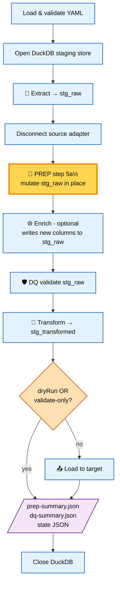
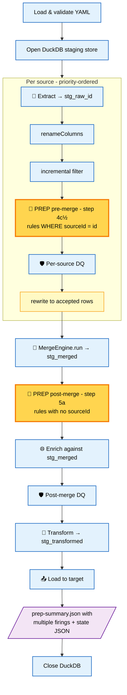

# Sluice — Phase 12: Prep Phase (pre-enrich data fixup)
# Open-source feature in @caracal-lynx/sluice
# Owner: Michael Scott, Caracal Lynx Limited (SC826823)
# Depends on: CLAUDE.md, PHASE-04-enrich-phase.md (Phase 4 complete)
# Last updated: 2026-05-12

---

## Overview

Phase 12 adds a **Prep Phase** that sits between Extract and Enrich. It mutates
columns of `stg_raw` (single-source) or each `stg_raw_{sourceId}` and
`stg_merged` (multi-source) in place using a configurable rule list, so that
Enrich and DQ both consume already-fixed data.

The phase exists to handle two recurring problems that the existing Transform
phase cannot solve, because Transform runs *after* DQ and *after* Enrich:

1. **Format drift** — the same logical value held in different shapes across
   source systems (e.g. legacy 8-character HS codes that must be padded to the
   modern 10-character form before they can be looked up against the UK Trade
   Tariff API).
2. **Bulk fixup** — a known set of invalid values that must be swapped for a
   predetermined valid equivalent (e.g. ~1,000 records in a client's Odoo
   export carrying the same wrong HS code, where the correct code is known but
   the source system will not be corrected before migration).

The phase is **optional and additive**: pipelines without a `prep:` section are
unaffected. No existing phase, plugin interface, schema, or test is modified
in a breaking way.

### Why a separate phase, not part of Transform?

Transform runs at step 7–8 of the runner pipeline (CLAUDE.md, *Pipeline Runner
— Execution Order*). Enrich runs at step 5b and DQ at step 6. Any fix applied
in Transform is invisible to both Enrich (which would call external APIs with
broken input) and DQ (which would reject rows that prep could have salvaged).

Prep is therefore positioned **between Extract and Enrich**, mutating the same
staging table that Enrich and DQ read from. The output column names equal the
input column names — prep is *in-place* fixup, not a mapping layer.

### Relationship with the Transform phase

Prep and Transform deliberately share three building blocks:

| Building block | Prep | Transform |
|---|---|---|
| Cleanse ops (`src/transform/cleanse.ts`) | ✓ reused | ✓ |
| Expression evaluator (`src/transform/expression.ts`) | ✓ reused | ✓ |
| Lookup loader (the **mechanism** in `transform/lookup.ts`) | ✓ reused | ✓ |
| Lookup **cache instance** | separate (v1) | separate (v1) |
| Output | mutates source columns | maps to new target columns |

The lookup *mechanism* is shared; the lookup *cache* is not. A lookup table
declared in `prep.lookups` is loaded into a separate resolver from one
declared in `transform.lookups`, even if the underlying YAML source is the
same. This is a v1 simplification; future work may collapse them into a single
shared cache.

---

## Execution order

### Single-source — `PipelineRunner.run()`



```
1.  Load + validate config
2.  Resolve output directory
3.  Open DuckDB staging store
4.  Connect source adapter
5.  Extract → 'stg_raw'
5a. Disconnect source adapter
5a½. ✨ PREP ✨   runPrep('stg_raw', prepConfig, undefined)        ← new
5b. Phase 4a Enrich  (skipped if --no-enrich / --no-prep is independent)
6.  Run DQ rules against 'stg_raw'
7.  Resolve transform lookups
8.  Transform 'stg_raw' → 'stg_transformed'
9.  (dryRun → STOP)
10. (validate-only → STOP)
11. Connect target adapter
12. Load → target
12a. Disconnect target adapter
13. Close DuckDB staging store
14. Write run state file
15. Log final summary
```

### Multi-source — `MultiSourcePipelineRunner.run()`



Prep has **two firing points** in multi-source pipelines:

```
4.  For each source (priority-ordered):
    a. runExtract → 'stg_raw_{sourceId}'
    b. If source.rename is set → StagingStore.renameColumns(...)
    c. Incremental filter (if applicable)
    c½. ✨ PREP (pre-merge) ✨   runPrep('stg_raw_{sourceId}', prepConfig, sourceId)
        Only rules whose sourceId matches (or rules with no sourceId+no field
        restriction, see "Rule scoping" below).
    d. Per-source DQ
    e. Filter to accepted rows
5.  MergeEngine.run(...)
5a. ✨ PREP (post-merge) ✨    runPrep('stg_merged', prepConfig, undefined)
    Only rules with NO sourceId.
5b. Phase 4a Enrich against 'stg_merged'
6.  Post-merge DQ against 'stg_merged'
7.  Filter rejected; Transform
8.  dryRun / validate-only check
9.  Load → target
10. writeStateFile
11. Close DuckDB
```

**Rationale for two firing points.** A rule scoped to one source must run
before the merge can see that source's data, otherwise rename/merge would
need to know about the fixup. A rule that applies to all sources (no
`sourceId`) runs once post-merge against `stg_merged`, which is cheaper than
running it once per source. This mirrors how DQ rules already work in
multi-source pipelines.

### Rule scoping in multi-source

| Rule has `sourceId`? | Fires at | Table |
|---|---|---|
| Yes (`sourceId: sql-server`) | Pre-merge, only for that source | `stg_raw_sql-server` |
| No | Post-merge, once | `stg_merged` |

A rule without `sourceId` does **not** run per-source. If a fixup needs to be
applied to every source individually (e.g. before per-source DQ inspects it),
duplicate the rule with explicit `sourceId` entries.

### Single-source: `sourceId` is rejected at config-load time

If `prep.rules[].sourceId` is set on a single-source pipeline, `ConfigLoader`
throws `ConfigError`. The field only makes sense when `sources` (plural) is
declared.

---

## YAML schema

```yaml
prep:
  # ── Lookups (loaded once, cached in a prep-only resolver) ───
  lookups:
    - name: hcCodeFixups
      source:                        # SourceConfig — any source adapter
        adapter: csv
        file: ./lookups/hc-code-fixups.csv
      key: invalid_code
      value: valid_code

  # ── Rules (applied top-to-bottom against the target table) ──
  rules:
    - field: HC_CODE                 # REQUIRED. Existing column to mutate.
      sourceId: excel                # OPTIONAL. Multi-source only. Restricts
                                     # this rule to one named pre-merge source.
      when: "row.HC_CODE.length === 8"
                                     # OPTIONAL. expr-eval predicate (or 'js:'
                                     # prefix). Rule is skipped for any row
                                     # where this evaluates to a falsy value.
                                     # Errors are treated per run.onError.
      cleanse: padEnd:10:0           # ONE OF: cleanse | expression | lookup
                                     # cleanse: pipe-separated op chain,
                                     # same syntax as transform.fields.cleanse.

    - field: HC_CODE
      expression: "row.HC_CODE.trim().toUpperCase()"
                                     # ONE OF. expr-eval expression, or
                                     # 'js:' prefix for vm sandbox.

    - field: HC_CODE
      lookup: hcCodeFixups           # ONE OF. Name of a prep.lookups entry.
      onMiss: keep                   # OPTIONAL. keep | null | error.
                                     # Default: keep.

  # ── Output ───────────────────────────────────────────────
  summaryFile: ./output/{name}-prep-summary.json
                                     # OPTIONAL. Default:
                                     # {outputDir}/{name}-prep-summary.json
```

### Field semantics

- `field` — required. Names a column that already exists in the target table.
  Unknown column → `PrepError` at runtime (caught before any mutation).
- `sourceId` — optional. Only valid in multi-source pipelines. Must match a
  source `id` declared in the top-level `sources:` array.
- `when` — optional row predicate. Same evaluation rules as transform
  expressions (expr-eval by default; `js:` prefix for the vm sandbox; the row
  object is exposed as `row`). A truthy result → apply the rule; falsy →
  skip. A *runtime error* in `when` is escalated per `run.onError`
  (`continue` logs `warn`, skips the rule for that row; `stop` throws
  `PrepError`).
- Exactly one of `cleanse`, `expression`, `lookup` must be set (refine
  constraint in Zod). Setting more than one → `ConfigError`.
- `onMiss` — only valid when `lookup` is set. Setting it on a `cleanse` or
  `expression` rule → `ConfigError`.
- `summaryFile` — relative paths resolve against the current working
  directory, not `run.outputDir`. (Same convention as `dq.rejectionFile`.)

### Rule order

Rules execute top-to-bottom. A later rule sees the result of every earlier
rule. Multiple rules targeting the same `field` are explicitly supported —
this is the normal pattern for "normalise the shape, then map known bad
values to fixed ones":

```yaml
rules:
  - field: HC_CODE
    when: "row.HC_CODE.length === 8"
    cleanse: padEnd:10:0
  - field: HC_CODE
    lookup: hcCodeFixups
    onMiss: keep
```

The lookup rule's input is the *already padded* value.

---

## Zod schema additions (`src/config/schema.ts`)

```typescript
const PrepRuleSchema = z.object({
  field:      z.string(),
  sourceId:   z.string().optional(),
  when:       z.string().optional(),
  cleanse:    CleanseOps.optional(),
  expression: z.string().optional(),
  lookup:     z.string().optional(),
  onMiss:     z.enum(['keep', 'null', 'error']).default('keep'),
})
  .refine(
    r => [r.cleanse, r.expression, r.lookup].filter(Boolean).length === 1,
    { message: 'prep rule must specify exactly one of cleanse, expression, lookup' },
  )
  .refine(
    r => r.onMiss === 'keep' || Boolean(r.lookup),
    { message: 'onMiss is only valid when lookup is set' },
  );

export const PrepSchema = z.object({
  lookups:     z.array(LookupSchema).default([]),
  rules:       z.array(PrepRuleSchema).min(1),
  summaryFile: z.string().optional(),
});

// In PipelineSchema:
prep: PrepSchema.optional(),
```

### Cross-cutting refinements (also in `schema.ts`)

```typescript
// Single-source pipelines must not declare sourceId on any prep rule.
PipelineSchema = PipelineSchema.refine(
  p => !p.prep
    || isMultiSource(p)
    || p.prep.rules.every(r => !r.sourceId),
  { message: 'prep.rules[].sourceId is only valid in multi-source pipelines' },
);

// Multi-source: every prep.rules[].sourceId must match a declared source id.
PipelineSchema = PipelineSchema.refine(
  p => !p.prep || !isMultiSource(p) || p.prep.rules.every(
    r => !r.sourceId || p.sources!.some(s => s.id === r.sourceId),
  ),
  { message: 'prep.rules[].sourceId must match a declared source id' },
);
```

### Inferred type

```typescript
export type Prep      = z.infer<typeof PrepSchema>;
export type PrepRule  = z.infer<typeof PrepRuleSchema>;
```

Re-export both from `src/config/types.ts`.

---

## New cleanse op: `padEnd`

`src/transform/cleanse.ts` currently exposes `padStart:<len>:<char>`. Add
`padEnd:<len>:<char>` with mirror-image behaviour:

```typescript
// padEnd:10:0  →  '12345678'.padEnd(10, '0')  →  '1234567800'
// padEnd:6:_   →  '42'.padEnd(6, '_')        →  '42____'
```

- Already-long strings pass through unchanged (the JS `String.prototype.padEnd`
  contract).
- Non-string input is `String(value)`-coerced first, matching the rest of the
  cleanse pipeline.
- Add to the **Cleanse operations reference** table in CLAUDE.md.
- Allowed-character regex on `CleanseOps` already permits the syntax
  (`[a-zA-Z|:0-9]+`).

---

## Engine: `PrepEngine` (`src/prep/engine.ts`)

```typescript
export interface PrepRunResult {
  table:        string;             // 'stg_raw' | 'stg_raw_{sourceId}' | 'stg_merged'
  rulesApplied: number;
  rules: Array<{
    field:       string;
    op:          string;            // 'cleanse:padEnd:10:0' | 'expression' | 'lookup:hcCodeFixups'
    rowsChanged: number;
    rowsSkipped: number;            // rows skipped by `when` predicate
    rowsFailed:  number;            // rows where the rule errored (only > 0 when run.onError === 'continue')
  }>;
}

export class PrepEngine {
  constructor(
    private readonly store:    StagingStore,
    private readonly resolver: PrepLookupResolver,
    private readonly evaluator: ExpressionEvaluator,   // shared instance
    private readonly logger:   Logger,
  ) {}

  async run(
    table:   string,
    prep:    Prep,
    sourceId: string | undefined,
    runCfg:  RunConfig,
  ): Promise<PrepRunResult>;
}
```

### Algorithm (per rule)

1. Validate the rule's `field` exists in `table` (via
   `store.columnNames(table)`). Missing → `PrepError`.
2. Filter the rule set by firing point:
   - Single-source: all rules with no `sourceId`.
   - Multi-source pre-merge: rules with `sourceId === currentSourceId`.
   - Multi-source post-merge: rules with no `sourceId`.
3. Read the table in batches of `runCfg.batchSize`.
4. For each row in the batch:
   - Evaluate `when` (if set). Falsy → skip; record `rowsSkipped`.
   - Apply the operation:
     - `cleanse`: pass the column value through
       `applyCleansePipeline(value, ops)`.
     - `expression`: `evaluator.evaluate(rule.expression, row)`.
     - `lookup`: `resolver.resolve(rule.lookup, value)`; apply `onMiss`.
   - If the new value differs from the old, record `rowsChanged` and stage
     the update.
5. Write the modified batch back via `CREATE OR REPLACE TABLE` swap
   (mirror the Transform engine pattern). Errors are surfaced as
   `PrepError` unless `runCfg.onError === 'continue'`, in which case the
   failing row is left untouched and `rowsFailed` increments.

### `onMiss` semantics

| `onMiss` | Lookup miss → |
|---|---|
| `keep` (default) | leave the existing value unchanged |
| `null`           | overwrite with SQL `NULL` |
| `error`          | throw `PrepError` immediately (halts run; ignores `run.onError`) |

`error` is intentionally non-overridable. If the operator wants the pipeline
to halt on a lookup miss, they get a halt; debouncing that via `run.onError`
would silently hide a data integrity problem.

---

## Lookup resolver: `PrepLookupResolver` (`src/prep/lookup.ts`)

Same shape as `transform/lookup.ts`'s `LookupResolver`, but maintained as a
**separate instance** (v1 isolation requirement). Implementation can be a
thin subclass or a copy — choose whichever yields less coupling. The
resolver:

- Calls each lookup's `SourceConfig` through the existing source adapter
  registry (any adapter is permitted; CSV is the obvious choice).
- Builds an in-memory `Map<string, unknown>` per lookup at `loadAll()`.
- Logs `debug` on cache hits and `warn` on misses (only when the rule's
  `onMiss !== 'keep'`, to avoid noise).

---

## Expression evaluator: shared instance

`PrepEngine` is constructed with the same `ExpressionEvaluator` used by
`TransformEngine`. Both `prep.rules[].expression` and `prep.rules[].when`
support the `js:` prefix with identical semantics to the transform phase
(logged at `warn` whenever the `vm` sandbox is invoked).

---

## Error handling

New error class in `src/utils/errors.ts`:

```typescript
export class PrepError extends PipelineError {}
```

Exit codes (extends CLAUDE.md → CLI section):

| Code | Cause |
|---|---|
| 0 | Success |
| 1 | Generic pipeline error |
| 2 | Critical DQ violations |
| 3 | Config error |
| 4 | Enrich error |
| **5** | **Prep error** |

`PrepError` is thrown for:

- Unknown column in `prep.rules[].field`
- Lookup miss with `onMiss: error`
- Runtime error in `when` / `expression` / cleanse op when
  `run.onError === 'stop'`
- DuckDB write failures from the rewrite step

---

## Logging and summary file

### Log levels

| Level | Event |
|---|---|
| `info` | "Prep phase: N rules applied to {table} — M rows changed, K skipped, F failed" |
| `info` | Per-rule one-liner with the same shape |
| `debug` | Per-row diff (only at debug; high volume) |
| `warn` | `when` runtime error with `onError: continue`; lookup miss with `onMiss: keep` (sampled, not per row); `js:` evaluation |
| `error` | Pre-throw log for any `PrepError` |

### Summary file shape

Written to `prep.summaryFile` (or `{outputDir}/{name}-prep-summary.json`):

```json
{
  "pipeline": "style-co-styles",
  "runAt":    "2026-05-12T14:22:00.000Z",
  "firings": [
    {
      "table":        "stg_raw_excel",
      "sourceId":     "excel",
      "rulesApplied": 2,
      "rules": [
        { "field": "HC_CODE", "op": "cleanse:padEnd:10:0", "rowsChanged": 412, "rowsSkipped": 18, "rowsFailed": 0 },
        { "field": "HC_CODE", "op": "lookup:hcCodeFixups", "rowsChanged": 38,  "rowsSkipped": 0,  "rowsFailed": 0 }
      ]
    },
    {
      "table":        "stg_merged",
      "sourceId":     null,
      "rulesApplied": 1,
      "rules": [
        { "field": "STYLE_NO", "op": "expression", "rowsChanged": 12, "rowsSkipped": 0, "rowsFailed": 0 }
      ]
    }
  ]
}
```

Single-source pipelines produce one `firings[]` entry with `sourceId: null`.

---

## CLI changes

### New flag

```
sluice run      <pipeline.yaml> [--no-prep]
sluice validate <pipeline.yaml> [--no-prep]
```

`--no-prep` skips the prep phase regardless of config. Mirrors `--no-enrich`.

### Existing commands

| Command | Runs prep? |
|---|---|
| `sluice run` | Yes (skippable via `--no-prep`) |
| `sluice validate` | Yes — DQ depends on prep's output (skippable via `--no-prep`) |
| `sluice profile` | **No** — profile is for raw source data |
| `sluice check` | No execution; validates the `prep:` block schema |
| `sluice plugins` | Unchanged |
| `sluice merge ...` | Unchanged |

### Progress bar

`src/utils/progress.ts → ProgressReporter` gains a new phase between
extract/merge and enrich:

| Phase | Icon | Label |
|---|---|---|
| extract | 🔎 | "Extract" |
| (merge — multi-source only) | 🔀 | "Merge" |
| **prep** | **🧽** | **"Prep"** |
| enrich | 🌐 | "Enrich" |
| DQ | 🛡️ | "DQ" |
| transform | 🔧 | "Transform" |
| load | 📤 | "Load" |

Prep is a determinate phase (rows × rules); the bar tracks total rule
applications across all firings.

---

## Files to add or modify

```
src/
├── config/
│   ├── schema.ts                        ← + PrepRuleSchema, PrepSchema, refinements
│   └── types.ts                         ← + Prep, PrepRule re-exports
├── prep/                                ← NEW directory
│   ├── index.ts                         ← barrel
│   ├── engine.ts                        ← PrepEngine
│   ├── lookup.ts                        ← PrepLookupResolver
│   └── types.ts                         ← PrepRunResult, PrepRuleResult
├── transform/
│   └── cleanse.ts                       ← + padEnd op
├── utils/
│   └── errors.ts                        ← + PrepError
├── runner.ts                            ← + runPrep step 5a½; PrepEngine wiring
├── multi-source-runner.ts               ← + runPrep firings 4c½ and 5a
├── cli.ts                               ← + --no-prep flag (run, validate)
└── utils/progress.ts                    ← + 🧽 prep phase entry

tests/
├── fixtures/
│   ├── prep-only.pipeline.yaml          ← NEW (single-source, minimal prep)
│   ├── prep-multi-source.pipeline.yaml  ← NEW (multi-source, both firings)
│   └── lookups/hc-code-fixups.csv       ← NEW
├── unit/
│   ├── config/prep-schema.test.ts       ← NEW
│   ├── prep/
│   │   ├── engine.test.ts               ← NEW
│   │   └── lookup.test.ts               ← NEW
│   └── transform/cleanse-padend.test.ts ← NEW (or extend existing cleanse test)
└── integration/
    ├── prep-single-source.test.ts       ← NEW
    └── prep-multi-source.test.ts        ← NEW

docs/
├── PHASE-12-prep-phase-spec.md          ← this file
└── architecture-diagrams.md             ← + prep node in the Mermaid flows

CLAUDE.md                                ← + prep section, padEnd in cleanse table,
                                            exit code 5, --no-prep flag, prep
                                            progress-bar icon, prep summary JSON,
                                            update execution-order blocks
```

`PLUGINS.md`, `README.md`, the public API barrel (`src/index.ts`), and the
existing enrich files do not need to change.

---

## Testing requirements

### Unit — config (`tests/unit/config/prep-schema.test.ts`)

- Minimal valid prep block parses.
- Each of `cleanse` / `expression` / `lookup` parses on its own.
- Setting two ops on one rule → ZodError.
- Setting zero ops on one rule → ZodError.
- `onMiss` on a non-lookup rule → ZodError.
- `sourceId` on a single-source pipeline → ZodError.
- `sourceId` referencing an undeclared source id → ZodError.
- Default `onMiss` is `keep`.
- Default `summaryFile` is undefined (runner fills in).

### Unit — engine (`tests/unit/prep/engine.test.ts`)

- Cleanse rule mutates the named column.
- Expression rule mutates the named column.
- `js:` expression mutates the named column and emits a `warn` log.
- Lookup hit replaces the value.
- Lookup miss + `onMiss: keep` leaves the value unchanged.
- Lookup miss + `onMiss: null` sets the value to SQL NULL.
- Lookup miss + `onMiss: error` throws `PrepError` even when
  `run.onError === 'continue'`.
- `when` truthy → rule applied; `when` falsy → rule skipped, `rowsSkipped`
  increments.
- `when` runtime error + `run.onError: continue` → `rowsFailed` increments,
  rule is skipped for that row, `warn` log emitted.
- `when` runtime error + `run.onError: stop` → `PrepError`.
- Multiple rules on the same field apply in declared order (left fold).
- `rowsChanged` is accurate (i.e. unchanged rows do not increment the
  counter).
- Unknown `field` → `PrepError` before any mutation.

### Unit — lookup (`tests/unit/prep/lookup.test.ts`)

- `loadAll()` populates the cache from a CSV lookup source.
- `resolve()` returns the cached value for a hit, `undefined` for a miss.
- A prep resolver and a transform resolver loaded from the same YAML
  produce two distinct cache instances (the v1 isolation contract).

### Unit — cleanse (`tests/unit/transform/cleanse-padend.test.ts`)

- `padEnd:10:0` pads short strings; leaves long strings untouched.
- `padEnd:6:_` works with non-numeric pad characters.
- Non-string input is `String()`-coerced before padding.

### Integration — single-source (`tests/integration/prep-single-source.test.ts`)

- Pipeline with `prep:` runs prep between extract and DQ; DQ sees fixed data.
- HC-code padding + lookup swap fixture: final output reflects both rules.
- `--no-prep` skips the phase; DQ sees raw data; rejection counts differ.
- Summary JSON is written to the expected path with the expected shape.
- Exit code 5 on a forced `PrepError` (e.g. unknown column).

### Integration — multi-source (`tests/integration/prep-multi-source.test.ts`)

- Pre-merge rules run only against their `sourceId` table.
- Post-merge rules run once against `stg_merged`.
- Pre-merge prep runs *after* `source.rename`, so rules reference renamed
  columns.
- Rules with `sourceId` referencing a missing source → ConfigError at load
  time (covered in config tests but verified end-to-end here).
- Summary JSON contains one `firings[]` entry per firing point.

### Coverage target

Match the rest of the repo: ≥80 % line coverage in `src/prep/`.

---

## Worked example — Style Co styles with HS code fixup

(Public-name version of the Eribé scenario described in the conversation that
produced this spec.)

```yaml
pipeline:
  name: style-co-styles-with-prep
  client: style-co
  version: "1.1"
  entity: Style

source:
  adapter: csv
  file: ./data/styles-export.csv

prep:
  lookups:
    - name: hcCodeFixups
      source: { adapter: csv, file: ./lookups/hc-code-fixups.csv }
      key: invalid_code
      value: valid_code

  rules:
    # 1. Legacy 8-char HS codes → modern 10-char (append two zeros)
    - field: HC_CODE
      when: "row.HC_CODE && row.HC_CODE.length === 8"
      cleanse: padEnd:10:0

    # 2. Map ~1,000 known-bad codes onto the correct one
    - field: HC_CODE
      lookup: hcCodeFixups
      onMiss: keep

dq:
  rules:
    - field: HC_CODE
      checks:
        - { type: notNull,   severity: critical }
        - { type: pattern, value: "^[0-9]{10}$", severity: critical }

# ... transform, target, run as normal
```

After prep:
- Rows whose HC_CODE was exactly 8 chars are padded to 10.
- Any row whose (now-padded) HC_CODE appears in `hc-code-fixups.csv` is
  swapped for the correct value.
- DQ's `pattern: ^[0-9]{10}$` rule sees the fixed values; if the lookup file
  is comprehensive, zero rows are rejected for HC_CODE.
- Enrich (e.g. `uk-trade-tariff`) calls the API with valid 10-char codes.

---

## Open questions (not blockers)

1. **Should `sluice profile` gain a `--with-prep` flag?** Today `profile` is
   defined as raw-source statistics. Operators iterating on prep rules may
   want before/after column profiles. Defer to v2.
2. **Shared lookup cache across prep and transform.** Locked to "separate"
   for v1. Revisit once a real client pipeline has duplication between the
   two.
3. **`when` as a SQL `WHERE` clause for performance.** Current design
   iterates rows in TypeScript. For very large pipelines (>10M rows), a
   SQL-translated path could be faster. Defer until a real workload demands
   it; v1 is consistent with how Transform already works.

---

## To-do list

### Stage 1 — schema and types (smallest verifiable slice)

- [ ] Add `padEnd:<len>:<char>` to `src/transform/cleanse.ts` and its unit
      tests.
- [ ] Add `padEnd` row to the cleanse table in `CLAUDE.md`.
- [ ] Add `PrepRuleSchema` + `PrepSchema` to `src/config/schema.ts` with both
      `.refine()` constraints (exactly-one-op, onMiss-requires-lookup).
- [ ] Add cross-cutting refinements to `PipelineSchema` for
      `sourceId`-single-source and `sourceId`-undeclared-id.
- [ ] Re-export `Prep`, `PrepRule` from `src/config/types.ts`.
- [ ] Unit tests in `tests/unit/config/prep-schema.test.ts`.
- [ ] `npm run build && npm test` clean.

### Stage 2 — error class and prep module skeleton

- [ ] Add `PrepError` to `src/utils/errors.ts`.
- [ ] Create `src/prep/{index.ts,types.ts,lookup.ts,engine.ts}` with stubs.
- [ ] Implement `PrepLookupResolver` (separate instance contract).
- [ ] Unit tests in `tests/unit/prep/lookup.test.ts`.
- [ ] `npm run build && npm test` clean.

### Stage 3 — engine

- [ ] Implement `PrepEngine.run()` with batched read/write and the algorithm
      above.
- [ ] Wire shared `ExpressionEvaluator` instance.
- [ ] Implement all `onMiss` branches.
- [ ] Implement `when` evaluation with `run.onError` semantics.
- [ ] Unit tests in `tests/unit/prep/engine.test.ts` covering every bullet
      under *Testing requirements → Unit — engine*.
- [ ] `npm run build && npm test` clean.

### Stage 4 — single-source runner integration

- [ ] Wire prep into `PipelineRunner.run()` between steps 5a and 5b.
- [ ] Add CLI flag `--no-prep` to `sluice run` and `sluice validate`.
- [ ] Update exit-code constant table; map `PrepError → 5`.
- [ ] Add prep phase to `ProgressReporter` (🧽).
- [ ] Implement summary JSON writer.
- [ ] Integration tests in `tests/integration/prep-single-source.test.ts`.
- [ ] Create `tests/fixtures/prep-only.pipeline.yaml` and
      `tests/fixtures/lookups/hc-code-fixups.csv`.
- [ ] `npm run build && npm test` clean.

### Stage 5 — multi-source runner integration

- [ ] Add pre-merge firing point in `MultiSourcePipelineRunner` between
      rename/incremental and per-source DQ.
- [ ] Add post-merge firing point between merge and enrich.
- [ ] Verify rule scoping (sourceId vs no-sourceId) at both firings.
- [ ] Extend summary JSON to multiple firings.
- [ ] Integration tests in `tests/integration/prep-multi-source.test.ts`.
- [ ] Create `tests/fixtures/prep-multi-source.pipeline.yaml`.
- [ ] `npm run build && npm test` clean.

### Stage 6 — documentation

- [ ] Update CLAUDE.md:
      - Add `prep:` section under "YAML PIPELINE CONFIG SPECIFICATION"
      - Update single-source execution order (step 5a½)
      - Update multi-source execution order (steps 4c½ and 5a)
      - Add `padEnd` to cleanse table
      - Add exit code 5 and `--no-prep` flag to CLI section
      - Add 🧽 to progress-bar phase list
      - Add `PrepError` to error-types code block
- [ ] Update `docs/architecture-diagrams.md` Mermaid flows to include prep.
- [ ] Update `MEMORY.md` phase queue entry to reflect Phase 12 status.
- [ ] (Optional) Add a one-paragraph mention to README's quick-start, if
      prep is expected to be common.

### Stage 7 — release

- [ ] Bump `@caracal-lynx/sluice` minor version (additive feature, no
      breaking changes).
- [ ] Update CHANGELOG (if maintained — confirm before adding).
- [ ] Open PR titled along the lines of `feat(prep): add pre-enrich data
      fixup phase`; squash-merge per the standard git workflow.

---

*This file is the authoritative specification for Phase 12 (Prep Phase). If
anything in the codebase contradicts this file, the codebase is wrong. Update
this file whenever the design changes — then tell Claude Code to re-read it
before continuing.*
