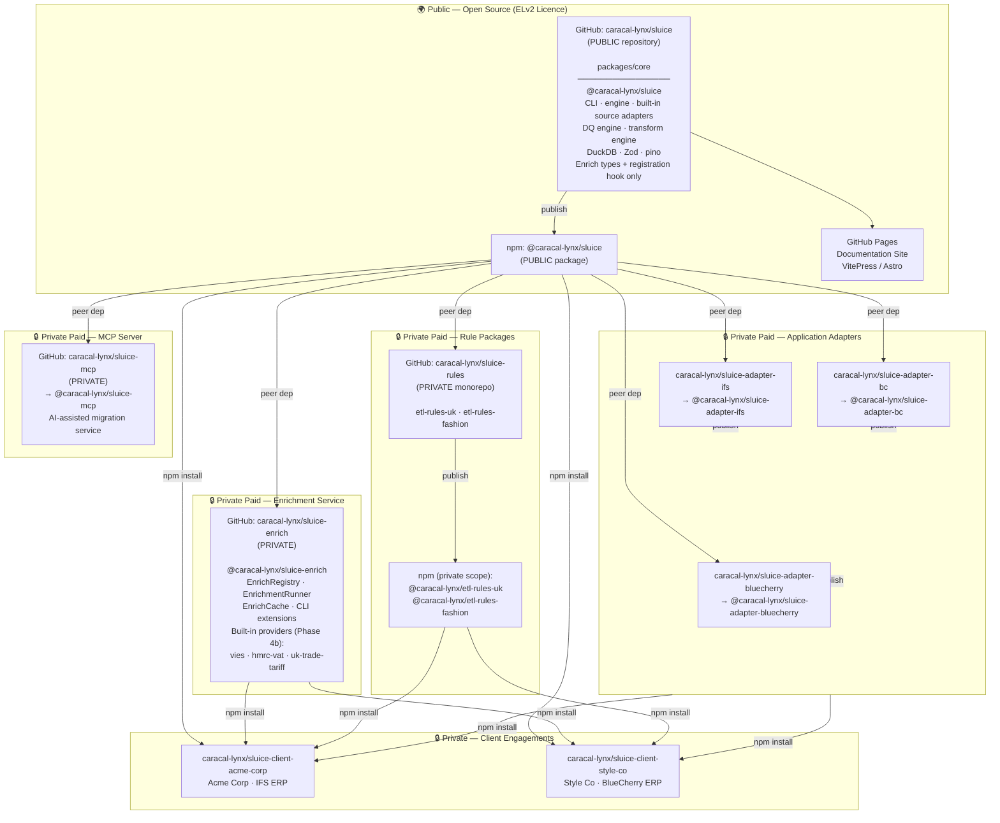
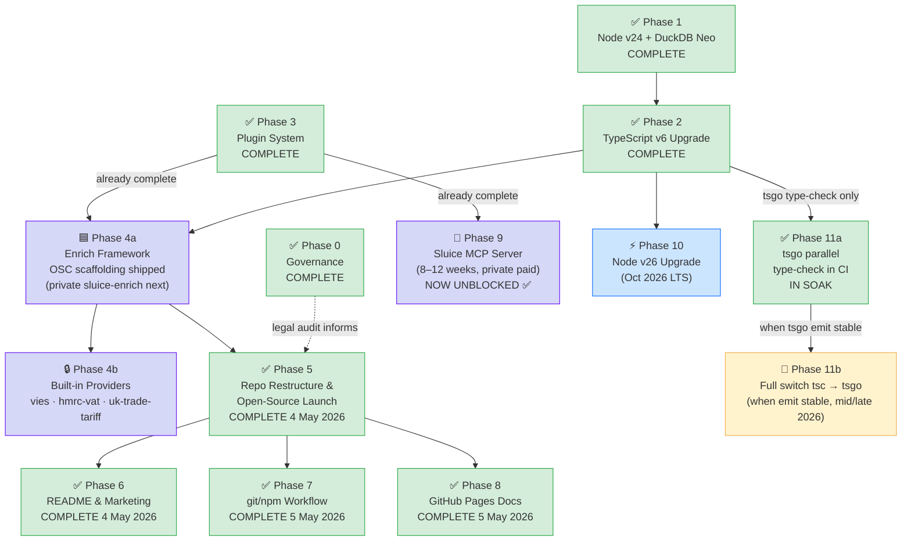
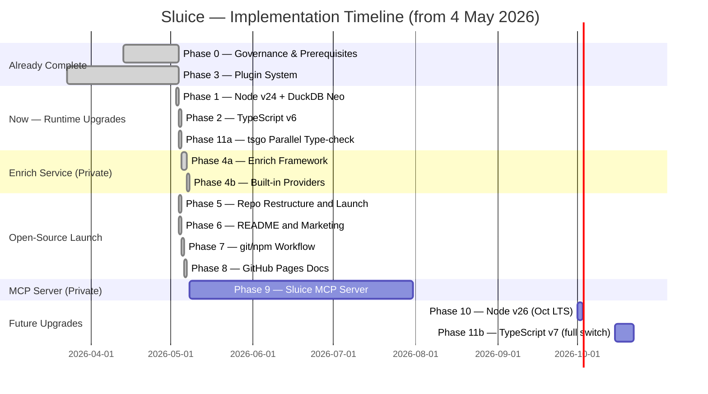
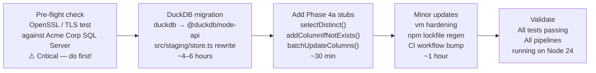
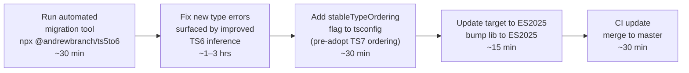
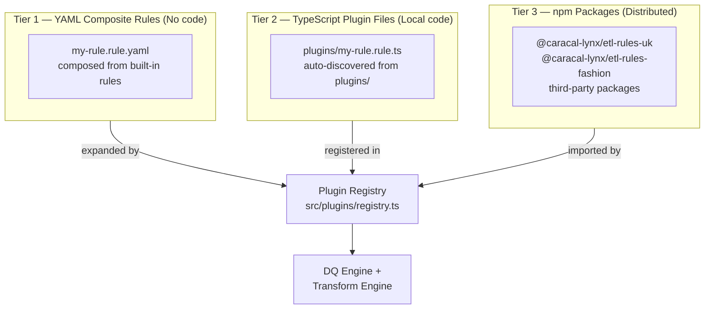
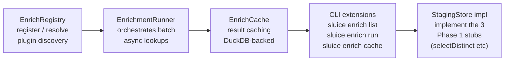
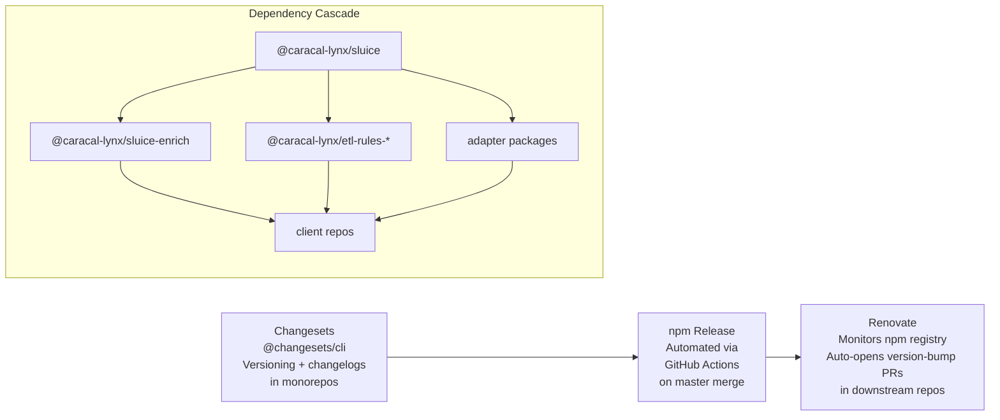

# Sluice — Vision Implementation Plan

> **Caracal Lynx Limited** | Owner: Michael Scott | Last updated: 7 May 2026 (post Phase 4 ✅ COMPLETE — `@caracal-lynx/sluice-enrich@1.0.0` + `@caracal-lynx/sluice@0.2.1` published)
>
> This document is the master implementation plan for realising the Sluice strategic vision: open-sourcing the core CLI, keeping paid services private, upgrading the runtime and language, and launching the Sluice MCP server as a commercial offering.

---

## Contents

1. [The Vision](#1-the-vision)
2. [Strategic Architecture](#2-strategic-architecture)
3. [Phase Overview & Dependencies](#3-phase-overview--dependencies)
4. [Phase 0 — Governance & Prerequisites ✅ COMPLETE](#4-phase-0--governance--prerequisites)
5. [Phase 1 — Node v24 + DuckDB Neo Upgrade ✅ COMPLETE](#5-phase-1--node-v24--duckdb-neo-upgrade)
6. [Phase 2 — TypeScript v6 Upgrade ✅ COMPLETE](#6-phase-2--typescript-v6-upgrade--complete)
7. [Phase 3 — Plugin System ✅ COMPLETE](#7-phase-3--plugin-system--complete)
8. [Phase 4 — Enrich Phase (Private) ✅ COMPLETE](#8-phase-4--enrich-phase-private--complete)
9. [Phase 5 — Repo Restructure & Open-Source Launch ✅ COMPLETE](#9-phase-5--repo-restructure--open-source-launch)
10. [Phase 6 — README & Marketing ✅ COMPLETE](#10-phase-6--readme--marketing)
11. [Phase 7 — git/npm Workflow ✅ COMPLETE](#11-phase-7--gitnpm-workflow)
12. [Phase 8 — GitHub Pages Documentation Site ✅ COMPLETE](#12-phase-8--github-pages-documentation-site)
13. [Phase 9 — Sluice MCP Server (Private Paid Service)](#13-phase-9--sluice-mcp-server-private-paid-service)
14. [Phase 10 — Node v26 Upgrade](#14-phase-10--node-v26-upgrade)
15. [Phase 11 — TypeScript v7](#15-phase-11--typescript-v7)
16. [Document Inventory](#16-document-inventory)
17. [Key Risks](#17-key-risks)

---

## 1. The Vision

Sluice will be open-sourced as a best-in-class, YAML-driven ETL pipeline CLI for data migrations of any kind — freely available to businesses running their own migrations, and the foundation of Caracal Lynx's specialist consultancy practice.

The strategic split is deliberate:

| Layer                            | Visibility        | Rationale                                                |
| -------------------------------- | ----------------- | -------------------------------------------------------- |
| **Core CLI engine**              | 🌍 Public (ELv2)  | Community credibility, ecosystem growth, marketing asset |
| **Enrichment service**           | 🔒 Private (paid) | Premium async API lookups — not a commodity              |
| **Country/region rule packages** | 🔒 Private (paid) | Domain expertise — part of Caracal Lynx's service value  |
| **Application adapter packages** | 🔒 Private (paid) | ERP-specific knowledge — not a commodity                 |
| **Client-specific plugins**      | 🔒 Private (paid) | Bespoke per-engagement deliverables                      |
| **Sluice MCP Server**            | 🔒 Private (paid) | AI-assisted migration — premium agentic service          |

This is the "commoditise the platform, sell the expertise" model: the engine is open, the knowledge is not.

---

## 2. Strategic Architecture

### 2.1 Repository & Package Map



### 2.2 What's in the Open-Source Core

The public `@caracal-lynx/sluice` package includes:

- The complete CLI (`sluice run`, `sluice check`, `sluice validate`, `sluice profile`)
- The pipeline runner and orchestration engine (with `registerEnrichPhase()` hook only — no enrich implementation)
- Built-in **generic** source adapters: `csv`, `xlsx`, `pg`, `mssql`, `rest`
- Built-in **generic** target adapters: `csv`, `pg`
- The DQ rule engine (with built-in primitive rules: `notNull`, `unique`, `pattern`, etc.)
- The transform engine (with all built-in transform types)
- The Phase 3 plugin/extension system (discovery, registry, interfaces)
- DuckDB staging layer (`@duckdb/node-api`)
- Enrich interface types (`EnrichPlugin`, `EnrichResult`) and Zod schema stubs — for third-party plugin authors only

The open-source core does **not** include: the `EnrichRegistry`, `EnrichmentRunner`, `EnrichCache`, any built-in enrich providers, ERP-specific adapters (IFS, BlueCherry, Business Central), UK/fashion-specific rule packages, or the MCP server.

---

## 3. Phase Overview & Dependencies

### 3.1 Phase Dependency Flow



### 3.2 Estimated Timeline

| Phase         | What                                                       | Duration                                                                                                                                                                                                                                                                                                                                                                        | Can start                             |
| ------------- | ---------------------------------------------------------- | ------------------------------------------------------------------------------------------------------------------------------------------------------------------------------------------------------------------------------------------------------------------------------------------------------------------------------------------------------------------------------- | ------------------------------------- |
| **Phase 0**   | Governance & legal                                         | ✅ **COMPLETE**                                                                                                                                                                                                                                                                                                                                                                 | —                                     |
| **Phase 1**   | Node v24 + DuckDB Neo                                      | ✅ **COMPLETE** (3 May 2026, PR #8)                                                                                                                                                                                                                                                                                                                                             | —                                     |
| **Phase 2**   | TypeScript v6                                              | ✅ **COMPLETE** (4 May 2026, PR #13)                                                                                                                                                                                                                                                                                                                                            | —                                     |
| **Phase 3**   | Plugin system                                              | ✅ **COMPLETE**                                                                                                                                                                                                                                                                                                                                                                 | —                                     |
| **Phase 4a**  | Enrich framework (OSC scaffolding + private framework)     | ✅ **COMPLETE** (5–6 May 2026, OSC commit `3ccfd8e` + `@caracal-lynx/sluice-enrich@0.1.0` / `0.1.1`)                                                                                                                                                                                                                                                                            | —                                     |
| **Phase 4b**  | Built-in providers (`vies`, `hmrc-vat`, `uk-trade-tariff`) | ✅ **COMPLETE** (7 May 2026, `@caracal-lynx/sluice-enrich@1.0.0` published; sluice-enrich PRs #19, #21, #22, #23, #25)                                                                                                                                                                                                                                                          | —                                     |
| **Phase 5**   | Restructure & launch                                       | ✅ **COMPLETE** (4 May 2026, PRs [#18–#22](https://github.com/caracal-lynx/sluice/pulls?q=is%3Apr+is%3Amerged+phase-5))                                                                                                                                                                                                                                                         | —                                     |
| **Phase 6**   | README & marketing                                         | ✅ **COMPLETE** (4 May 2026, [PR #27](https://github.com/caracal-lynx/sluice/pull/27))                                                                                                                                                                                                                                                                                          | —                                     |
| **Phase 7**   | git/npm workflow                                           | ✅ **COMPLETE** (5 May 2026, PRs [#29](https://github.com/caracal-lynx/sluice/pull/29) · [#31](https://github.com/caracal-lynx/sluice/pull/31) · [#33](https://github.com/caracal-lynx/sluice/pull/33) · [#34](https://github.com/caracal-lynx/sluice/pull/34) · [#35](https://github.com/caracal-lynx/sluice/pull/35) · [#36](https://github.com/caracal-lynx/sluice/pull/36)) | —                                     |
| **Phase 8**   | GitHub Pages                                               | ✅ **COMPLETE** (5 May 2026, PRs [#41](https://github.com/caracal-lynx/sluice/pull/41) · [#42](https://github.com/caracal-lynx/sluice/pull/42) · [#43](https://github.com/caracal-lynx/sluice/pull/43) · [#44](https://github.com/caracal-lynx/sluice/pull/44) · [#45](https://github.com/caracal-lynx/sluice/pull/45))                                                         | —                                     |
| **Phase 9**   | MCP Server                                                 | 8–12 weeks                                                                                                                                                                                                                                                                                                                                                                      | **Now unblocked** (Phase 3 complete)  |
| **Phase 10**  | Node v26                                                   | 1–2 days                                                                                                                                                                                                                                                                                                                                                                        | Oct 2026 (LTS cut)                    |
| **Phase 11a** | tsgo CI type-check                                         | ✅ **MERGED — IN SOAK** (4 May 2026, PR #15)                                                                                                                                                                                                                                                                                                                                    | —                                     |
| **Phase 11b** | TypeScript v7 (full switch)                                | 1–2 hours                                                                                                                                                                                                                                                                                                                                                                       | When tsgo emit stable (mid/late 2026) |

### 3.3 Gantt Chart



---

## 4. Phase 0 — Governance & Prerequisites ✅ COMPLETE

**Status:** ✅ COMPLETE

These are non-technical prerequisites that need to be in place before the public launch. They do not block Phases 1–4 but **must be complete before Phase 5**.

### 4.1 Board Resolution

As a Scottish company (SC826823) with multiple directors (Michael, Carolyn, Andrew, Duncan), the decision to open-source company IP should be minuted as a board resolution. Document:

- The decision to publish `@caracal-lynx/sluice` under the Elastic Licence 2.0
- The decision to keep rule packages, adapters, the enrich service, and the MCP server private and commercially licenced
- The decision to restructure the monorepo to support the public/private split

### 4.2 Client Contract Audit

Review engagement agreements with **Acme Corp** and **Style Co** for:

- IP ownership clauses (does any Sluice code built using their requirements belong to them?)
- Confidentiality obligations covering schema names, field names, or business logic
- Any restrictions on publishing tools developed during their engagement

If in doubt, take legal advice before Phase 5.

### 4.3 UK GDPR Audit

Scan the codebase, test fixtures, and sample YAML files for:

- Real customer names or records (even anonymised)
- Actual connection strings or credentials committed to Git history
- Client-identifiable schema details in examples or docs

Use `git log -S "acme-corp"` / `git log -S "style-co"` etc. to check history, not just HEAD.

### 4.4 Dependency Licence Audit

```bash
npx license-checker --summary --excludePrivatePackages
```

Confirm all runtime dependencies are MIT, Apache 2.0, BSD, or ISC. Flag any GPL-licensed packages that might create obligations.

### 4.5 npm Namespace Confirmation

Confirm `@caracal-lynx` is registered in your npm account and the Pro plan is active for private packages. Verify `npm whoami` and org membership.

### Success Criteria

- [x] Board resolution minuted
- [x] Client contracts reviewed (no blocking clauses found)
- [x] GDPR audit clean (no real data in codebase or history)
- [x] Dependency licences audited
- [x] npm `@caracal-lynx` org confirmed and active

---

## 5. Phase 1 — Node v24 + DuckDB Neo Upgrade ✅ COMPLETE

**Status:** ✅ **COMPLETE** — merged to `master` on 3 May 2026 ([PR #8](https://github.com/BCGubbins/sluice/pull/8), squash commit `e1be8c4`).

**Reference:** `docs/archive/node24-upgrade-plan.md` — implementation reference (executed; see PR #8)

### Summary

Two changes done together in a single PR:

1. **Node 20 → 24 LTS** — Node 24 is LTS from October 2025, EOL April 2028. The right target now that Node 26 is delayed. Node 25.x is a non-LTS Current release (EOL June 2026) — skip it entirely.
2. **`duckdb` → `@duckdb/node-api`** — the old package is already dead (frozen at DuckDB 1.4.x). The new package is Promise-native, TypeScript-first, and ABI-stable (no `npm rebuild` after Node version changes ever again). The `StagingStore` rewrite is the only significant work.

### Why Node 24 Not 26?

|            | Node 24 LTS   | Node 26 LTS              |
| ---------- | ------------- | ------------------------ |
| Released   | April 2025    | April 2026               |
| LTS start  | October 2025  | October 2026             |
| EOL        | April 2028    | April 2030               |
| Status now | ✅ Active LTS | 🔵 Current (not yet LTS) |

Node 26 is "Current" until October 2026 — not recommended for production. Node 24 is the correct LTS target today.

### DuckDB API Migration Summary

```
duckdb (deprecated)              │  @duckdb/node-api (DuckDB Neo)
─────────────────────────────────┼──────────────────────────────────────────
new duckdb.Database(path)        │  await DuckDBInstance.create(path)
db.connect(callback)             │  await instance.connect()
conn.all(sql, [], callback)      │  const r = await conn.runAndReadAll(sql)
                                 │  r.getRowObjects()
conn.run(sql, [], callback)      │  await conn.run(sql)
Prepared: conn.prepare(sql, cb)  │  const p = await conn.prepare(sql)
                                 │  await p.bindVarchar(1, val); await p.run()
Rebuilds on every Node ABI bump  │  ABI-stable — pre-built binaries, no rebuild
Frozen at DuckDB 1.4.x           │  1.5.x onwards, actively maintained
```

### Key Changes



### Phase 4a StagingStore Stubs

During the Node 24 upgrade, add the following stub methods to `StagingStore`. These are required by the Phase 4a enrich engine but implemented during Phase 4a development. Adding them now locks the interface before enrich begins.

```typescript
// Phase 4a stubs — throw until sluice-enrich implements them
async selectDistinct(_field: string): Promise<string[]> {
  throw new Error('not yet implemented — install @caracal-lynx/sluice-enrich');
}
async addColumnIfNotExists(_column: string, _type: 'BOOLEAN' | 'VARCHAR'): Promise<void> {
  throw new Error('not yet implemented — install @caracal-lynx/sluice-enrich');
}
async batchUpdateColumns(_updates: Map<number, Record<string, unknown>>): Promise<void> {
  throw new Error('not yet implemented — install @caracal-lynx/sluice-enrich');
}
```

### Steps (hand to Claude Code)

1. **Pre-flight:** Run TLS connectivity test against Acme Corp SQL Server before any code changes. If TLS 1.2 handshake fails, investigate `--openssl-legacy-provider` or update SQL Server TLS config before proceeding.
2. **DuckDB:** Migrate `src/staging/store.ts` to `@duckdb/node-api`. See `docs/archive/node24-upgrade-plan.md` for full API diff and StagingStore skeleton.
3. **Phase 4a stubs:** Add the three stub methods above to `StagingStore`.
4. **vm hardening:** Add `{ timeout: 1000 }` to `vm.runInNewContext()` calls.
5. **CI workflow:** Bump `node-version` to `'24'` in `.github/workflows/ci.yml`.
6. **Lock file:** Delete `package-lock.json`, run `npm install`.
7. **Test:** `npm test` — all suites green.

### Estimated effort: 1–2 days

### Success Criteria

- [x] All Vitest suites passing on Node 24 — 415 / 415 green
- [x] `@duckdb/node-api` fully replaces `duckdb` — confirmed by codebase grep
- [x] Three Phase 4a stub methods present in `StagingStore` — landed alongside the rest of the Phase 4a OSC scaffolding (this commit). The private `@caracal-lynx/sluice-enrich` package overwrites them on the prototype at import time.
- [x] CI workflow runs on `node-version: '24'` — `.github/workflows/ci.yml` updated; PR #8 CI passed in 55 s
- [x] Real pipeline run (`sluice run`) completes end-to-end — live `sluice validate` against Acme Corp SQL Server round-tripped a query under Node 24 + OpenSSL 3.5; TLS pre-flight passed cleanly with no `cryptoCredentialsDetails` workaround required

**Bonus fix landed in the same PR:** `src/plugins/loader.ts` now wraps absolute paths in `pathToFileURL()` before dynamic import — Node 24's stricter ESM loader rejects raw `C:\…` paths. Caught when running a fixture pipeline end-to-end on Windows; would have surfaced on first real Node 24 run.

---

## 6. Phase 2 — TypeScript v6 Upgrade ✅ COMPLETE

**Status:** ✅ **COMPLETE** — merged to `master` on 4 May 2026 ([PR #13](https://github.com/BCGubbins/sluice/pull/13)).

**Reference:** `docs/PHASE-02-typescript-v6-upgrade.md` — execution plan (executed; see PR #13)

**Prerequisite:** Phase 1 (Node 24 + DuckDB Neo) complete — shipped 3 May 2026 (PR #8).

### Summary

Sluice is already in the best possible position for this upgrade. Using `module: "nodenext"` / `moduleResolution: "nodenext"` means the biggest TS 6 breaking change (removal of old `node` resolution) is a non-event. With `strict: true` already set and no decorators in the codebase, the migration is mostly mechanical.

### Phase 2A — TypeScript 5 → 6 (3–5 hours)



### Phase 2B — TypeScript 7 (two-stage, from Phase 11 onwards)

TypeScript 7 uses a native Go compiler (`tsgo`) — 10× faster type-checking. The migration is two-phased to avoid disruption:

| Stage                         | When                                  | What                                                   | Impact                                       |
| ----------------------------- | ------------------------------------- | ------------------------------------------------------ | -------------------------------------------- |
| **11A — Parallel type-check** | After Phase 2                         | Add `tsgo --noEmit` to CI alongside `tsc`              | Zero disruption. Free speed benefit on CI.   |
| **11 — Full switch**          | When tsgo emit stable (mid/late 2026) | Retire `tsc`, use `tsgo` for both type-check and build | Under-second type-check for ~50 source files |

### Success Criteria

- [x] `tsc --noEmit` passes with zero errors on TS6 — confirmed clean on both `tsconfig.json` and `tsconfig.test.json`; type-check time dropped from ~14.4 s on TS 5.7 to ~3.4 s on TS 6 + ES2025
- [x] All Vitest suites passing — 415 / 415 green, matching the Phase 1 baseline
- [x] `tsgo --noEmit` added to CI (Phase 11A done) — shipped in [PR #15](https://github.com/BCGubbins/sluice/pull/15) on 4 May 2026; running with `continue-on-error: true` during the soak period
- [x] No `console.log` introduced (pino only) — no source-file changes were needed; the codebase had no latent type issues that TS 6 surfaced

**Bonus:** the `typescript-eslint` peer-dep at `^8.18.0` capped TypeScript at `<5.8.0`; bumped to `^8.59.1` (still v8) which supports `<6.1.0`. `vitest@^2.1.0` has no `typescript` peer dep and stayed put. `.github/workflows/ci.yml` gained an explicit `npx tsc --noEmit` step before `build` for clearer failure attribution.

---

## 7. Phase 3 — Plugin System ✅ COMPLETE

**Status:** ✅ COMPLETE — implemented on Node 20 / TypeScript 5

**Reference:** `docs/archive/PHASE2-EXTENSIONS.md` — full specification (implemented)

### Summary

The three-tier plugin/extension system is fully implemented. All three tiers are working end-to-end:

### Three-Tier Extension Model



### What This Enables

- Phase 9 (MCP Server) is now **unblocked** — no longer waiting on Phase 3
- The open-source launch (Phase 5) has the full extension story to tell
- Caracal Lynx's private rule packages (`etl-rules-uk`, `etl-rules-fashion`) plug in via Tier 3
- The enrich system (Phase 4) integrates via the same registry interfaces

---

## 8. Phase 4 — Enrich Phase (Private) ✅ COMPLETE

**Status:** ✅ **COMPLETE** — Phase 4a shipped 2026-05-05/06; Phase 4b shipped 2026-05-06.

**OSC side (`@caracal-lynx/sluice@0.2.0`):** `EnrichPlugin` / `EnrichResult` / `EnrichOptions` / `EnrichPhaseFactory` interface types, Zod `EnrichSchema` with `enrich:` block + lookup-level `cache: false` override, three `RunSchema` tuning fields (`enrichConcurrency`, `enrichTimeoutMs`, `enrichMaxRetries`), the `registerEnrichPhase()` injection hook, the `runEnrich` slot in both `PipelineRunner` and `MultiSourcePipelineRunner` (single-source uses `'stg_raw'`, multi-source uses `'stg_merged'`), the `--no-enrich` CLI flag, the `EnrichError` class with exit code 4, and three `StagingStore` stub methods. Public re-exports of `Logger` (pino type) and `EnrichError`.

**Private side (`@caracal-lynx/sluice-enrich@1.0.0`):** Full framework — `EnrichRegistry`, `EnrichCache` (in-memory + DuckDB-persisted), `loadEnrichPlugins`, `EnrichmentRunner`, `createEnrichPhase`, `patchStagingStore`, plus the `sluice-enrich` diagnostic CLI (`plan`, `providers`). Three built-in providers — **`vies`** (EU VAT), **`hmrc-vat`** (UK VAT + consultation reference for audit trail), **`uk-trade-tariff`** (HS / commodity codes). Sandbox-readiness integration tests gated on `RUN_LIVE_TESTS=1` / `HMRC_SANDBOX_BEARER_TOKEN`.

**Reference:** `docs/PHASE-04-enrich-phase.md` — full specification (updated: private architecture)

> ⚠️ **The entire enrich subsystem is a private, commercial offering from Caracal Lynx Limited** It is not part of the open-source core and is not published to the public npm registry. The open-source `@caracal-lynx/sluice` core includes only the `EnrichPlugin` interface type, Zod schema stubs, and the `registerEnrichPhase()` injection hook — no implementation.

### 8.1 Package Architecture

| Component                                   | Location                           | Visibility               |
| ------------------------------------------- | ---------------------------------- | ------------------------ |
| `EnrichPlugin` interface                    | `@caracal-lynx/sluice` core        | 🌍 Public (types only)   |
| `EnrichResult` / `EnrichConfig` Zod schemas | `@caracal-lynx/sluice` core        | 🌍 Public (schema stubs) |
| `registerEnrichPhase()` hook                | `@caracal-lynx/sluice` core runner | 🌍 Public (hook only)    |
| `EnrichRegistry`                            | `@caracal-lynx/sluice-enrich`      | 🔒 Private               |
| `EnrichmentRunner`                          | `@caracal-lynx/sluice-enrich`      | 🔒 Private               |
| `EnrichCache`                               | `@caracal-lynx/sluice-enrich`      | 🔒 Private               |
| CLI extensions (`sluice enrich *`)          | `@caracal-lynx/sluice-enrich`      | 🔒 Private               |
| Built-in providers (Phase 4b)               | `@caracal-lynx/sluice-enrich`      | 🔒 Private               |

The `registerEnrichPhase()` pattern keeps the runner clean:

```typescript
// In open-source PipelineRunner (src/runner/runner.ts)
import type { EnrichPhaseFactory } from "./types.js";
let enrichPhaseFactory: EnrichPhaseFactory | undefined;

export function registerEnrichPhase(factory: EnrichPhaseFactory): void {
  enrichPhaseFactory = factory;
}

// Phase 2.5 runs only if registered (i.e. sluice-enrich is installed)
if (enrichPhaseFactory && config.enrich) {
  await enrichPhaseFactory(config.enrich, stagingStore, logger).run();
}
```

### 8.2 Phase 4a — Enrich Framework (3–4 weeks)

Builds the complete enrich infrastructure in the private `caracal-lynx/sluice-enrich` repository:



**Key constraints:**

- `EnrichPlugin.enrich()` is **async** (unlike DQ/Transform plugins which are sync) — network I/O is the whole point
- Cache backed by DuckDB (same instance as staging) — no external cache service
- Batch lookups: group rows by lookup key to minimise API calls
- Rate limiting: configurable concurrency + `axios-retry` with exponential backoff

### 8.3 Phase 4b — Built-in Providers (3–4 weeks, separate development)

The three built-in providers are a **separate development phase** within the private `sluice-enrich` package. They are not part of Phase 4a and may be released independently:

| Provider          | API                  | What it enriches                           |
| ----------------- | -------------------- | ------------------------------------------ |
| `vies`            | EU VIES SOAP API     | VAT registration validation + company name |
| `hmrc-vat`        | HMRC VAT Number API  | UK VAT registration validation             |
| `uk-trade-tariff` | UK Global Tariff API | Commodity code descriptions + duty rates   |

All three providers are behind the `@caracal-lynx/sluice-enrich` paywall. They are not open-source.

### Success Criteria (Phase 4a) ✅

- [x] `EnrichRegistry`, `EnrichmentRunner`, `EnrichCache` implemented and tested
- [x] `registerEnrichPhase()` hook wiring verified end-to-end (full `PipelineRunner.run()` integration test with `consultationRefs` round-tripping into `state.json`)
- [x] Three `StagingStore` stubs from Phase 1 implemented (against real `:memory:` DuckDB)
- [x] CLI enrich commands working (`sluice-enrich plan` + `providers`)
- [x] Private npm package published to `@caracal-lynx/sluice-enrich` (`0.1.0` 2026-05-06; `0.1.1` post-publish cleanup)

### Success Criteria (Phase 4b) ✅

- [x] All three built-in providers implemented and tested (`vies`, `hmrc-vat`, `uk-trade-tariff` — 50+ unit tests via `axios-mock-adapter`)
- [x] Integration tests against VIES production, HMRC sandbox, UK Tariff production (env-gated; default-skipped in CI)
- [x] Published as part of `@caracal-lynx/sluice-enrich` (`1.0.0`)

---

## 9. Phase 5 — Repo Restructure & Open-Source Launch ✅ COMPLETE

**Status:** ✅ **COMPLETE** — flipped public on 4 May 2026.

- **Public repo:** [caracal-lynx/sluice](https://github.com/caracal-lynx/sluice) (transferred from `BCGubbins/sluice`; redirect retained)
- **First public npm release:** [`@caracal-lynx/sluice@0.1.0`](https://www.npmjs.com/package/@caracal-lynx/sluice) under Elastic Licence 2.0
- **GitHub Pages:** [caracal-lynx.github.io/sluice](https://caracal-lynx.github.io/sluice/) — placeholder serving `docs/` until Phase 8 fills it
- **PRs landed:** [#18 SPDX + LICENSE](https://github.com/caracal-lynx/sluice/pull/18) · [#19 hygiene files](https://github.com/caracal-lynx/sluice/pull/19) · [#20 fixture renames](https://github.com/caracal-lynx/sluice/pull/20) · [#21 package.json metadata](https://github.com/caracal-lynx/sluice/pull/21) · [#22 client-specific example removal](https://github.com/caracal-lynx/sluice/pull/22)
- **History rewrites:** multiple `git filter-repo` passes purged a 1.9 MB client dataset, client-specific example pipelines, and a stray SQL file from full git history before the visibility flip.

**Reference:** `docs/PHASE-05-DEVELOPMENT-WORKFLOW.md`

### 5.1 Repository Restructure

The current repository must be split into public and private parts:

```
BEFORE (single private monorepo):
  sluice/
    packages/core/
    packages/etl-rules-uk/
    packages/etl-rules-fashion/

AFTER (separate repos):
  PUBLIC: caracal-lynx/sluice
    packages/core/                  ← open-source CLI engine

  PRIVATE: caracal-lynx/sluice-rules
    packages/etl-rules-uk/          ← private paid service
    packages/etl-rules-fashion/     ← private paid service

  PRIVATE: caracal-lynx/sluice-enrich  ← already created in Phase 4
    (already separate)
```

### 5.2 Open-Source Hygiene Files for `caracal-lynx/sluice`

| File                               | Purpose                                               |
| ---------------------------------- | ----------------------------------------------------- |
| `LICENSE`                          | Elastic Licence 2.0 text                              |
| `LICENCE-FAQ.md`                   | Plain-English licence explainer (already written)     |
| `CONTRIBUTING.md`                  | How to submit PRs and issues                          |
| `CODE_OF_CONDUCT.md`               | Community standards (Contributor Covenant v2.1)       |
| `SECURITY.md`                      | Vulnerability disclosure process                      |
| `README.md`                        | Elevator pitch + quick start + paid services signpost |
| `.github/ISSUE_TEMPLATE/`          | Bug report + feature request templates                |
| `.github/PULL_REQUEST_TEMPLATE.md` | PR checklist                                          |

### 5.3 Apply ELv2 Licence to Source Files

```typescript
// SPDX-License-Identifier: Elastic-2.0
// Copyright (c) 2026 Caracal Lynx Limited
```

Add to the top of every `.ts` file in `packages/core/src/`.

Update `package.json`:

```json
{
  "license": "Elastic-2.0"
}
```

### 5.4 npm Publishing

| Package                           | Visibility | Registry                      |
| --------------------------------- | ---------- | ----------------------------- |
| `@caracal-lynx/sluice`            | **Public** | npmjs.com (public)            |
| `@caracal-lynx/sluice-enrich`     | Private    | npmjs.com (Pro plan, private) |
| `@caracal-lynx/etl-rules-uk`      | Private    | npmjs.com (Pro plan, private) |
| `@caracal-lynx/etl-rules-fashion` | Private    | npmjs.com (Pro plan, private) |
| All adapter packages              | Private    | npmjs.com (Pro plan, private) |
| `@caracal-lynx/sluice-mcp`        | Private    | npmjs.com (Pro plan, private) |

### 5.5 Make the GitHub Repository Public

1. Confirm the GDPR audit (Phase 0) is complete
2. Confirm the Git history is clean (no credentials, no client data)
3. Settings → General → Change repository visibility → Public
4. Enable GitHub Pages on the `master` branch (or `gh-pages` branch)
5. Enable GitHub Discussions for community Q&A
6. Add repository topics: `etl`, `data-migration`, `erp`, `typescript`, `yaml`, `duckdb`, `cli`

### Success Criteria

- [x] `caracal-lynx/sluice` is public on GitHub — flipped 4 May 2026
- [x] `@caracal-lynx/sluice` is published as public on npm — `0.1.0` shipped 4 May 2026
- [ ] `caracal-lynx/sluice-rules` is private on GitHub — **deferred**, created lazily when the rule packages are ported (per the resolved scope decision: only the public repo flipped during Phase 5; sibling private repos created on demand)
- [x] All hygiene files present and correct — `LICENSE`, `LICENCE-FAQ.md`, `CONTRIBUTING.md`, `CODE_OF_CONDUCT.md` (Contributor Covenant 2.1), `SECURITY.md`, three issue-template forms, PR template
- [x] ELv2 licence applied to all source files — SPDX header on all 67 `src/**/*.ts` files; `"license": "Elastic-2.0"` in `package.json`
- [x] Git history verified clean — multiple `filter-repo` rewrites; final §2.1 audit shows zero hits for the audited client and system terms

---

## 10. Phase 6 — README & Marketing ✅ COMPLETE

**Status:** ✅ **COMPLETE** — shipped 4 May 2026 in [PR #27](https://github.com/caracal-lynx/sluice/pull/27).

- README rewrite: elevator-pitch hero block, npm-version badge, three-tier Extension Model callout, copy-pasteable Quickstart YAML referencing `examples/hello-world.pipeline.yaml`, four-step bash quickstart, Paid Services section (with 🚧 Coming soon tag on the MCP Server), Community / Security / Licence / About sections.
- **NEW [PLUGINS.md](../PLUGINS.md)** (~12 KB) — full Tier 1/2/3 plugin author guide. Closes the Phase 3 deferred deliverable.
- **NEW [examples/hello-world.pipeline.yaml](../examples/hello-world.pipeline.yaml)** + matching CSV — newcomer-runnable end-to-end demo.
- GitHub repo About panel: description set to _"Config-driven ETL toolkit for ERP data migrations. Clean data flows through."_; homepage URL `https://caracallynx.com`.
- `package.json` `files` array now includes `PLUGINS.md` so it ships in the npm tarball.

**Reference:** `docs/PHASE-06-readme-and-marketing-spec.md` — execution plan (executed; see PR #27)

### README Structure for the Public Repo

The `README.md` in `caracal-lynx/sluice` is the first thing anyone sees. It must:

1. **Lead with the elevator pitch** — problem → solution → value proposition
2. **Show a quick YAML example** — something that fits in ~20 lines and looks approachable
3. **Highlight the extension model** — community can write adapters and plugins
4. **Signpost paid Caracal Lynx services** — prominently but not intrusively

### Paid Services Section in README

```markdown
## 🏢 Sluice + Caracal Lynx Professional Services

The Sluice core CLI is open-source and free to use.
Caracal Lynx offers additional paid services built on top of it:

| Service                     | What it is                                                                   |
| --------------------------- | ---------------------------------------------------------------------------- |
| **Enrichment Service**      | Async API lookups (EU VAT, UK VAT, trade tariff) — fills gaps in source data |
| **Application Adapters**    | Pre-built ERP adapters (IFS, Business Central, BlueCherry)                   |
| **Domain Rule Packages**    | UK compliance rules, fashion/retail data standards                           |
| **Client-Specific Plugins** | Bespoke plugins tailored to your source system and data model                |
| **Sluice MCP Server**       | AI-assisted migration using Claude — agentic pipeline authoring,             |
|                             | live schema inspection, automatic DQ iteration                               |
| **Migration Delivery**      | Full end-to-end data migration, delivered by Caracal Lynx                    |

📧 sluice@caracallynx.com
🌐 caracallynx.com
```

### Incorporate Elevator Pitch

> ⚠️ **Action required:** Paste the elevator pitch from your previous chat into the README hero section.

### Success Criteria

- [x] README live in the public repo with elevator pitch — hero block originally sourced from `docs/elevator-pitch.md` (file retired post-Phase 6; canonical pitch now lives directly in [README.md](../README.md))
- [x] Paid services section clearly signposted — at the bottom of the README between the deep documentation and the Community / Security / Licence sections
- [x] Logo image rendering correctly — `images/sluice_banner.png` shows on github.com and on npmjs.com (verified via `npm pack --dry-run`)
- [ ] Quickstart badge linking to docs site — **deferred** until Phase 8 ships the docs site; HTML comment placeholder in the README badge row

---

## 11. Phase 7 — git/npm Workflow ✅ COMPLETE

**Status:** ✅ **COMPLETE** — shipped 5 May 2026.

- **First Changesets-managed release:** [`@caracal-lynx/sluice@0.1.3`](https://www.npmjs.com/package/@caracal-lynx/sluice/v/0.1.3) live on npm with [SLSA v1 provenance attestation](https://registry.npmjs.org/-/npm/v1/attestations/@caracal-lynx%2fsluice@0.1.3).
- **PRs landed:** [#29 Changesets bootstrap](https://github.com/caracal-lynx/sluice/pull/29) · [#31 Renovate templates](https://github.com/caracal-lynx/sluice/pull/31) · [#33 release.yml](https://github.com/caracal-lynx/sluice/pull/33) · [#34 doc-fix release trigger](https://github.com/caracal-lynx/sluice/pull/34) · [#35 Version PR](https://github.com/caracal-lynx/sluice/pull/35) · [#36 Trusted Publishing OIDC](https://github.com/caracal-lynx/sluice/pull/36).
- **Downstream repos created (Stage 0.3):** seven private repos under `caracal-lynx/` — `sluice-enrich`, `sluice-rules` (monorepo), three adapter repos (`sluice-adapter-{ifs,bc,bluecherry}`), and two client repos using **real client names** (`sluice-client-cochran`, `sluice-client-eribe`) rather than the spec's placeholders. Renovate is **onboarded on all 7** under Mend's Community Free tier.
- **Auth model deviation from the original spec:** the spec called for a Classic Automation token, but [npm retired Classic tokens in November 2025](https://docs.npmjs.com/about-access-tokens). Granular tokens cannot bypass account-level "authorization and writes" 2FA in the current UI, so PR #36 switched to **npm Trusted Publishing** (OIDC-based, no stored token). The package's Trusted Publishers list authorises this repo + `release.yml` directly.

**Reference:** [`docs/PHASE-07-git-npm-workflow-spec.md`](PHASE-07-git-npm-workflow-spec.md) — execution plan (executed; see PRs above).

### Summary

This phase implements the automated dependency cascade that keeps all repos in sync after the open-source split.

### Key Components



### Implementation Steps

1. **Public sluice repo:** Install and configure `@changesets/cli`. Set `baseBranch: "master"`.
2. **CI pipeline:** Add publish workflow (`npm publish --access public`) triggered on Changesets bot PRs merged to master.
3. **Private sluice-enrich repo:** Configure Renovate to watch `@caracal-lynx/sluice`.
4. **Private sluice-rules repo:** Configure Renovate to watch `@caracal-lynx/sluice`.
5. **Adapter repos:** Configure Renovate to watch `@caracal-lynx/sluice` (peer dep updates).
6. **Client repos:** Configure Renovate to watch all `@caracal-lynx/*` packages.
7. **Breaking change policy:** Major version bumps require manual review at every downstream boundary. Renovate set to `automerge: false` for major bumps.

### Success Criteria

- [x] Changesets configured in `caracal-lynx/sluice` — PR #29 (5 May 2026)
- [x] CI publish workflow working — `0.1.3` published successfully via OIDC + provenance after the Trusted Publishing switch in PR #36
- [x] Renovate onboarded on `sluice-enrich`, `sluice-rules`, three adapter repos, two client repos (`sluice-client-cochran`, `sluice-client-eribe`) — confirmed on the Mend dashboard, all 7 with `Renovate Status: onboarded`
- [ ] **Cascade verification deferred** — Mend's Default Engine Setting for the org is **Interactive** (user approves each pending update on the dashboard before PRs post to GitHub). When you approve the 7 pending `@caracal-lynx/sluice@^0.1.3` updates on <https://developer.mend.io/github/caracal-lynx>, the cascade fires. Not a Phase 7 blocker — that's a one-click verification when the user is ready.

### Outstanding follow-ups (non-blocking)

- [ ] **Enable** "Allow GitHub Actions to create and approve pull requests" at <https://github.com/caracal-lynx/sluice/settings/actions> so future Version PRs land automatically without manual intervention. PR #35 (the first Version PR) had to be opened manually because of this default.

---

## 12. Phase 8 — GitHub Pages Documentation Site

**Status:** ✅ **COMPLETE** — shipped 5 May 2026. Live at <https://caracal-lynx.github.io/sluice/>.

**Reference:** `docs/PHASE-08-github-pages-plan.md` (full site structure and content outline)

**PRs:** [#41](https://github.com/caracal-lynx/sluice/pull/41) (initial Astro Starlight scaffold + 17 content pages + Zod-driven schema auto-gen + GitHub Pages workflow) · [#42](https://github.com/caracal-lynx/sluice/pull/42) and [#43](https://github.com/caracal-lynx/sluice/pull/43) (hero banner cropping — root cause: Astro's image pipeline was cropping `hero.image.file` to a 400×400 square; fix uses `image.html` to bypass processing) · [#44](https://github.com/caracal-lynx/sluice/pull/44) (full-width banner hero layout, drops Starlight's split-column hero in favour of a custom `.sluice-hero` block) · [#45](https://github.com/caracal-lynx/sluice/pull/45) (CTA button styling — Starlight's `.sl-link-button` styles are scoped to Astro component instances, so we roll our own under `.sluice-cta`).

**Acceptance verification:**

- Quickstart end-to-end on a clean PowerShell 7 shell — verified by Michael Scott on 5 May 2026 (under the implementation plan's 10-minute target)
- Link health — `npx linkinator https://caracal-lynx.github.io/sluice/ --recurse` reports zero broken internal links (31 links scanned, external domains skipped)
- Lighthouse — home page 98/96/100/100 (Performance/Accessibility/Best Practices/SEO); Quickstart page 100/100/100/100. All comfortably above the ≥ 90 target.
- Schema reference — auto-generated by `docs-site/scripts/generate-schema-reference.ts` from `src/config/schema.ts` on every build
- Changelog — auto-synced from `/CHANGELOG.md` by `docs-site/scripts/sync-changelog.ts`
- Commercial Support — live with Enrich Service, MCP Server, ERP adapters, rule packages, and migration delivery copy

### Summary

GitHub Pages is Sluice's front door to the world. Delivered as Astro Starlight in `docs-site/` (a standalone npm project, not a workspace; isolated from the runtime package).

### Recommended Build: Astro

Given your existing Astro knowledge, use:

```bash
npm create astro@latest sluice-docs
# Use Starlight template — perfect for docs sites
npm install @astrojs/starlight
```

Starlight deploys to GitHub Pages with a one-line GitHub Actions workflow, generates a sidebar from your Markdown structure, and supports auto-generated API docs via TypeDoc integration.

### Site Structure

```
docs.sluice.dev (or sluice.caracallynx.com)
├── / (Home — elevator pitch + quickstart CTA)
├── /getting-started/
│   ├── installation
│   ├── quickstart        ← most important page; write first
│   └── core-concepts
├── /reference/
│   ├── pipeline-yaml     ← auto-generated from Zod schemas
│   ├── source-adapters
│   ├── target-adapters
│   ├── dq-rules
│   └── transforms
├── /guides/
│   ├── data-migration-patterns
│   ├── writing-pipelines
│   ├── plugin-system
│   └── ci-cd
├── /architecture/
├── /changelog/           ← rendered from CHANGELOG.md
└── /commercial-support   ← lead generation: enrich, adapters, MCP, migration delivery
```

### Content Priority Order

1. Quickstart (highest value — write this first)
2. DQ Rules reference
3. Pipeline YAML Schema (auto-generate from Zod)
4. Source/Target Adapters reference
5. Architecture page (Mermaid diagram included)
6. Commercial Support page (Enrich Service, MCP Server, adapters, migration delivery)
7. Everything else

### Success Criteria

- [x] Docs site live on GitHub Pages — <https://caracal-lynx.github.io/sluice/>
- [x] Quickstart works end-to-end (verified on a clean machine) — Michael Scott, 5 May 2026
- [x] Schema reference auto-generated from Zod schemas — `docs-site/scripts/generate-schema-reference.ts`
- [x] Commercial Support page live with Enrich Service and MCP Server mentions
- [x] Changelog rendering from `CHANGELOG.md` — `docs-site/scripts/sync-changelog.ts`

---

## 13. Phase 9 — Sluice MCP Server (Private Paid Service)

**Status:** ✅ NOW UNBLOCKED — Phase 3 (plugin system) is complete

**Reference:** `docs/PHASE-09-sluice-mcp-spec.md` — full Claude Code-ready specification (1,168 lines)

> ⚠️ The Sluice MCP Server is a **private, commercial offering from Caracal Lynx Limited**. It is not part of the open-source core and is not published to the public npm registry. It is provided to clients as part of a paid Sluice-assisted migration engagement.

### What it delivers

The MCP server turns Claude (or Claude Code) into an active participant in a migration engagement rather than a passive advisor:

```
WITHOUT MCP server:
  Claude generates YAML → human runs it → human pastes results back → Claude advises

WITH MCP server:
  Claude generates YAML → executes it → inspects results → self-corrects
  Human approval only required before live run
```

### 16 MCP Tools (from the spec)

| Category              | Tools                                                                          |
| --------------------- | ------------------------------------------------------------------------------ |
| **Pipeline**          | `validate_pipeline`, `dry_run_pipeline`, `run_pipeline`, `get_run_logs`        |
| **Schema Inspection** | `inspect_source_schema`, `list_tables`, `get_sample_rows`, `diff_schemas`      |
| **Config**            | `read_pipeline_yaml`, `write_pipeline_yaml`, `list_pipelines`, `get_run_state` |
| **Scaffolding**       | `scaffold_rule`, `scaffold_plugin`, `scaffold_adapter`, `list_plugins`         |

### Implementation Phases (from spec)

| Phase           | What                                                           | Effort  |
| --------------- | -------------------------------------------------------------- | ------- |
| **MCP Phase 1** | Config tools + scaffold tools — no DB deps, immediately useful | ~2 days |
| **MCP Phase 2** | Live schema inspection tools (mssql/pg)                        | ~2 days |
| **MCP Phase 3** | Pipeline execution tools (validate, dry-run, run, logs)        | ~3 days |

### Repository

- GitHub: `caracal-lynx/sluice-mcp` (private)
- npm: `@caracal-lynx/sluice-mcp` (private — Pro plan)
- Delivered to clients as a `claude_desktop_config.json` entry

### Success Criteria

- [ ] All 16 MCP tools implemented and tested
- [ ] `run_pipeline` defaults to `dryRun: true` — live run requires explicit flag
- [ ] Working end-to-end with Claude Code on the Acme Corp pipeline
- [ ] Client installation documented (see `docs/PHASE-05-DEVELOPMENT-WORKFLOW.md §11`)

---

## 14. Phase 10 — Node v26 Upgrade

**Status:** 🔵 Deferred — do when Node 26 LTS cut (October 2026)

**Reference:** `docs/archive/node26-upgrade-plan.md` (strategy doc — superseded by Phase 1; retained as historical) and `docs/PHASE-10-node26-upgrade.md` (paused execution plan, awaiting Node 26 LTS)

### Why Deferred

Node 26 is currently "Current" (non-LTS). It becomes LTS in October 2026. There is no reason to run Current in production when Node 24 LTS is fully supported until April 2028. Phase 1 (Node 24) delivers all the benefits we need now.

### When to Start

- Node 26 LTS cut: **October 2026**
- Recommended start: November 2026 (after one month of LTS stabilisation)
- This phase is deliberately lightweight — Node 24 → 26 is a much smaller jump than 20 → 24

### Key Changes (preview)

- `node-version: '26'` in CI
- Lockfile regen
- Any new OpenSSL 3.x deprecations (unlikely after Node 24 already adopted OpenSSL 3.x)
- npm 12 (ships with Node 26) — check for any CLI behaviour changes

### Estimated effort: 0.5–1 day

---

## 15. Phase 11 — TypeScript v7

**Status:** ✅ Phase 11a **MERGED — IN SOAK** ([PR #15](https://github.com/BCGubbins/sluice/pull/15), 4 May 2026). Phase 11b runs when `tsgo` emit is stable (estimated mid/late 2026).

**Reference:** `docs/PHASE-11-typescript-v7-spec.md` — execution plan (Phase 11a executed; see PR #15). Phase 11b (full compiler switch) remains deferred until `tsgo` emit is byte-stable.

This phase is delivered in two stages, mirroring the `4a/4b` pattern: a zero-risk CI-only parallel run first, then a full compiler switch once `tsgo` emit output is byte-stable.

### Phase 11a — Parallel type-check in CI ✅ MERGED — IN SOAK

Shipped on 4 May 2026 in [PR #15](https://github.com/BCGubbins/sluice/pull/15). What landed:

- Devdep `@typescript/native-preview@^7.0.0-dev.20260504.1`.
- `npm run typecheck` (tsc) and `npm run typecheck:tsgo` scripts.
- New CI step `Type-check (tsgo, parallel)` running `npm run typecheck:tsgo` with `continue-on-error: true` after the test step.

Local timing on Sluice's ~50-file surface: tsc 2.1 s → tsgo 1.2 s (~1.7× faster). Both compilers reported zero errors and zero divergences, so the soak period is mostly a confidence exercise. A follow-up PR will remove `continue-on-error: true` once the parallel step has run cleanly across ~10 PRs / ~2 weeks of normal traffic.

### Phase 11b — Full switch (when `tsgo` emit is stable)

1. Replace `tsc` with `tsgo` in `package.json` build scripts
2. Validate that `dist/` output is byte-for-byte equivalent
3. Remove `typescript` package; `@typescript/native-preview` is the only compiler
4. Remove `continue-on-error` from CI type-check step

Sluice is an excellent candidate for `tsgo` — ~50 source files, no decorators, no Language Service plugins, targets ES2025. Type-check will complete in under a second.

---

## 16. Document Inventory

### Existing Documents (Sluice project folder)

| Document                                                                                                                            | Status                                                                                                               | Notes                                                                                                                                                                                                                                                                                                                                                                                                                                                                                                                                                                                                                      |
| ----------------------------------------------------------------------------------------------------------------------------------- | -------------------------------------------------------------------------------------------------------------------- | -------------------------------------------------------------------------------------------------------------------------------------------------------------------------------------------------------------------------------------------------------------------------------------------------------------------------------------------------------------------------------------------------------------------------------------------------------------------------------------------------------------------------------------------------------------------------------------------------------------------------- |
| `open-sourcing-sluice.md`                                                                                                           | ✅ Good                                                                                                              | Decision confirmed (ELv2).                                                                                                                                                                                                                                                                                                                                                                                                                                                                                                                                                                                                 |
| `licensing-strategy.md`                                                                                                             | ✅ Good                                                                                                              | ELv2 confirmed as decision.                                                                                                                                                                                                                                                                                                                                                                                                                                                                                                                                                                                                |
| `docs/licensing-faq.md`                                                                                                             | ✅ Good                                                                                                              | Minor clarification on what's in the open-source core. _(Originally at repo root as `LICENCE-FAQ.md`; relocated to `docs/` so GitHub's licensee tool stops reporting a spurious second "Unknown licence found" detection.)_                                                                                                                                                                                                                                                                                                                                                                                                |
| `docs/PHASE-08-github-pages-plan.md`                                                                                                | ✅ Good                                                                                                              | Enrich Service mention to add when updating. (Renamed from `github-pages-plan.md`.)                                                                                                                                                                                                                                                                                                                                                                                                                                                                                                                                        |
| `docs/PHASE-09-sluice-mcp-spec.md`                                                                                                  | ✅ Good                                                                                                              | Private paid service note added prominently. (Renamed from `SLUICE-MCP-SPEC.md`.)                                                                                                                                                                                                                                                                                                                                                                                                                                                                                                                                          |
| `docs/Context.md`                                                                                                                   | ✅ Good                                                                                                              | Open-source decision, Node 24, TS upgrade path, MCP plans.                                                                                                                                                                                                                                                                                                                                                                                                                                                                                                                                                                 |
| `docs/archive/node24-upgrade-plan.md`                                                                                               | ✅ EXECUTED                                                                                                          | Node 20→24 + DuckDB Neo plan — shipped in PR #8 (3 May 2026). Retained as implementation reference. References to `typescript6-upgrade-plan.md` and `PHASE2.5-ENRICH.md` inside this archived doc point to the pre-rename filenames; that is intentional.                                                                                                                                                                                                                                                                                                                                                                  |
| `docs/archive/node26-upgrade-plan.md`                                                                                               | 📦 Archived                                                                                                          | Original Node 20→26 single-step strategy. Superseded — when Phase 10 runs, baseline is Node 24 and DuckDB migration is already done.                                                                                                                                                                                                                                                                                                                                                                                                                                                                                       |
| `docs/archive/typescript-upgrade-plan.md`                                                                                           | 📦 Archived                                                                                                          | Exact duplicate of the active `docs/PHASE-02-typescript-v6-upgrade.md`.                                                                                                                                                                                                                                                                                                                                                                                                                                                                                                                                                    |
| `docs/archive/PHASE2-EXTENSIONS.md`                                                                                                 | 📦 Archived                                                                                                          | Full plugin system spec — implemented in Phase 3. `PLUGINS.md` is the canonical author guide.                                                                                                                                                                                                                                                                                                                                                                                                                                                                                                                              |
| `docs/archive/phase1-3-release-packaging.md`, `docs/archive/phase3-multi-source-merge.md`, `docs/archive/phase3-prep-phase{1,2}.md` | 📦 Archived                                                                                                          | Old phase-numbering design notes; technical content retained for reference. Multi-source merge has shipped.                                                                                                                                                                                                                                                                                                                                                                                                                                                                                                                |
| `docs/PHASE-02-typescript-v6-upgrade.md`                                                                                            | ✅ EXECUTED                                                                                                          | Comprehensive. Phase 2 shipped on 4 May 2026 ([PR #13](https://github.com/BCGubbins/sluice/pull/13)). Retained as implementation reference. (Renamed from `typescript6-upgrade-plan.md`.)                                                                                                                                                                                                                                                                                                                                                                                                                                  |
| `docs/PHASE-04-enrich-phase.md`                                                                                                     | ✅ EXECUTED                                                                                                          | Phase 4 shipped 5–7 May 2026. OSC scaffolding in `@caracal-lynx/sluice@0.2.0`/`0.2.1`; private framework + three built-in providers (`vies`, `hmrc-vat`, `uk-trade-tariff`) in `@caracal-lynx/sluice-enrich@1.0.0`. Spec retained as implementation reference.                                                                                                                                                                                                                                                                                                                                                             |
| `docs/PHASE-05-DEVELOPMENT-WORKFLOW.md`                                                                                             | ✅ Good                                                                                                              | Reauthored 2026-05-04 to match the current open-source split design — public `@caracal-lynx/sluice` + 8 sibling private repos (`sluice-enrich`, `sluice-rules`, three adapter repos, `sluice-mcp`, two client repos). Spec format mirrors PHASE-06 / PHASE-07. Branching conventions extracted to `branching-strategy.md`; release-cascade content moved to PHASE-07. §11 (Client Local Setup) retained for Phase 9 cross-reference.                                                                                                                                                                                       |
| `docs/branching-strategy.md`                                                                                                        | ✅ Good                                                                                                              | Working branching convention for all Sluice repos: single protected `master`, short-lived `feat/`/`fix/`/`docs/`/`chore/`/`hotfix/` branches, `[<branch-name>] - ` commit prefix. Lifted out of PHASE-05 during the 2026-05-04 rewrite.                                                                                                                                                                                                                                                                                                                                                                                    |
| `docs/PHASE-06-readme-and-marketing-spec.md`                                                                                        | ✅ EXECUTED                                                                                                          | Phase 6 shipped 4 May 2026 ([PR #27](https://github.com/caracal-lynx/sluice/pull/27)). Retained as implementation reference.                                                                                                                                                                                                                                                                                                                                                                                                                                                                                               |
| `docs/PHASE-07-git-npm-workflow-spec.md`                                                                                            | ✅ EXECUTED                                                                                                          | Phase 7 shipped 5 May 2026 (PRs [#29](https://github.com/caracal-lynx/sluice/pull/29), [#31](https://github.com/caracal-lynx/sluice/pull/31), [#33](https://github.com/caracal-lynx/sluice/pull/33), [#34](https://github.com/caracal-lynx/sluice/pull/34), [#35](https://github.com/caracal-lynx/sluice/pull/35), [#36](https://github.com/caracal-lynx/sluice/pull/36)). Auth model deviated from the spec: Classic Automation tokens were retired by npm in November 2025, so PR #36 switched to npm Trusted Publishing (OIDC). Spec retained as implementation reference; closing changelog notes are appended in-doc. |
| `docs/PHASE-10-node26-upgrade.md`                                                                                                   | ✅ Good                                                                                                              | Paused execution plan; awaiting Node 26 LTS cut (Oct 2026). (Renamed from `node26-upgrade-execution-plan.md`.)                                                                                                                                                                                                                                                                                                                                                                                                                                                                                                             |
| `docs/PHASE-11-typescript-v7-spec.md`                                                                                               | ✅ 11a EXECUTED                                                                                                      | Phase 11a (tsgo parallel CI type-check) shipped 4 May 2026 ([PR #15](https://github.com/BCGubbins/sluice/pull/15)) and is currently in soak. Phase 11b (full compiler switch) remains deferred until `tsgo` emit is byte-stable.                                                                                                                                                                                                                                                                                                                                                                                           |
| `SLUICE-IMPLEMENTATION-PLAN.md`                                                                                                     | ✅ **This document**                                                                                                 | Master plan — updated 4 May 2026 (post Phase 5 — open-source launch).                                                                                                                                                                                                                                                                                                                                                                                                                                                                                                                                                      |
| `LICENSE`                                                                                                                           | ✅ Shipped Phase 5 (PR [#18](https://github.com/caracal-lynx/sluice/pull/18))                                        | ELv2 text verbatim from elastic.co                                                                                                                                                                                                                                                                                                                                                                                                                                                                                                                                                                                         |
| `docs/licensing-faq.md`                                                                                                             | ✅ Shipped Phase 5 (PR [#18](https://github.com/caracal-lynx/sluice/pull/18)); relocated from repo root post-Phase 4 | Plain-English ELv2 explainer. _Originally at repo root as `LICENCE-FAQ.md`; the `LICEN[CS]E*`-pattern filename triggered GitHub's licensee tool to report it as a second "Unknown licence found" file alongside `LICENSE`, hence the move._                                                                                                                                                                                                                                                                                                                                                                                |
| `CONTRIBUTING.md`                                                                                                                   | ✅ Shipped Phase 5 (PR [#19](https://github.com/caracal-lynx/sluice/pull/19))                                        | PR process + branching ref + sign-off                                                                                                                                                                                                                                                                                                                                                                                                                                                                                                                                                                                      |
| `CODE_OF_CONDUCT.md`                                                                                                                | ✅ Shipped Phase 5 (PR [#19](https://github.com/caracal-lynx/sluice/pull/19))                                        | Contributor Covenant v2.1 verbatim; reporting → conduct@caracallynx.com                                                                                                                                                                                                                                                                                                                                                                                                                                                                                                                                                    |
| `SECURITY.md`                                                                                                                       | ✅ Shipped Phase 5 (PR [#19](https://github.com/caracal-lynx/sluice/pull/19))                                        | security@caracallynx.com; 48 hr ack / 90-day SLA                                                                                                                                                                                                                                                                                                                                                                                                                                                                                                                                                                           |
| `.github/ISSUE_TEMPLATE/{bug_report,feature_request,config}.yml`                                                                    | ✅ Shipped Phase 5 (PR [#19](https://github.com/caracal-lynx/sluice/pull/19))                                        | GitHub form schemas                                                                                                                                                                                                                                                                                                                                                                                                                                                                                                                                                                                                        |
| `.github/PULL_REQUEST_TEMPLATE.md`                                                                                                  | ✅ Shipped Phase 5 (PR [#19](https://github.com/caracal-lynx/sluice/pull/19))                                        | PR checklist (type, public-API impact, tests, sign-off)                                                                                                                                                                                                                                                                                                                                                                                                                                                                                                                                                                    |

### Documents shipped in Phase 6

| Document                                                                     | Notes                                                                                                                                                                                                                                |
| ---------------------------------------------------------------------------- | ------------------------------------------------------------------------------------------------------------------------------------------------------------------------------------------------------------------------------------ |
| `README.md` rewrite                                                          | Shipped Phase 6 (PR [#27](https://github.com/caracal-lynx/sluice/pull/27)). Hero block, npm badge, Extension Model callout, Quickstart YAML, Paid Services section with 🚧 MCP tag, Community / Security / Licence / About sections. |
| `PLUGINS.md` (new)                                                           | Shipped Phase 6 (PR [#27](https://github.com/caracal-lynx/sluice/pull/27)). Full Tier 1/2/3 plugin author guide; closes the Phase 3 deferred deliverable.                                                                            |
| `examples/hello-world.pipeline.yaml` + `examples/data/hello-world.csv` (new) | Shipped Phase 6 (PR [#27](https://github.com/caracal-lynx/sluice/pull/27)). Newcomer-runnable end-to-end demo referenced from the Quickstart.                                                                                        |

### Documents to Create

| Document          | When    | Notes                                                                                                                |
| ----------------- | ------- | -------------------------------------------------------------------------------------------------------------------- |
| GitHub Pages site | Phase 8 | Astro + Starlight (Pages currently serves `/docs` markdown as placeholder at https://caracal-lynx.github.io/sluice/) |

---

## 17. Key Risks

| Risk                                                           | Likelihood       | Impact | Mitigation                                                                                                                                  |
| -------------------------------------------------------------- | ---------------- | ------ | ------------------------------------------------------------------------------------------------------------------------------------------- |
| Acme Corp SQL Server rejects TLS 1.2 (Node 24 OpenSSL 3.x)     | ✅ **MITIGATED** | High   | Pre-flight TLS check passed cleanly under Node 24 / OpenSSL 3.5; no `cryptoCredentialsDetails` workaround required.                         |
| Client contract blocks open-sourcing                           | Low              | High   | Phase 0 legal audit before any public action.                                                                                               |
| DuckDB `@duckdb/node-api` API differences larger than expected | ✅ **MITIGATED** | Medium | Phase 1 shipped successfully; full rewrite landed in PR #8. `docs/archive/node24-upgrade-plan.md` retained as the implementation reference. |
| TypeScript 7 tsgo emit not stable before target date           | Medium           | Low    | Phase 11a (type-check only) has zero risk. Phase 11b (full switch) deferred.                                                                |
| Community engagement lower than expected post-launch           | Low              | Low    | Docs quality (Quickstart) is the primary driver of adoption.                                                                                |
| Enrich API rate limits causing pipeline slowdowns              | Medium           | Medium | EnrichCache backed by DuckDB; batch lookups; configurable concurrency.                                                                      |
| `sluice-enrich` scope creep during Phase 4a                    | Medium           | Medium | Phase 4a = framework only. Providers are Phase 4b — separate, not blocking launch.                                                          |

---

_Caracal Lynx Limited — SC826823 — Gretna, Scotland_
_"Clean data flows through."_
