# Sluice — Architecture Diagrams

Visual reference for the Sluice ETL toolkit. All diagrams are Mermaid and
render natively in GitHub, VS Code, and most docs portals. A FigJam
blueprint at the bottom mirrors the same structure for whiteboard use.

> *Clean data flows through.*

---

## 1. System context

Where Sluice sits between the client's legacy systems and their target ERP.

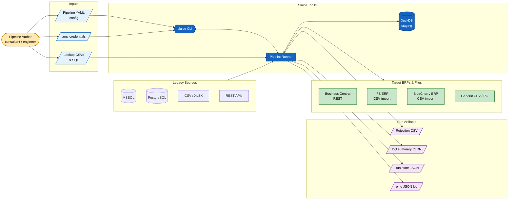

---

## 2. Component architecture

Module dependencies inside `src/`. Arrows point toward the dependency.

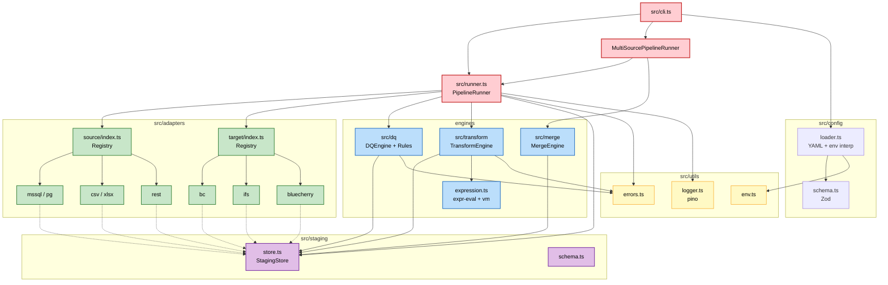

---

## 3. Single-source runtime (sequence)

Phase ordering as implemented in `PipelineRunner.run()`.

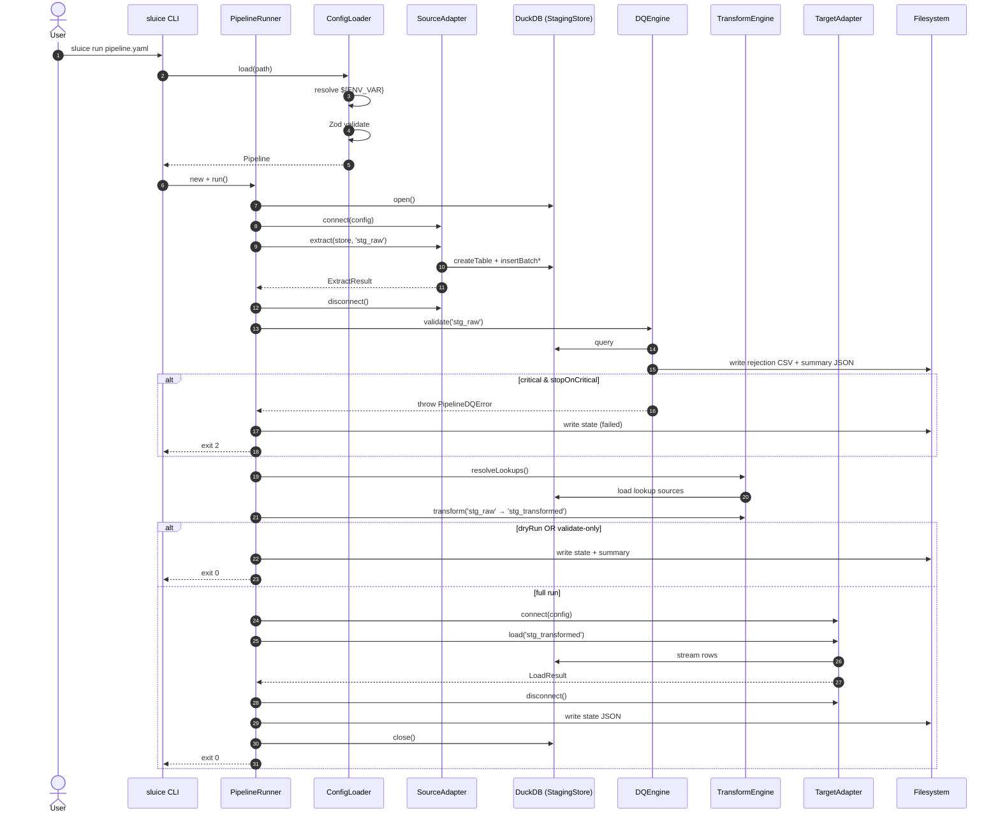

---

## 4. Multi-source merge flow

Pipeline with `sources[]` + `merge:`. Runner is
`MultiSourcePipelineRunner`.

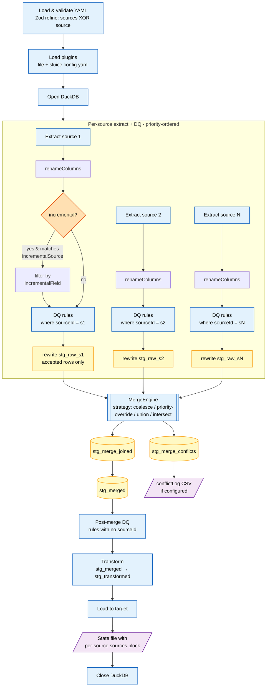

**Merge strategies at a glance:**

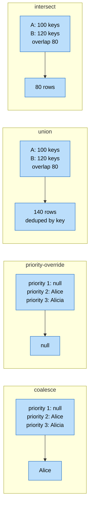

---

## 5. DQ engine — rule evaluation and severity routing

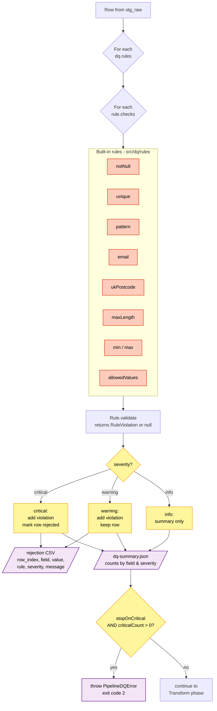

---

## 6. Transform engine — field resolution

How a single `FieldMapping` resolves to an output column value.

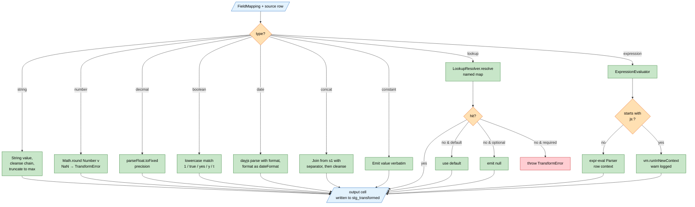

**Cleanse pipe chain** (left-to-right):

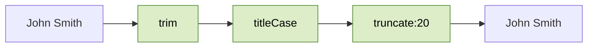

---

## 7. Plugin / extension architecture

Three tiers of extension, all flowing through a single loader into
registry-backed engines.

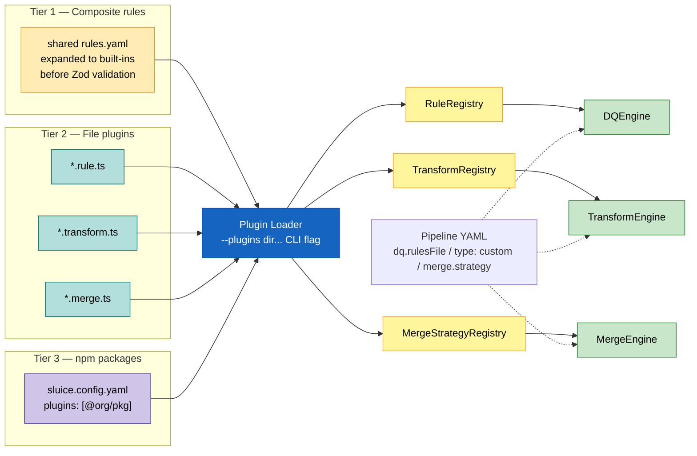

---

## 8. Staging tables — lifecycle in DuckDB

Names are canonical; runner code refers to them as string literals.

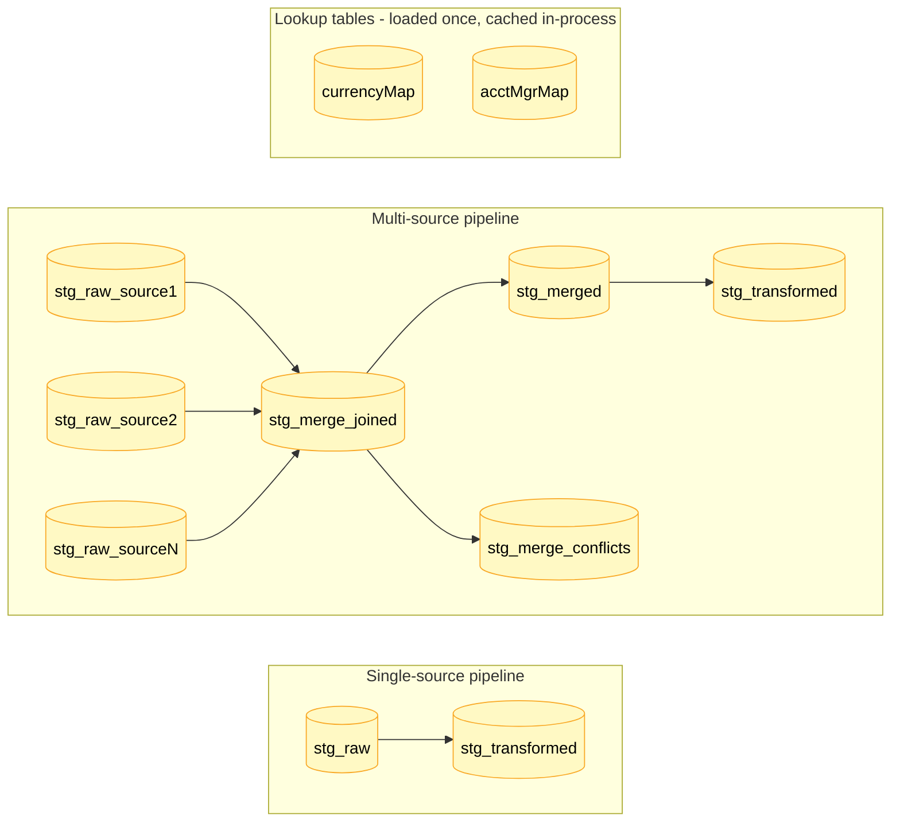

**Persistence:**

- Default DuckDB path: `{outputDir}/{pipelineName}.duckdb`
- `run.stagingDb: ':memory:'` → in-process only (used by tests, dryRun)
- Tables are **not** dropped between phases — state is inspectable after a run
- A fresh run truncates / recreates `stg_*` tables at the start of each phase

---

## 9. Incremental mode & state file

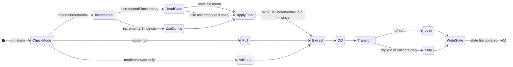

---

## 10. CLI commands and exit codes

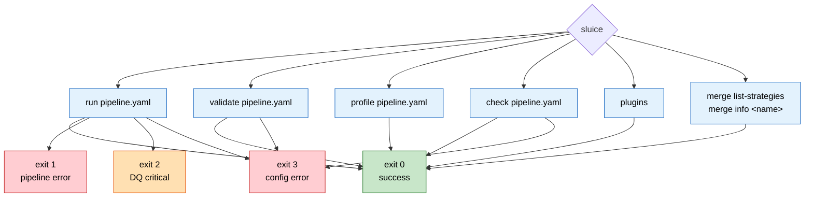

---

## 11. Error hierarchy

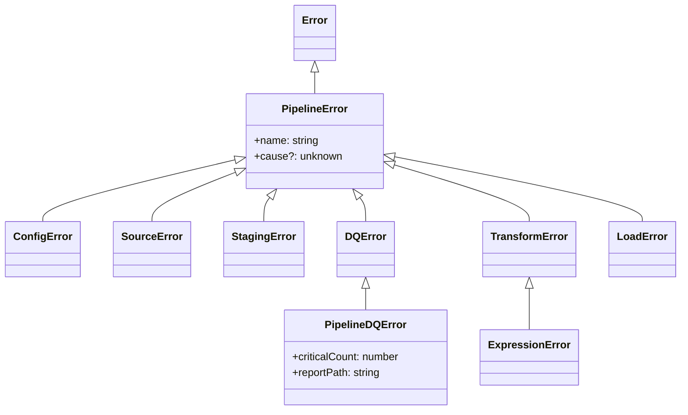

---

## 12. Client deployment topology

Each client runs Sluice as a CLI against its own private config repo.

```mermaid
flowchart LR
    classDef client fill:#FFE0B2,stroke:#E65100,color:#000
    classDef repo fill:#E1BEE7,stroke:#6A1B9A,color:#000
    classDef erp fill:#C8E6C9,stroke:#2E7D32,color:#000
    classDef pkg fill:#1565C0,stroke:#0D47A1,color:#FFF

    Pkg[@caracal-lynx/sluice<br/>npm package]:::pkg

    subgraph CochranEnv[Cochran Group - Annan]
      direction TB
      CochRepo[clients/cochran<br/>private repo<br/>.env + *.pipeline.yaml]:::repo
      CochSrc[(MSSQL LegacyDB)]:::client
      IFS[IFS ERP<br/>CSV import dir]:::erp
      CochRepo -->|sluice run| CochSrc
      CochRepo --> IFS
    end

    subgraph EribeEnv[Eribé Knitwear]
      direction TB
      EribeRepo[clients/eribe<br/>private repo<br/>.env + *.pipeline.yaml]:::repo
      EribeSrc[(MSSQL / CSV exports)]:::client
      BC[BlueCherry ERP<br/>CSV import dir]:::erp
      EribeRepo -->|sluice run| EribeSrc
      EribeRepo --> BC
    end

    Pkg -.installed via npm.-> CochRepo
    Pkg -.installed via npm.-> EribeRepo
```

---

## FigJam / Figma board blueprint

To mirror these diagrams on a whiteboard, create one board with the
following frames (left-to-right, then wrap):

| # | Frame title | Content | Connector style |
|---|---|---|---|
| 1 | System Context | Diagram 1 | Left → right |
| 2 | Component Architecture | Diagram 2 | Top → bottom |
| 3 | Runtime — Single-Source | Diagram 3 (sequence) | Vertical lifelines |
| 4 | Runtime — Multi-Source Merge | Diagram 4 + strategy legend | Top → bottom |
| 5 | DQ Engine | Diagram 5 | Top → bottom |
| 6 | Transform Engine | Diagram 6 + cleanse chain | Top → bottom |
| 7 | Plugin Architecture | Diagram 7 | Left → right |
| 8 | Staging Tables | Diagram 8 | Left → right |
| 9 | Incremental & State | Diagram 9 | Left → right |
| 10 | CLI & Exit Codes | Diagram 10 | Radial |
| 11 | Error Hierarchy | Diagram 11 (class diagram) | Inheritance arrows |
| 12 | Client Deployments | Diagram 12 | Per-client cluster |

**Sticky-note callouts to add alongside the frames:**

- *DuckDB is the single source of truth mid-run — tables persist after the
  run for debugging.*
- *Per-source DQ runs **before** merge; post-merge DQ runs **after**. Same
  rule library, different scope.*
- *The `${ENV_VAR}` interpolation happens in `ConfigLoader.load()` — the
  CLI is responsible for calling `loadEnv()` first.*
- *`type: custom` fields and `dq.rulesFile` references are resolved by the
  plugin loader **before** Zod sees them.*
- *Exit code 2 is reserved for DQ-driven failure — CI can distinguish
  data-quality blockers from infrastructure errors.*

---

## Rendering tips

- **GitHub:** Mermaid renders natively in `.md` files.
- **VS Code:** install *Markdown Preview Mermaid Support*.
- **Static export:** `npx @mermaid-js/mermaid-cli -i docs/architecture-diagrams.md -o docs/arch.pdf`
- **FigJam:** paste each Mermaid block as a text node beside its frame for
  source-of-truth reference.
