# Sluice — Architecture Diagrams

Visual reference for the Sluice ETL toolkit. All diagrams are Mermaid and
render natively in GitHub, VS Code, and most docs portals. A FigJam
blueprint at the bottom mirrors the same structure for whiteboard use.

> _Clean data flows through._

**Verified against `@caracal-lynx/sluice@0.9.6`, 2026-08-22.** Diagrams here are
checked against `src/`, not maintained from memory; every Mermaid block in this
file parses. If you change a phase, an adapter, a rule or an exit code, change
the diagram in the same PR — a diagram that lies is worse than no diagram,
because it is quoted with confidence.

---

## 0. Pipeline stages at a glance

The whole engine in one picture. Everything below this section is a zoom into
one part of it.

Six stages run in a fixed order, three of them optional. **Prep, Enrich and
Merge are skipped entirely unless the pipeline configures them** — a minimal
pipeline is Extract → DQ → Transform → Load.

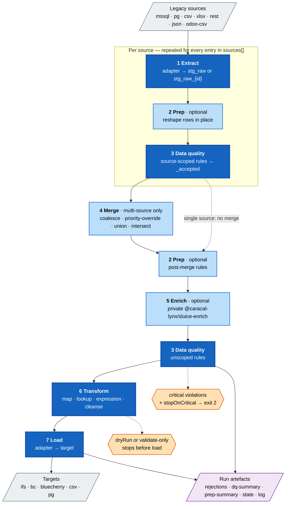

**Reading the order, because it is easy to get wrong:**

- **Extract** — always. One adapter per source; the incremental filter applies
  here.
- **Prep** — only when a `prep:` block is present and `--no-prep` was not
  passed. Mutates the staging table **in place**, before Enrich and DQ. Fires
  once per source pre-merge (rules carrying that `sourceId`) and again
  post-merge (rules with no `sourceId`).
- **Enrich** — only when an `enrich:` block is present, the private package is
  installed, `--no-enrich` was not passed, and the run is neither a dry run nor
  `validate-only`. The implementation is `@caracal-lynx/sluice-enrich`; this
  repo exports only the types. **Skipped silently when the package is absent**,
  so "enrich did nothing" usually means "not installed".
- **DQ** — always. Rejected rows are **not deleted**: they are excluded by
  materialising `{table}_accepted`, leaving the original table inspectable.
- **Merge** — only for `sources[]` + `merge:`, and only under
  `MultiSourcePipelineRunner`.
- **Transform** — always. The only stage that writes `stg_transformed`.
- **Load** — skipped for `dryRun` and `validate-only`.

**Enrich sits between Prep and DQ, not after Transform.** That ordering is
deliberate — enrichment adds columns that DQ rules are then allowed to
validate — and it is the single most common thing people mis-draw.

---

## 1. System context

Where Sluice sits between the client's legacy systems and their target ERP.

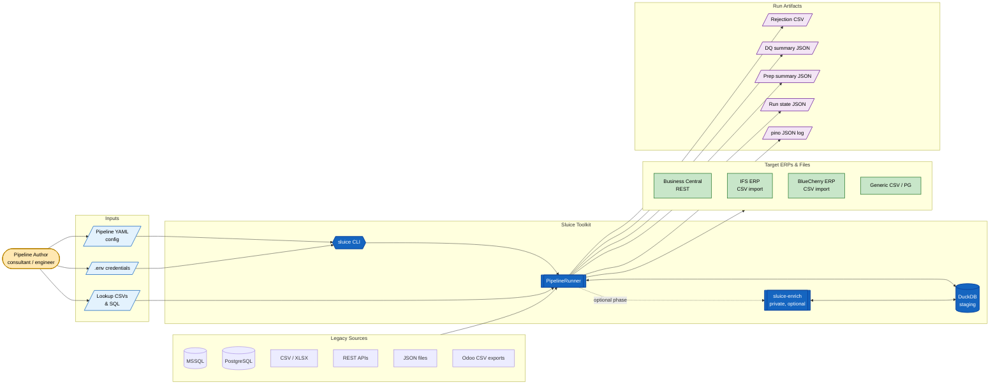

---

## 2. Component architecture

Module dependencies inside `src/`. Arrows point toward the dependency.

```mermaid
flowchart TB
    classDef entry fill:#FFCDD2,stroke:#C62828,stroke-width:2px,color:#000
    classDef engine fill:#BBDEFB,stroke:#1565C0,stroke-width:1.5px,color:#000
    classDef adapter fill:#C8E6C9,stroke:#2E7D32,stroke-width:1.5px,color:#000
    classDef infra fill:#E1BEE7,stroke:#6A1B9A,stroke-width:1.5px,color:#000
    classDef utils fill:#FFF9C4,stroke:#F9A825,stroke-width:1.2px,color:#000

    CLI[src/cli.ts]:::entry
    Runner[src/runner.ts<br/>PipelineRunner]:::entry
    MSRunner[MultiSourcePipelineRunner]:::entry

    subgraph Config[src/config]
      Schema[schema.ts<br/>Zod]
      Loader[loader.ts<br/>YAML + env interp]
    end

    subgraph Adapters[src/adapters]
      SrcReg[source/index.ts<br/>Registry]:::adapter
      TgtReg[target/index.ts<br/>Registry]:::adapter
      MSSQL[mssql / pg]:::adapter
      CSV[csv / xlsx]:::adapter
      REST[rest]:::adapter
      JsonSrc[json]:::adapter
      OdooSrc[odoo-csv]:::adapter
      BC[bc]:::adapter
      IFS[ifs]:::adapter
      BlueCherry[bluecherry]:::adapter
      CsvTgt[csv]:::adapter
      PgTgt[pg]:::adapter
    end

    subgraph Engines[engines]
      DQ[src/dq<br/>DQEngine + Rules]:::engine
      Transform[src/transform<br/>TransformEngine]:::engine
      Merge[src/merge<br/>MergeEngine]:::engine
      Prep[src/prep<br/>PrepEngine<br/>+ PrepLookupResolver]:::engine
      Expr[expression.ts<br/>expr-eval-fork + vm]:::engine
    end

    subgraph Ext[extension points]
      Plugins[src/plugins<br/>loader + registries]:::infra
      EnrichT[src/enrich/types.ts<br/>types only — impl is the<br/>private sluice-enrich pkg]:::infra
    end

    subgraph Staging[src/staging]
      Store[store.ts<br/>StagingStore]:::infra
      SSchema[schema.ts]:::infra
    end

    subgraph Utils[src/utils]
      Logger[logger.ts<br/>pino]:::utils
      EnvMod[env.ts]:::utils
      Errors[errors.ts]:::utils
    end

    CLI --> Runner
    CLI --> MSRunner
    CLI --> Loader

    MSRunner --> Runner
    Runner --> SrcReg
    Runner --> TgtReg
    Runner --> Prep
    Runner --> EnrichT
    Runner --> DQ
    Runner --> Transform
    Runner --> Plugins
    MSRunner --> Merge
    Runner --> Store

    Loader --> Schema
    SrcReg --> MSSQL
    SrcReg --> CSV
    SrcReg --> REST
    SrcReg --> JsonSrc
    SrcReg --> OdooSrc
    TgtReg --> BC
    TgtReg --> IFS
    TgtReg --> BlueCherry
    TgtReg --> CsvTgt
    TgtReg --> PgTgt

    DQ --> Store
    Transform --> Store
    Transform --> Expr
    Merge --> Store
    Prep --> Store
    Prep --> Expr
    Plugins --> DQ
    Plugins --> Transform
    Plugins --> Merge

    MSSQL -.-> Store
    CSV -.-> Store
    REST -.-> Store
    BC -.-> Store
    IFS -.-> Store
    BlueCherry -.-> Store
    CsvTgt -.-> Store
    PgTgt -.-> Store

    Runner --> Errors
    Runner --> Logger
    Loader --> EnvMod
    DQ --> Errors
    Transform --> Errors
```

---

## 3. Single-source runtime (sequence)

Phase ordering as implemented in `PipelineRunner.run()`. **Enrich runs between
Prep and DQ** — see the ordering table in §0.

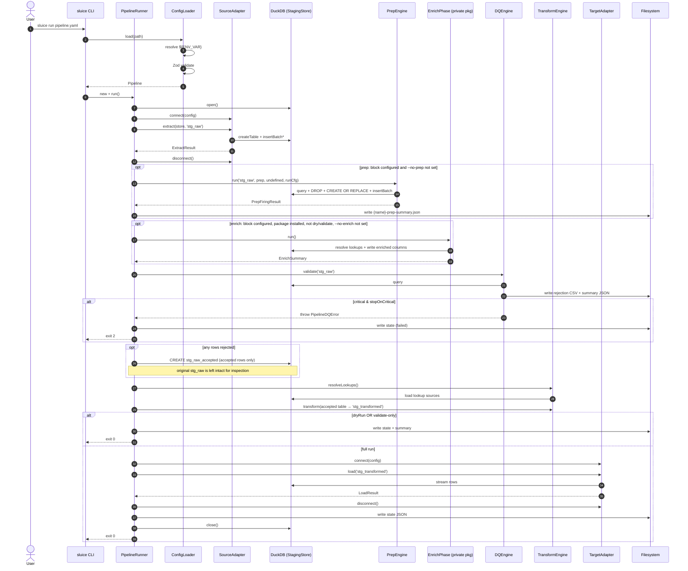

---

## 4. Multi-source merge flow

Pipeline with `sources[]` + `merge:`. Runner is
`MultiSourcePipelineRunner`.

Note the **two** prep firings and **two** DQ passes: source-scoped rules run
before the merge, unscoped rules after it. Enrich runs once, post-merge.

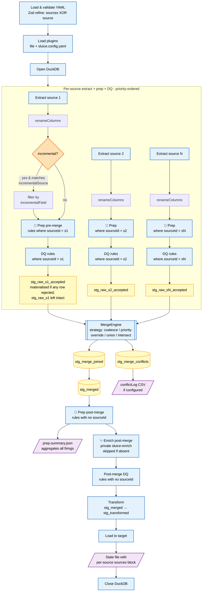

**Merge strategies at a glance:**

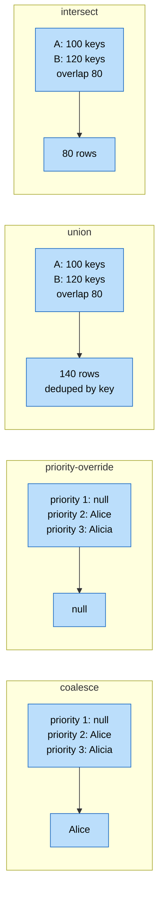

---

## 5. DQ engine — rule evaluation and severity routing

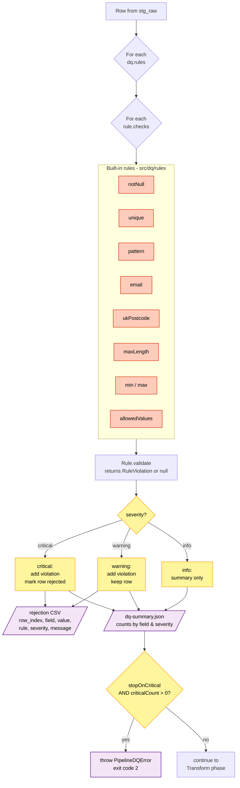

---

## 6. Transform engine — field resolution

How a single `FieldMapping` resolves to an output column value.

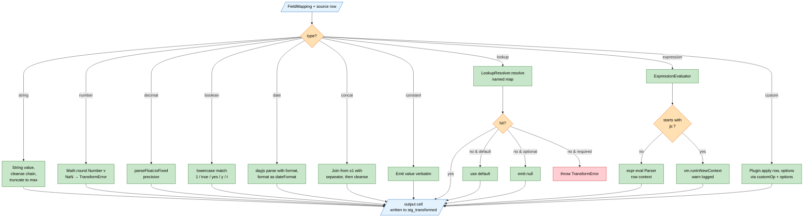

**Cleanse pipe chain** (left-to-right):

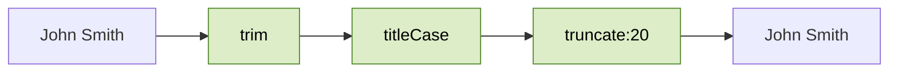

---

## 7. Plugin / extension architecture

Three tiers of extension, all flowing through a single loader into
registry-backed engines.

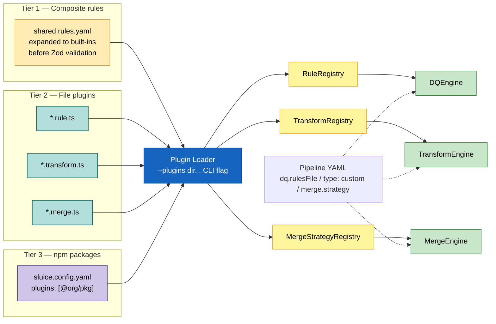

---

## 8. Staging tables — lifecycle in DuckDB

Names are canonical; runner code refers to them as string literals.

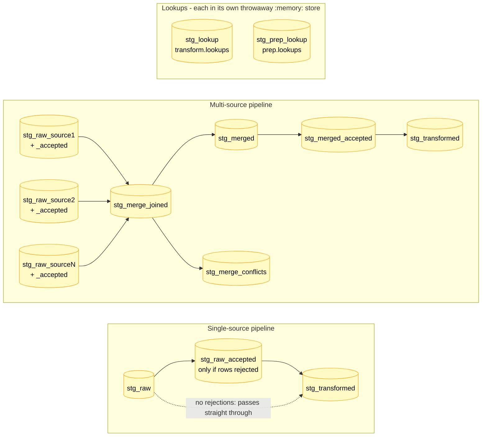

**Persistence:**

- Default DuckDB path: `{outputDir}/{pipelineName}.duckdb`
- `run.stagingDb: ':memory:'` → in-process only (used by tests, dryRun)
- Tables are **not** dropped between phases — state is inspectable after a run
- A fresh run truncates / recreates `stg_*` tables at the start of each phase
- **DQ never deletes rejected rows.** When a run has rejections it materialises
  `{table}_accepted` and hands that to Transform, leaving the original table
  whole so a failed run can be inspected. With no rejections the table is passed
  straight through and no `_accepted` table is created — do not write a query
  that assumes one exists
- **Lookup tables are not in the pipeline's staging database at all.** Each
  lookup is resolved in its own throwaway `:memory:` `StagingStore` under a
  fixed table name — `stg_lookup` for `transform.lookups`, `stg_prep_lookup`
  for `prep.lookups` — reduced to a `Map` and cached in-process. You will not
  find these tables in `{pipelineName}.duckdb` after a run, and the two caches
  are deliberately separate (`PrepLookupResolver` vs `LookupResolver`)

---

## 9. Incremental mode & state file

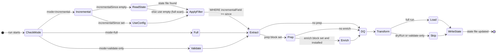

---

## 10. CLI commands and exit codes

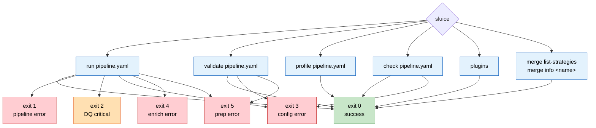

---

## 11. Error hierarchy

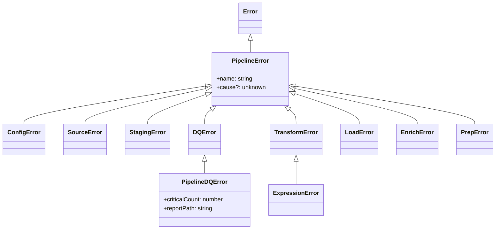

---

## 12. Client deployment topology

Each client runs Sluice as a CLI against its own private config repo. Client
names here are aliases, not real engagements.

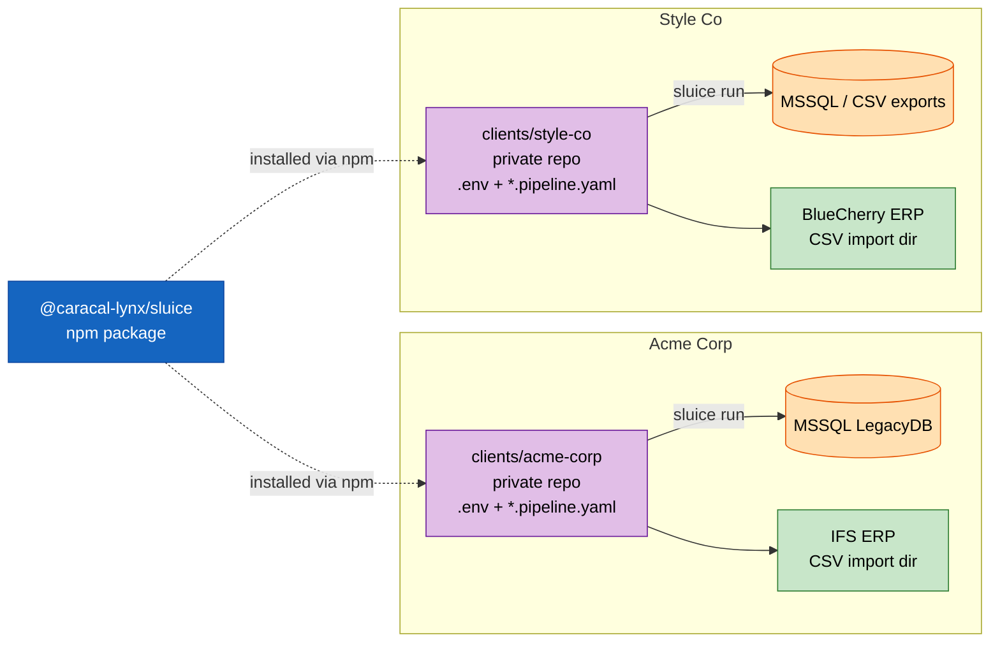

---

## FigJam / Figma board blueprint

To mirror these diagrams on a whiteboard, create one board with the
following frames (left-to-right, then wrap):

| #   | Frame title                  | Content                     | Connector style    |
| --- | ---------------------------- | --------------------------- | ------------------ |
| 0   | Pipeline Stages Overview     | Diagram 0                   | Top → bottom       |
| 1   | System Context               | Diagram 1                   | Left → right       |
| 2   | Component Architecture       | Diagram 2                   | Top → bottom       |
| 3   | Runtime — Single-Source      | Diagram 3 (sequence)        | Vertical lifelines |
| 4   | Runtime — Multi-Source Merge | Diagram 4 + strategy legend | Top → bottom       |
| 5   | DQ Engine                    | Diagram 5                   | Top → bottom       |
| 6   | Transform Engine             | Diagram 6 + cleanse chain   | Top → bottom       |
| 7   | Plugin Architecture          | Diagram 7                   | Left → right       |
| 8   | Staging Tables               | Diagram 8                   | Left → right       |
| 9   | Incremental & State          | Diagram 9                   | Left → right       |
| 10  | CLI & Exit Codes             | Diagram 10                  | Radial             |
| 11  | Error Hierarchy              | Diagram 11 (class diagram)  | Inheritance arrows |
| 12  | Client Deployments           | Diagram 12                  | Per-client cluster |

**Sticky-note callouts to add alongside the frames:**

- _DuckDB is the single source of truth mid-run — tables persist after the
  run for debugging._
- _Per-source DQ runs **before** merge; post-merge DQ runs **after**. Same
  rule library, different scope._
- _Enrich sits between **Prep and DQ**, not after Transform — enriched columns
  are meant to be validated. Its implementation is the private
  `@caracal-lynx/sluice-enrich`; if that package is absent the phase is skipped
  silently, so an "enrich did nothing" report usually means "not installed"._
- _DQ never deletes a rejected row. It materialises `{table}_accepted` and
  passes that on, so the rejected rows survive in the original table for
  post-mortem._
- _The `${ENV_VAR}` interpolation happens in `ConfigLoader.load()` — the
  CLI is responsible for calling `loadEnv()` first._
- _`type: custom` fields and `dq.rulesFile` references are resolved by the
  plugin loader **before** Zod sees them._
- _Exit code 2 is reserved for DQ-driven failure — CI can distinguish
  data-quality blockers from infrastructure errors._

---

## Rendering tips

- **GitHub:** Mermaid renders natively in `.md` files.
- **VS Code:** install _Markdown Preview Mermaid Support_.
- **Static export:** `npx @mermaid-js/mermaid-cli -i docs/architecture-diagrams.md -o docs/arch.pdf`
- **FigJam:** paste each Mermaid block as a text node beside its frame for
  source-of-truth reference.
- **Check every block parses** before committing a change to this file. From
  `packages/sluice`:

  ```powershell
  # One-off: mermaid-cli renders through puppeteer and needs a headless browser
  pnpm dlx puppeteer browsers install chrome-headless-shell

  # The check itself — prints "✅" per block, non-zero exit on a parse error
  pnpm dlx @mermaid-js/mermaid-cli -i docs/architecture-diagrams.md -o "$env:TEMPrch-check.md"
  Remove-Item .rch-check-*.svg    # it writes one SVG per block into the CWD
  ```

  All 15 blocks pass as of 2026-08-22. Two gotchas the command earns its keep
  on: it writes a numbered `.svg` per diagram into the **current directory**
  (delete them — they are not wanted in the repo), and without the browser
  install it fails with a `Could not find chrome-headless-shell` error rather
  than a syntax complaint.

  Diagram 12 shipped unrenderable for weeks because nothing ran this: node ids
  cannot contain spaces, and a find-and-replace over client names had left
  `Style CoRepo`. GitHub renders a broken block as a small error box that is
  very easy to scroll past.
