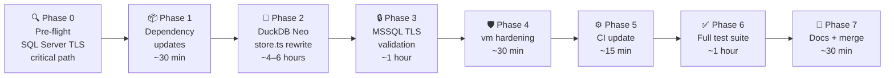

# Sluice — Node.js 20 → 24 + DuckDB Neo Upgrade Plan
**Prepared for:** Caracal Lynx Limited / Michael Scott  
**Date:** 2026-05-01  
**Starting point:** Node.js 20 LTS (EOL April 2026)  
**Target:** Node.js 24 LTS (released April 2025; LTS since October 2025; EOL April 2028)  
**Audience:** Claude Code — use this document to plan and implement the upgrade  
**Related:** `docs/typescript6-upgrade-plan.md` (run after this), `docs/node26-upgrade-plan.md` (deferred to Phase 10)

---

## 1. Why Upgrade Now?

| Version | Status | EOL | Action |
|---|---|---|---|
| Node.js 20 LTS | ☠️ **Expired** | April 2026 | Upgrade immediately |
| Node.js 22 LTS | Active LTS | April 2027 | Skip — only 12 months remaining |
| **Node.js 24 LTS** | ✅ **Active LTS** | **April 2028** | **Target — 2 years runway** |
| Node.js 25 | ⚠️ Non-LTS (odd) | June 2026 | Do NOT use |
| Node.js 26 | Current (not yet LTS) | October 2029 | Deferred — do when LTS (October 2026) |

Node 20 reached end-of-life on 30 April 2026. The `duckdb` npm package (currently used by Sluice) is **already deprecated** and stopped shipping new DuckDB releases after 1.4.x. These two facts make this upgrade mandatory, not optional.

---

## 2. Changes That Affect Sluice

### 2.1 DuckDB Package — 🔴 BREAKING CHANGE (mandatory migration)

**What changed:** The `duckdb` npm package is officially deprecated. It last shipped with DuckDB 1.4.x (Fall 2025) and will not receive the 1.5.x series or any future DuckDB releases. The official replacement is `@duckdb/node-api` (the "Node Neo" client).

**Key differences:**

| Concern | `duckdb` (deprecated) | `@duckdb/node-api` (Node Neo) |
|---|---|---|
| Import | `import duckdb from 'duckdb'` | `import { DuckDBInstance, DuckDBConnection } from '@duckdb/node-api'` |
| Open database | `new duckdb.Database(path)` — **sync** | `await DuckDBInstance.create(path)` — **async factory** |
| Connect | `db.connect(callback)` — **callbacks** | `await instance.connect()` — **Promise** |
| Run DDL/DML | `conn.run(sql, [params], callback)` | `await conn.run(sql)` |
| Query rows | `conn.all(sql, callback)` | `await conn.runAndReadAll(sql)` |
| Row objects | `callback receives Row[]` (untyped `any`) | `result.getRowObjects()` — TypeScript typed |
| Prepared statements | `conn.prepare(sql, callback)` | `await conn.prepare(sql)` |
| Close | `db.close(callback)` | `await conn.close(); await instance.close()` |
| Native bindings | Rebuilds per Node ABI version (`npm rebuild`) | Wraps pre-built DuckDB binary — **ABI-stable, no rebuild ever** |
| Type safety | Minimal | Full TypeScript, `DuckDBValue` types |
| ESM/CJS | CJS only | Both ESM and CJS |
| DuckDB version | Frozen at 1.4.x | 1.5.x onwards (current) |

**Sluice impact:** `src/staging/store.ts` uses DuckDB exclusively. The entire `StagingStore` class must be rewritten against `@duckdb/node-api`. This is the single largest change in the upgrade.

The good news: per Sluice conventions, DuckDB is only imported inside `src/staging/store.ts`. No other module imports from `duckdb` directly. The migration is fully contained to one file.

**Forward-compatibility note:** Phase 4a (the private `@caracal-lynx/sluice-enrich` package) will later require three additional `StagingStore` methods: `selectDistinct()`, `addColumnIfNotExists()`, and `batchUpdateColumns()`. The new `@duckdb/node-api` API makes these straightforward to implement. Add them as stubs during this upgrade so the enrich phase can be bolted on cleanly. See §6.4.

---

### 2.2 OpenSSL 3.5 — ⚠️ HIGH RISK (pre-flight check required)

**What changed:** Node.js 24 upgrades from OpenSSL 3.0 (used in Node 20) to OpenSSL 3.5. The default TLS security level was raised from **level 1 to level 2**. This prohibits:

- RSA/DSA/DH keys shorter than 2048 bits
- ECC keys shorter than 224 bits
- RC4 cipher suites
- **TLS 1.0 and TLS 1.1 connections**

**Sluice impact:**

| Adapter | Risk | Reason |
|---|---|---|
| `mssql` (Cochran Group) | ⚠️ **HIGH** | `tedious` negotiates TLS with SQL Server. Older SQL Server versions (2012/2014) that haven't been patched may use TLS 1.0/1.1 or short keys. |
| `pg` adapter | Low | PostgreSQL servers are typically well-patched. |
| `rest` / `bc` adapter | None | Azure endpoints (`login.microsoftonline.com`, BC REST API) use modern TLS. |

**Action required:** Run the pre-flight TLS connectivity test (Phase 0, Step 1) against Cochran Group's SQL Server **before any code changes**. If the connection fails, escalate to resolve SQL Server TLS configuration before proceeding.

**Workaround if SQL Server TLS is old (temporary, documented):**
```typescript
// src/adapters/source/mssql.ts — if pre-flight fails, add temporarily:
const config: mssql.config = {
  // ... existing config ...
  options: {
    encrypt: true,
    cryptoCredentialsDetails: {
      minVersion: 'TLSv1.2',   // Force TLS 1.2 minimum
    },
  },
};
// TODO: Remove when Cochran SQL Server is confirmed on TLS 1.2+ natively.
```

---

### 2.3 `require(esm)` Now Stable — Low Risk

**What changed:** Synchronous `require()` of ESM modules is **stable** in Node 24 (it was broken/experimental in Node 20). Some npm dependencies may have already gone ESM-only.

**Action:** Run `npm ls` after upgrading and check for any ESM-only packages that previously required workarounds. `csv-parse` and `axios` have been known to ship ESM-only versions.

---

### 2.4 `vm.runInNewContext` — Low Risk, Needs Awareness

**What changed:** Node 24 includes security hardening for the `vm` module related to the `timeout` option and buffer allocation.

**Sluice impact:** `src/transform/expression.ts` uses `vm.runInNewContext()` for `js:` prefix expressions. The sandbox context provided is already appropriately minimal.

**Action:** Ensure `vm.runInNewContext()` does **not** use the `timeout` option (use a `Promise.race` with `setTimeout` instead if a timeout is needed). Use `node:vm` import prefix (recommended form in Node 22+).

---

## 3. Upgrade Sequence



**Estimated total effort:** 1–2 days, with Phase 2 (DuckDB rewrite) representing the majority of the work.

---

## 4. Phase 0 — Pre-flight Checks

**Do this before creating a branch or changing any code.**

### Step 1 — Cochran SQL Server TLS Connectivity Test (Critical)

Create a one-off test script (do not commit):

```typescript
// scripts/test-tls-node24.ts — run with Node 24, delete after
import mssql from 'mssql';

const config: mssql.config = {
  server:   process.env.MSSQL_HOST!,
  port:     Number(process.env.MSSQL_PORT ?? 1433),
  database: process.env.MSSQL_DATABASE!,
  user:     process.env.MSSQL_USER!,
  password: process.env.MSSQL_PASSWORD!,
  options:  { encrypt: true, trustServerCertificate: false },
};

async function test() {
  const pool = await mssql.connect(config);
  const result = await pool.request().query('SELECT @@VERSION AS version');
  console.log('✅ Connected. SQL Server version:', result.recordset[0].version);
  await pool.close();
}

test().catch(err => {
  console.error('❌ Connection failed:', err.message);
  console.error('Action required: check SQL Server TLS version and certificate chain.');
  process.exit(1);
});
```

Run with:
```bash
node --version   # confirm Node 24
npx tsx scripts/test-tls-node24.ts
```

**If it fails:** Do not proceed with the upgrade until Cochran Group's SQL Server is confirmed to support TLS 1.2 or higher. Apply the temporary `cryptoCredentialsDetails` workaround in Phase 3 as an interim measure.

### Step 2 — Lockfile Inventory

```bash
# Check for any packages with known Node 24 incompatibilities
npx npm-check-updates --target latest --format group
# Review — do not upgrade everything blindly. Focus on packages flagged for Node version.

# Check DuckDB specifically (should show it's outdated/deprecated)
npm show duckdb version
npm show @duckdb/node-api version
```

### Step 3 — Create Upgrade Branch

```bash
git checkout -b feat/node24-upgrade
```

---

## 5. Phase 1 — Low-Risk Dependency Updates

Update non-breaking dependencies before tackling DuckDB. This keeps the DuckDB diff clean and isolated.

```bash
# Update patch/minor versions of stable dependencies
npm update commander axios axios-retry pino dayjs zod js-yaml csv-parse csv-stringify

# Update dev dependencies
npm update -D typescript @types/node vitest tsx eslint prettier

# Check for any engine constraint warnings
npm install
npm ls --depth=0 2>&1 | grep "WARN"
```

Review the output for:
- Any packages requiring `node >= 22` or higher (update if available)
- Any packages that have gone ESM-only (check for `"type": "module"` in their package.json)
- The `mssql` package — confirm it is on v10+ (tedious v17+, full TLS 1.2/1.3 support)

```bash
npm show mssql version   # Must be 10.x or higher
```

---

## 6. Phase 2 — DuckDB Neo Migration

**This is the largest and most important change in the upgrade.**

### 6.1 Package Swap

```bash
npm uninstall duckdb
npm install @duckdb/node-api
```

Verify:
```bash
node -e "const { DuckDBInstance } = require('@duckdb/node-api'); console.log('DuckDB Neo loaded')"
# Must print: DuckDB Neo loaded
```

**Note:** Unlike `duckdb`, there is no `npm rebuild` step — `@duckdb/node-api` wraps pre-built DuckDB binaries and is ABI-stable. This is the last time you will need to think about native binding compatibility for DuckDB on any future Node upgrade.

### 6.2 API Patterns Reference

Before rewriting `store.ts`, internalise these pattern equivalences:

```typescript
// ── OLD: duckdb (callback-based) ────────────────────────────────────────────
import duckdb from 'duckdb';
const db = new duckdb.Database(':memory:');
db.connect((err, conn) => {
  conn.run('CREATE TABLE t (id INTEGER, name VARCHAR)', (err) => { /* ... */ });
  conn.all('SELECT * FROM t', (err, rows) => { /* rows: any[] */ });
  conn.prepare('INSERT INTO t VALUES (?, ?)', (err, stmt) => {
    stmt.run(1, 'hello', (err) => { /* ... */ });
  });
});
db.close();

// ── NEW: @duckdb/node-api (Promise-based, TypeScript-native) ─────────────────
import { DuckDBInstance } from '@duckdb/node-api';
const instance = await DuckDBInstance.create(':memory:');
const conn = await instance.connect();

await conn.run('CREATE TABLE t (id INTEGER, name VARCHAR)');

const result = await conn.runAndReadAll('SELECT * FROM t');
const rows = result.getRowObjects();          // Record<string, DuckDBValue>[]
// Or: result.getRows()                        // DuckDBValue[][] (column-ordered)

const prepared = await conn.prepare('INSERT INTO t VALUES ($1, $2)');
prepared.bindInteger(1, 1);
prepared.bindVarchar(2, 'hello');
await prepared.run();
prepared.close();

await conn.close();
await instance.close();
```

### 6.3 StagingStore Full Rewrite

Replace the entire content of `src/staging/store.ts` with the following. Keep the public method signatures identical to what the rest of the codebase expects — only the internals change.

```typescript
// src/staging/store.ts
// ⚠️ IMPORTANT: This is the ONLY file in the codebase that may import from
// @duckdb/node-api. All other modules interact with DuckDB exclusively through
// StagingStore methods. Do not add DuckDB imports anywhere else.
// SPDX-License-Identifier: Elastic-2.0
// Copyright (c) 2026 Caracal Lynx Limited

import { DuckDBInstance, type DuckDBConnection } from '@duckdb/node-api';
import { logger } from '@/utils/logger';

export class StagingStore {
  private instance!: DuckDBInstance;
  private conn!: DuckDBConnection;

  /**
   * Factory method — replaces the sync constructor pattern from the old duckdb API.
   * Called ONLY from PipelineRunner — never instantiate StagingStore elsewhere.
   */
  static async create(dbPath = ':memory:'): Promise<StagingStore> {
    const store = new StagingStore();
    store.instance = await DuckDBInstance.create(dbPath);
    store.conn = await store.instance.connect();
    logger.debug({ dbPath }, 'StagingStore opened');
    return store;
  }

  // ── DDL / DML ─────────────────────────────────────────────────────────────

  /** Executes a DDL or DML statement that produces no result set. */
  async run(sql: string): Promise<void> {
    await this.conn.run(sql);
  }

  // ── Queries ───────────────────────────────────────────────────────────────

  /** Executes a SELECT and returns all rows as plain objects. */
  async queryAll(sql: string): Promise<Record<string, unknown>[]> {
    const result = await this.conn.runAndReadAll(sql);
    return result.getRowObjects() as Record<string, unknown>[];
  }

  /** Executes a SELECT and returns the first row, or undefined. */
  async queryOne(sql: string): Promise<Record<string, unknown> | undefined> {
    const rows = await this.queryAll(sql);
    return rows[0];
  }

  /** Returns a single scalar value from the first column of the first row. */
  async queryScalar<T = unknown>(sql: string): Promise<T | undefined> {
    const row = await this.queryOne(sql);
    if (row === undefined) return undefined;
    const value = Object.values(row)[0];
    return value as T;
  }

  // ── Bulk insert ───────────────────────────────────────────────────────────

  /**
   * Bulk-inserts rows into a table using a prepared statement.
   * More efficient than individual INSERTs for large datasets.
   *
   * @param table   Table name (e.g. 'stg_raw')
   * @param columns Column names in order
   * @param rows    Array of row objects; each object must have all columns as keys
   */
  async bulkInsert(
    table: string,
    columns: string[],
    rows: Record<string, unknown>[],
  ): Promise<void> {
    if (rows.length === 0) return;
    const placeholders = columns.map((_, i) => `$${i + 1}`).join(', ');
    const sql = `INSERT INTO "${table}" (${columns.map(c => `"${c}"`).join(', ')}) VALUES (${placeholders})`;
    const prepared = await this.conn.prepare(sql);

    for (const row of rows) {
      columns.forEach((col, i) => {
        const val = row[col];
        const pos = i + 1;
        if (val === null || val === undefined) {
          prepared.bindNull(pos);
        } else if (typeof val === 'boolean') {
          prepared.bindBoolean(pos, val);
        } else if (typeof val === 'bigint') {
          prepared.bindBigInt(pos, val);
        } else if (typeof val === 'number') {
          Number.isInteger(val)
            ? prepared.bindInteger(pos, val)
            : prepared.bindDouble(pos, val);
        } else {
          prepared.bindVarchar(pos, String(val));
        }
      });
      await prepared.run();
    }
    prepared.close();
    logger.debug({ table, rowCount: rows.length }, 'bulkInsert complete');
  }

  // ── Table utilities ───────────────────────────────────────────────────────

  /** Returns true if a table exists in the current database. */
  async tableExists(tableName: string): Promise<boolean> {
    const row = await this.queryOne(
      `SELECT COUNT(*) AS n FROM information_schema.tables
       WHERE table_name = '${tableName}'`
    );
    return Number(row?.n ?? 0) > 0;
  }

  /** Returns column names for a table. */
  async columnNames(tableName: string): Promise<string[]> {
    const rows = await this.queryAll(
      `SELECT column_name FROM information_schema.columns
       WHERE table_name = '${tableName}'
       ORDER BY ordinal_position`
    );
    return rows.map(r => String(r['column_name']));
  }

  // ── Phase 4a stubs — implement during @caracal-lynx/sluice-enrich development ──
  //
  // These methods are required by the EnrichmentRunner (Phase 4a).
  // They are STUBS only in this upgrade — do NOT implement the bodies now.
  // They will be fully implemented during Phase 4a alongside the private
  // @caracal-lynx/sluice-enrich package, once the enrich runner can be
  // tested end-to-end.
  //
  // Keeping them here as stubs ensures:
  //   (a) The TypeScript interface is agreed upfront
  //   (b) The EnrichmentRunner can reference them in its type signature
  //   (c) No surprises during Phase 4a — the DuckDB API is already proven

  /**
   * Returns distinct non-null, non-empty values for a column in stg_raw.
   * Used by EnrichmentRunner to determine which values need API calls.
   * Implement in Phase 4a.
   */
  async selectDistinct(_field: string): Promise<string[]> {
    throw new Error(
      'StagingStore.selectDistinct() is not yet implemented. ' +
      'Implement during Phase 4a (@caracal-lynx/sluice-enrich development).'
    );
  }

  /**
   * Adds a column to stg_raw if it does not already exist.
   * Used by EnrichmentRunner to write provider result columns.
   * Implement in Phase 4a.
   */
  async addColumnIfNotExists(_column: string, _type: 'BOOLEAN' | 'VARCHAR'): Promise<void> {
    throw new Error(
      'StagingStore.addColumnIfNotExists() is not yet implemented. ' +
      'Implement during Phase 4a (@caracal-lynx/sluice-enrich development).'
    );
  }

  /**
   * Batch-updates stg_raw. Updates is a Map<rowid, Record<column, value>>.
   * Used by EnrichmentRunner to apply provider results to all matching rows.
   * Implement in Phase 4a.
   */
  async batchUpdateColumns(_updates: Map<number, Record<string, unknown>>): Promise<void> {
    throw new Error(
      'StagingStore.batchUpdateColumns() is not yet implemented. ' +
      'Implement during Phase 4a (@caracal-lynx/sluice-enrich development).'
    );
  }

  // ── Lifecycle ─────────────────────────────────────────────────────────────

  /** Closes the DuckDB connection and instance. Must be called when pipeline completes. */
  async close(): Promise<void> {
    await this.conn.close();
    await this.instance.close();
    logger.debug('StagingStore closed');
  }
}
```

### 6.4 PipelineRunner — StagingStore Construction Update

The old `duckdb` `Database` was constructed synchronously. `StagingStore.create()` is now async. Update the construction call in `src/runner.ts`:

```typescript
// Before (old duckdb — sync):
const stagingStore = new StagingStore(dbPath);

// After (@duckdb/node-api — async factory):
const stagingStore = await StagingStore.create(dbPath);
```

Ensure `close()` is called in the `finally` block of the pipeline runner, which it almost certainly already is.

### 6.5 Update `package.json`

```json
{
  "dependencies": {
    "@duckdb/node-api": "^1.5.0"
  }
}
```

Remove `duckdb` (and `duckdb-async` if used) from dependencies entirely.

### 6.6 Test the Rewrite in Isolation

Before running the full test suite, verify the new StagingStore works on its own:

```bash
# Quick smoke test — create in-memory store, insert a row, read it back
npx tsx -e "
import { StagingStore } from './src/staging/store.ts';
const store = await StagingStore.create();
await store.run('CREATE TABLE test (id INTEGER, name VARCHAR)');
await store.bulkInsert('test', ['id', 'name'], [{ id: 1, name: 'hello' }]);
const rows = await store.queryAll('SELECT * FROM test');
console.log('rows:', rows);
await store.close();
"
```

Expected output: `rows: [ { id: 1, name: 'hello' } ]`

---

## 7. Phase 3 — MSSQL TLS Validation

**Only needed if the Phase 0 TLS pre-flight test failed or returned warnings.**

### 7.1 Check mssql Package Version

```bash
npm show mssql version   # Must be 10.x
```

If below v10, update:
```bash
npm install mssql@latest
```

### 7.2 Verify Connection on Node 24

Re-run the pre-flight test script from Phase 0 with the updated `mssql` package:

```bash
npx tsx scripts/test-tls-node24.ts
```

### 7.3 Temporary TLS Workaround (if SQL Server not yet patched)

If connection still fails, apply the temporary workaround in `src/adapters/source/mssql.ts`. Document clearly with a TODO comment including the date and what needs to change:

```typescript
options: {
  encrypt: true,
  trustServerCertificate: false,
  cryptoCredentialsDetails: {
    minVersion: 'TLSv1.2',
    // TODO 2026-05: Remove when Cochran SQL Server confirmed TLS 1.2+ native.
    // Required because Node 24 OpenSSL 3.5 raises security level to 2,
    // which rejects TLS 1.0/1.1 connections. SQL Server version TBC.
  },
},
```

---

## 8. Phase 4 — `vm.runInNewContext` Hardening

**File:** `src/transform/expression.ts`

### 8.1 Update Import

```typescript
// Before:
import vm from 'vm';

// After (use node: prefix — recommended in Node 22+):
import vm from 'node:vm';
```

### 8.2 Verify No Timeout Option

Confirm the `vm.runInNewContext()` call does **not** pass a `timeout` option. If it currently does, replace it with a `Promise.race` pattern:

```typescript
// Safe pattern — no vm timeout option:
const result = vm.runInNewContext(code, {
  row,
  Date,
  Math,
  JSON,
  String,
  Number,
  Boolean,
});

// If execution time safety is needed, use Promise.race instead of vm timeout:
const EVAL_TIMEOUT_MS = 5000;
const result = await Promise.race([
  Promise.resolve(vm.runInNewContext(code, sandbox)),
  new Promise<never>((_, reject) =>
    setTimeout(
      () => reject(new ExpressionError(`Expression timed out after ${EVAL_TIMEOUT_MS}ms: ${code}`)),
      EVAL_TIMEOUT_MS,
    )
  ),
]);
```

---

## 9. Phase 5 — CI and Configuration Updates

### 9.1 GitHub Actions Workflow

```yaml
# .github/workflows/ci.yml — update node-version
- uses: actions/setup-node@v4
  with:
    node-version: '24'    # was '20'
    cache: 'npm'
```

### 9.2 `package.json` Engines Field

```json
{
  "engines": {
    "node": ">=24.0.0"
  }
}
```

### 9.3 `.nvmrc` (if present)

```
24
```

### 9.4 Regenerate Lock File

Node 24 ships with npm 10. Regenerate the lockfile to pick up any format changes:

```bash
rm package-lock.json
npm install
```

### 9.5 TypeScript Target (align with upcoming TS6 upgrade)

Node 24's V8 supports ES2025 syntax. The upcoming TypeScript 6 upgrade will set `target: "ES2025"` — no change needed here, but note it for continuity.

---

## 10. Phase 6 — Full Test Suite and Coverage Gate

```bash
# Build
npm run build

# Lint
npm run lint

# Full test suite with coverage
npm run test:cov
```

**Requirements before proceeding:**
- [ ] All Vitest suites green (zero failures)
- [ ] `src/dq/` coverage ≥ 80%
- [ ] `src/transform/` coverage ≥ 80%
- [ ] `src/staging/` coverage sufficient (new `StagingStore` methods covered)

**Integration tests — run both fixture pipelines:**

```bash
npx vitest run tests/integration/

# Then manually end-to-end:
npx tsx src/cli.ts run tests/fixtures/cochran-customers.pipeline.yaml --dry-run
npx tsx src/cli.ts run tests/fixtures/eribe-styles.pipeline.yaml --dry-run
npx tsx src/cli.ts check tests/fixtures/cochran-customers.pipeline.yaml
```

All must complete without errors. Verify exit codes:
```
exit 0 = success
exit 1 = runtime error
exit 2 = DQ critical failures
exit 3 = config error
```

**StagingStore unit test additions required:**

The new `StagingStore` methods need test coverage. Add to `tests/unit/staging/store.test.ts`:

```typescript
describe('StagingStore (@duckdb/node-api)', () => {
  let store: StagingStore;

  beforeEach(async () => { store = await StagingStore.create(); });
  afterEach(async () => { await store.close(); });

  it('creates in-memory store', () => { expect(store).toBeDefined(); });

  it('run() executes DDL without error', async () => {
    await expect(store.run('CREATE TABLE t (id INTEGER)')).resolves.toBeUndefined();
  });

  it('bulkInsert() and queryAll() round-trip', async () => {
    await store.run('CREATE TABLE t (id INTEGER, name VARCHAR)');
    await store.bulkInsert('t', ['id', 'name'], [
      { id: 1, name: 'alice' },
      { id: 2, name: 'bob' },
    ]);
    const rows = await store.queryAll('SELECT * FROM t ORDER BY id');
    expect(rows).toHaveLength(2);
    expect(rows[0]).toMatchObject({ id: 1, name: 'alice' });
  });

  it('queryOne() returns undefined for empty result', async () => {
    await store.run('CREATE TABLE empty (id INTEGER)');
    const row = await store.queryOne('SELECT * FROM empty');
    expect(row).toBeUndefined();
  });

  it('tableExists() returns correct result', async () => {
    await store.run('CREATE TABLE exists_test (id INTEGER)');
    expect(await store.tableExists('exists_test')).toBe(true);
    expect(await store.tableExists('no_such_table')).toBe(false);
  });

  it('Phase 4a stub methods throw clearly', async () => {
    await expect(store.selectDistinct('field')).rejects.toThrow('not yet implemented');
    await expect(store.addColumnIfNotExists('col', 'VARCHAR')).rejects.toThrow('not yet implemented');
    await expect(store.batchUpdateColumns(new Map())).rejects.toThrow('not yet implemented');
  });
});
```

---

## 11. Phase 7 — Documentation and Merge

### 11.1 Update `CLAUDE.md` Tech Stack Table

```markdown
| Runtime | Node.js 24 LTS | No Bun, no Deno — must run in GitHub Actions |
| Staging | `@duckdb/node-api` | Replaces deprecated `duckdb` package — ABI-stable |
```

### 11.2 Update `package.json` Description / Homepage (if present)

No changes required.

### 11.3 Update `README.md`

Update any badge or mention of "Node 20" to "Node 24+".

### 11.4 Delete the TLS Test Script

```bash
rm scripts/test-tls-node24.ts
git add -A
```

### 11.5 Commit and Merge

```bash
git add -A
git commit -m "feat: upgrade Node.js 20 → 24 LTS + migrate DuckDB to @duckdb/node-api"
git push origin feat/node24-upgrade
# Open PR → develop; merge after CI passes
```

---

## 12. Risk Register

| Risk | Likelihood | Impact | Mitigation |
|---|---|---|---|
| Cochran SQL Server TLS 1.0/1.1 | Medium | High — MSSQL adapter fails | Phase 0 pre-flight; temporary `cryptoCredentialsDetails` workaround if needed |
| `@duckdb/node-api` API behaviour differs from expected | Low | Medium — test failures | Smoke test in §6.6 before running full suite; DuckDB docs are comprehensive |
| ESM-only dependency breaks build | Low | Medium — build fails | `npm ls` check in Phase 1; `require(esm)` is stable in Node 24 |
| `vm.runInNewContext` edge case on Node 24 | Very Low | Low — expression eval | Remove `timeout` option; test `js:` expressions in unit suite |
| StagingStore refactor introduces regression | Low | Medium — staging layer broken | Comprehensive unit tests in §10; smoke test in §6.6 |
| Phase 4a stub methods cause confusion | Very Low | Very Low | Stubs throw explicit "not yet implemented" errors; they will not be called in normal pipeline operation |

---

## 13. Rollback Plan

If a blocker is encountered (most likely: Cochran TLS issue that cannot be resolved quickly):

1. Keep `feat/node24-upgrade` branch uncommitted to `main`/`develop`
2. The codebase on `main` continues to run on Node 20 (still functional, though EOL)
3. Address the SQL Server TLS issue out-of-band (patch SQL Server or apply connection string workaround)
4. Resume the upgrade once the blocker is resolved
5. **Do not roll back to `duckdb`** — the old package is deprecated and frozen; any DuckDB issues must be resolved on `@duckdb/node-api`

---

## 14. Next Steps After This Upgrade

Once all tests pass and this branch is merged to `develop`:

1. **TypeScript 5 → 6 upgrade** — see `docs/typescript6-upgrade-plan.md` (Phase 1 in that plan starts immediately after this upgrade is merged)
2. **Phase 4a — `@caracal-lynx/sluice-enrich`** — the private enrich subsystem. The StagingStore stub methods added in this upgrade form the interface contract for the EnrichmentRunner. See `docs/PHASE2.5-ENRICH.md` for the full spec.
3. **Node v26 upgrade** — deferred to Phase 10 of the implementation plan. When Node 26 goes LTS (October 2026), the migration from Node 24 will be significantly smaller than the 20→24 jump. No DuckDB work required — `@duckdb/node-api` is ABI-stable.

---

## 15. References

- [Node.js 24 Release Notes](https://nodejs.org/en/blog/release/v24.0.0)
- [Node.js Releases (EOL dates)](https://nodejs.org/en/about/previous-releases)
- [@duckdb/node-api npm](https://www.npmjs.com/package/@duckdb/node-api)
- [DuckDB Node Neo Client announcement](https://duckdb.org/2024/12/18/duckdb-node-neo-client)
- [DuckDB Node.js (Neo) API docs](https://duckdb.org/docs/current/clients/node_neo/overview)
- [duckdb-node-neo GitHub](https://github.com/duckdb/duckdb-node-neo)
- [Node.js v22 to v24 Migration Guide](https://nodejs.org/en/blog/migrations/v22-to-v24)
- [OpenSSL Security Level 2 — Node 24](https://github.com/nodejs/node/issues/59715)

---

*Prerequisite for: `docs/typescript6-upgrade-plan.md` (Phase 2) and `docs/PHASE2.5-ENRICH.md` (Phase 4a/4b)*  
*See also: `docs/node26-upgrade-plan.md` (Phase 10 — deferred until Node 26 LTS, October 2026)*  
*Caracal Lynx Limited — SC826823*
